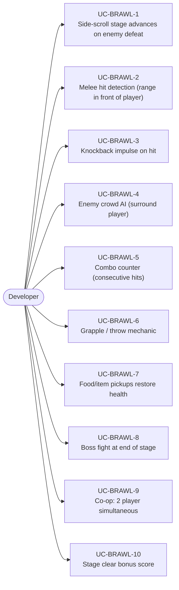
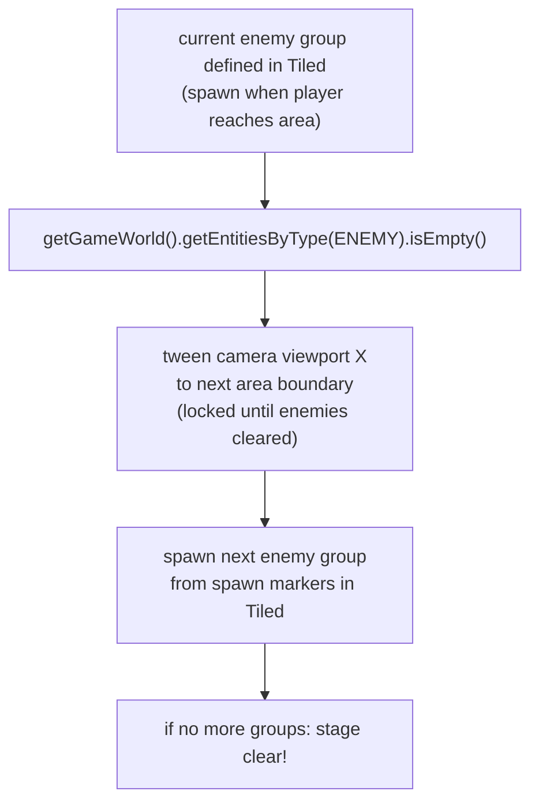
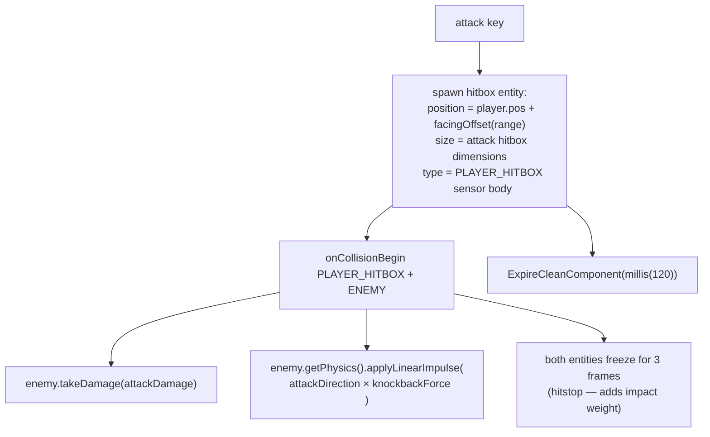
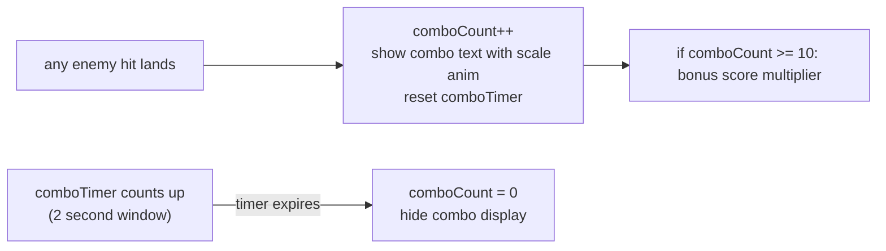
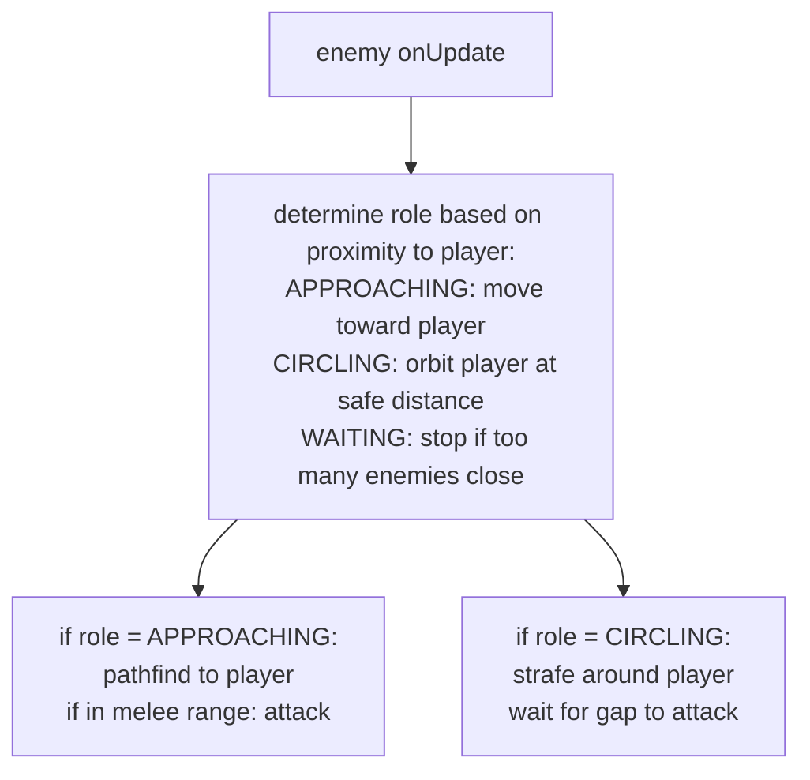
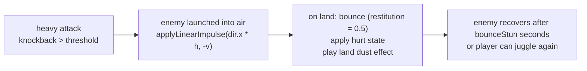

# Game Type — Beat 'em Up / Brawler

Covers side-scrolling brawlers (Streets of Rage, Final Fight style). Player fights multiple melee enemies on a scrolling stage, combo attacks, knockback, co-op.

## Actors and Primary Use Cases

## Stage Progression

## Melee Combat System

## Combo Counter

## Enemy Crowd AI

## Knockback and Ground Bounce

