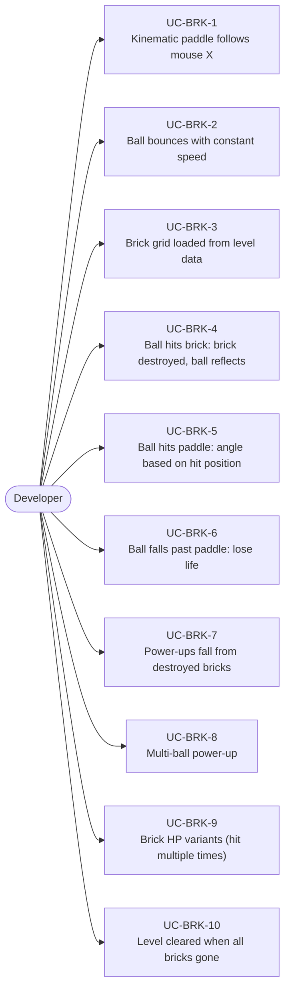
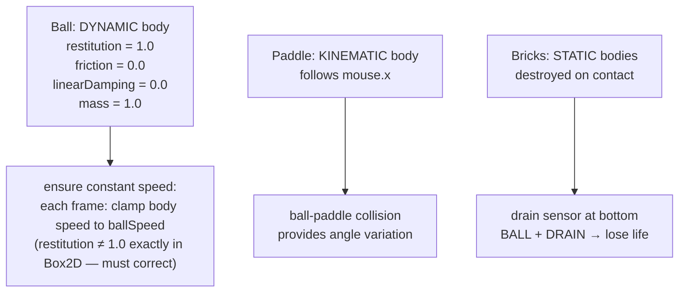
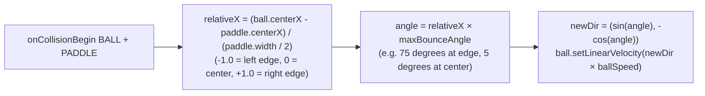
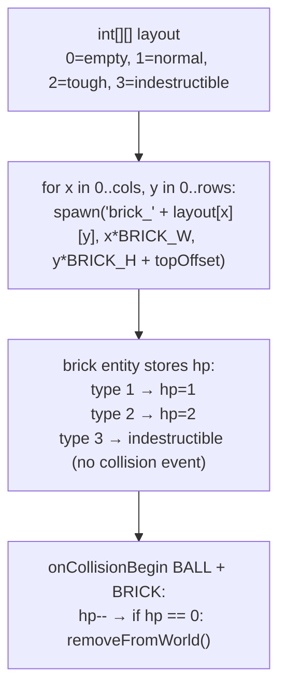
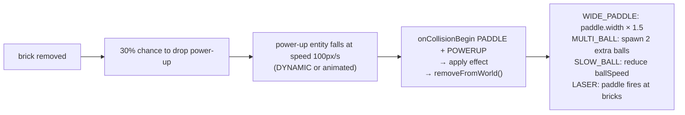
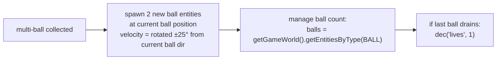

# Game Type — Breakout / Arkanoid

Covers ball-and-paddle games. Player controls a paddle, ball bounces off bricks, bricks destroyed on contact, power-ups fall from bricks, multi-ball, shrink/grow paddle.

## Actors and Primary Use Cases

## Physics Configuration

## Angle Control from Paddle

## Brick Grid

## Power-Up System

## Multi-Ball

