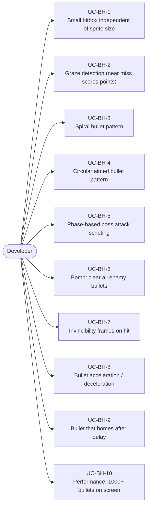
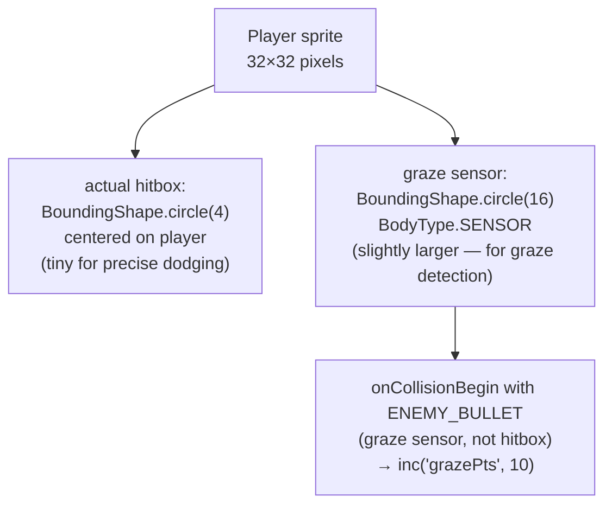
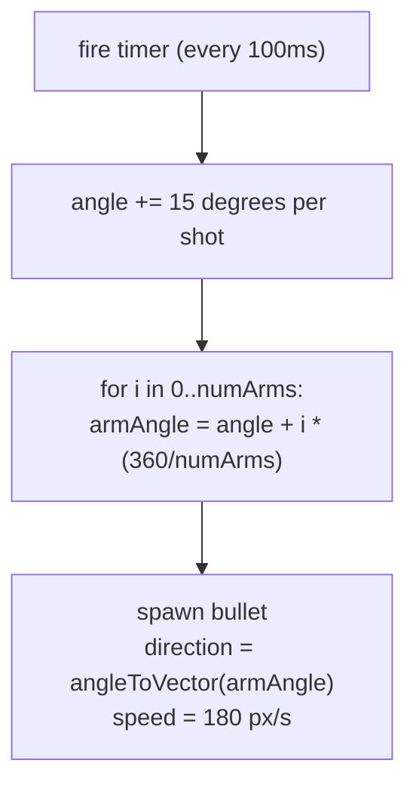
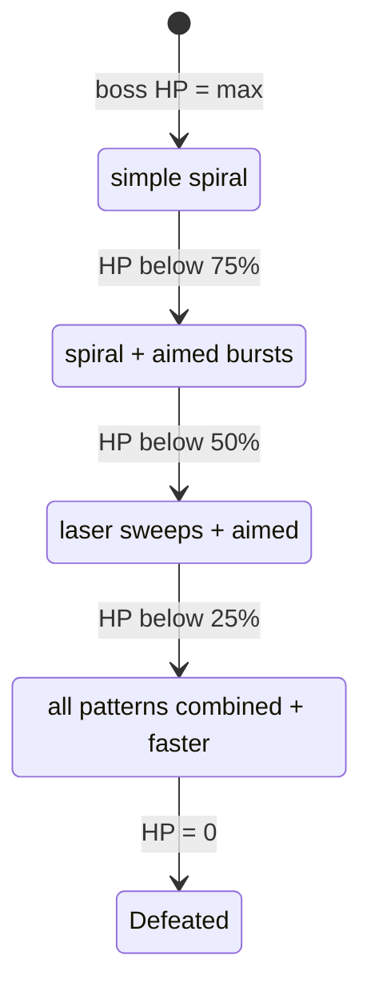
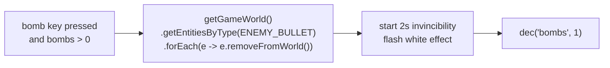
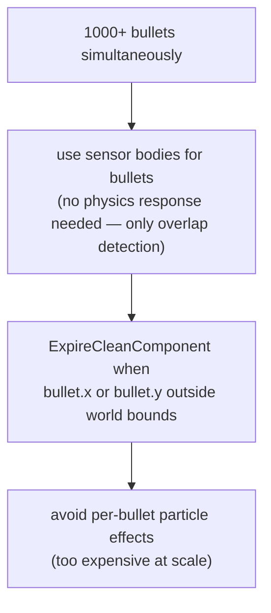

# Game Type — Bullet Hell (Danmaku)

Covers dense-pattern shooters where the screen fills with enemy bullets the player must weave through. Hitbox is much smaller than sprite. Graze mechanic, bomb screen-clear.

## Actors and Primary Use Cases

## Hitbox vs Sprite

## Spiral Pattern

## Boss Phase Script

## Bomb Screen Clear

## Performance Pattern

