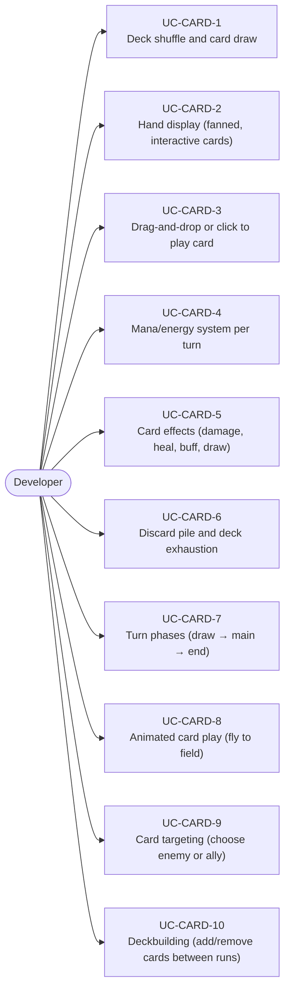
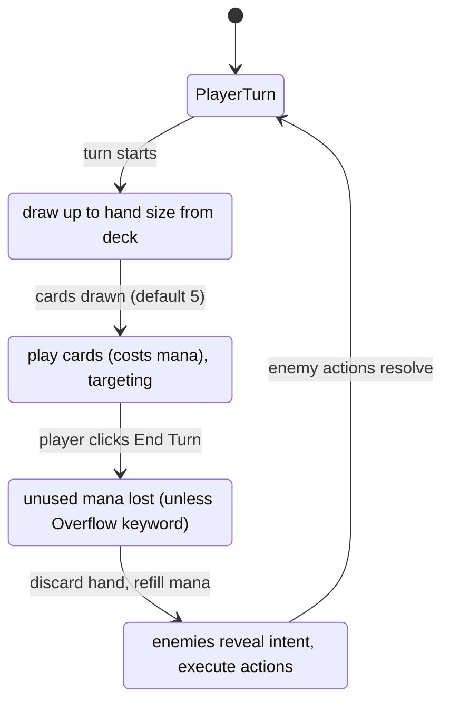
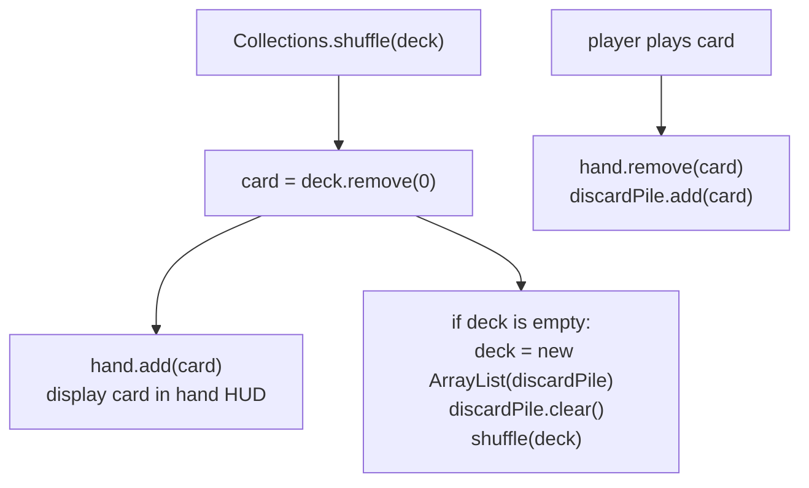
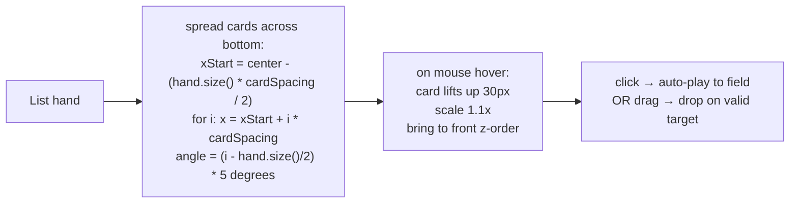
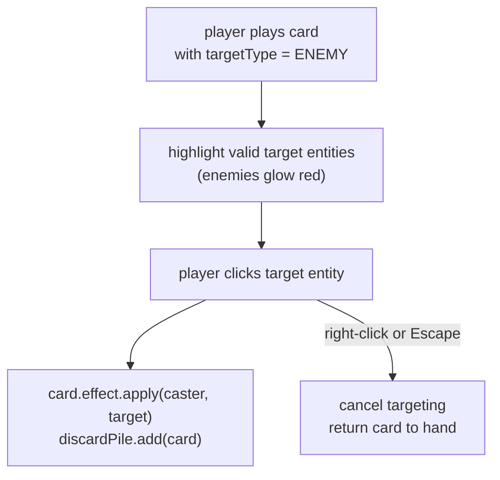
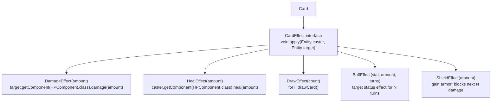

# Game Type — Card Game / Deckbuilder

Covers card-based games (Slay the Spire, Hearthstone style). Deck management, hand display, drag-to-play, mana economy, turn structure, card effects.

## Actors and Primary Use Cases

## Turn Structure State Machine

## Deck and Hand

## Hand Display (Fan Layout)

## Card Targeting

## Card Effects Pattern

