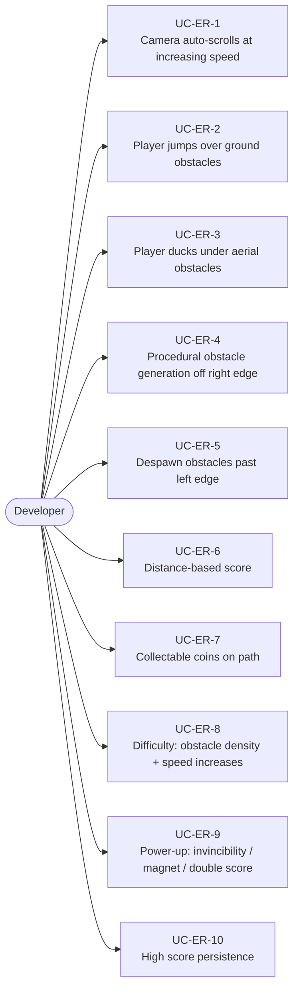
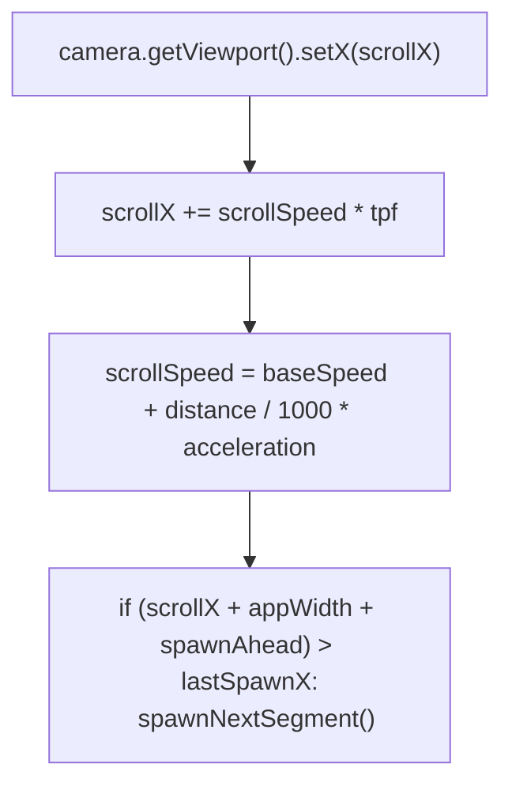
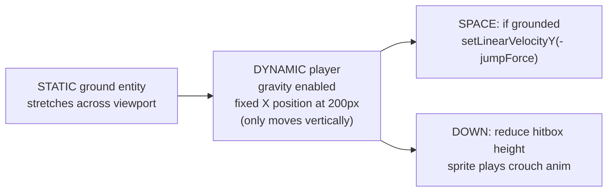
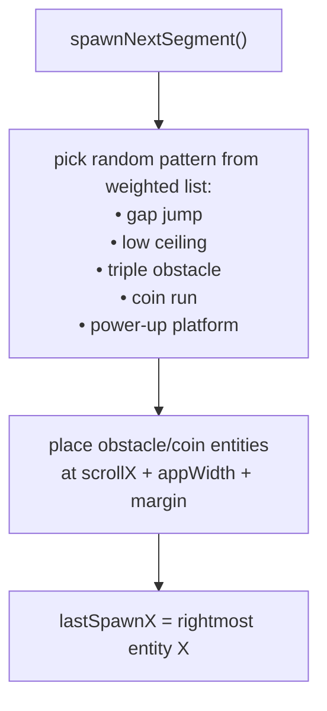
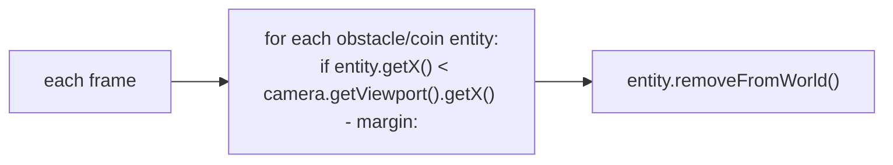
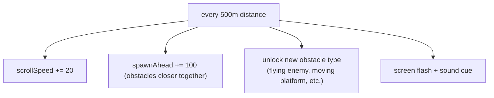
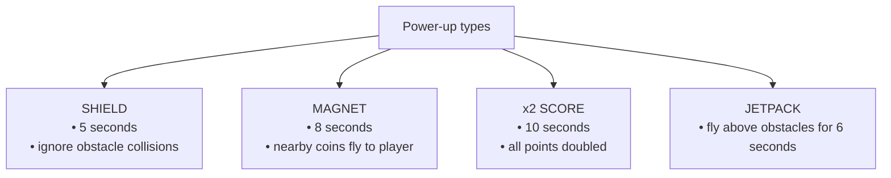

# Game Type — Endless Runner

Covers auto-scrolling games (Temple Run 2D, Jetpack Joyride style). Camera moves automatically, player reacts to procedurally generated obstacles, difficulty scales with distance.

## Actors and Primary Use Cases

## Auto-Scroll Architecture

## Ground and Player

## Procedural Generation

## Obstacle Despawning

## Difficulty Curve

## Power-Up System

