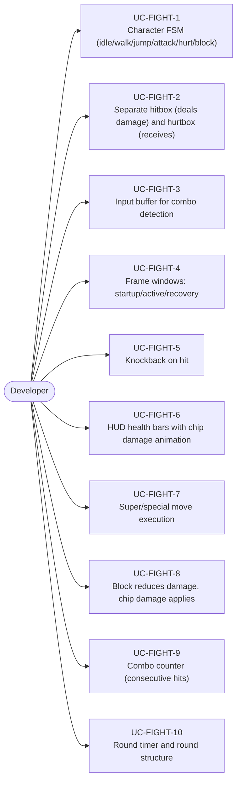
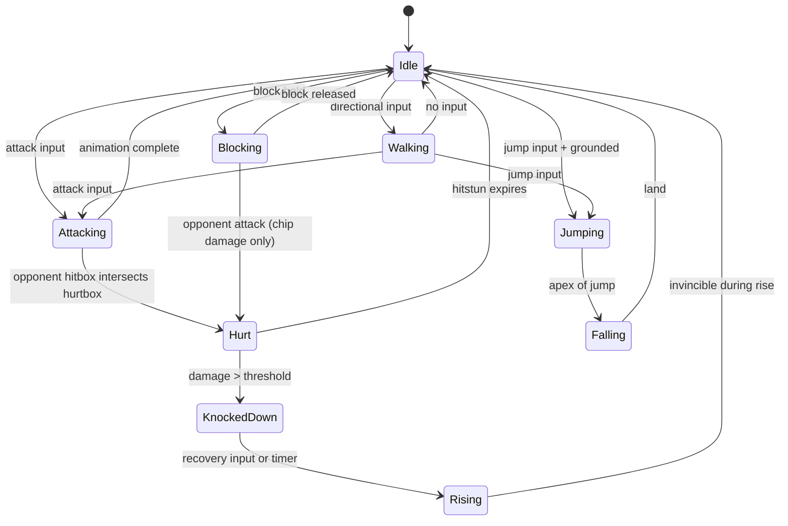
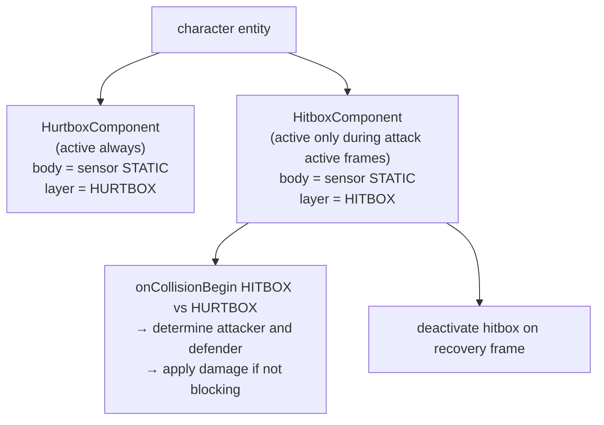
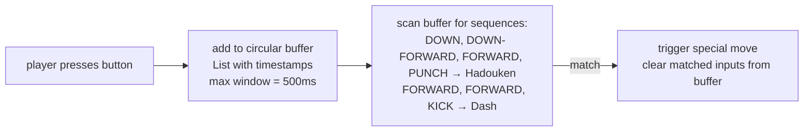
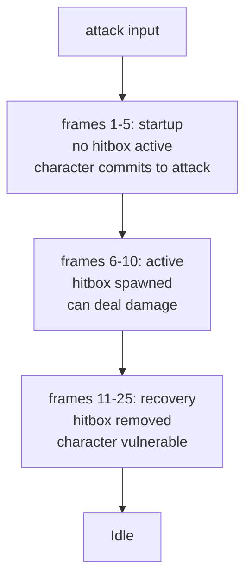
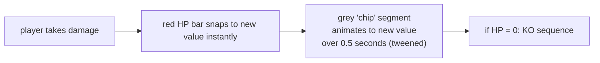

# Game Type — Fighting Game

Covers 1v1 and 2v2 close-combat games. Character state machines, hitbox/hurtbox distinction, combo systems, frame data windows.

## Actors and Primary Use Cases

## Character State Machine

## Hitbox / Hurtbox Architecture

## Input Buffer

## Frame Data Pattern

## Health Bar Animation

