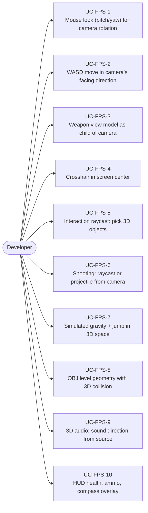
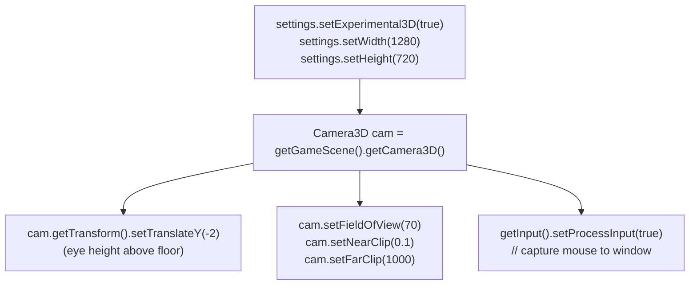
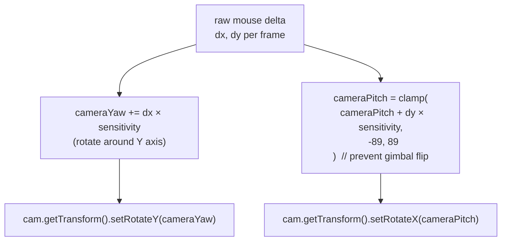
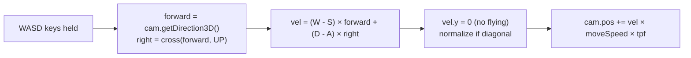
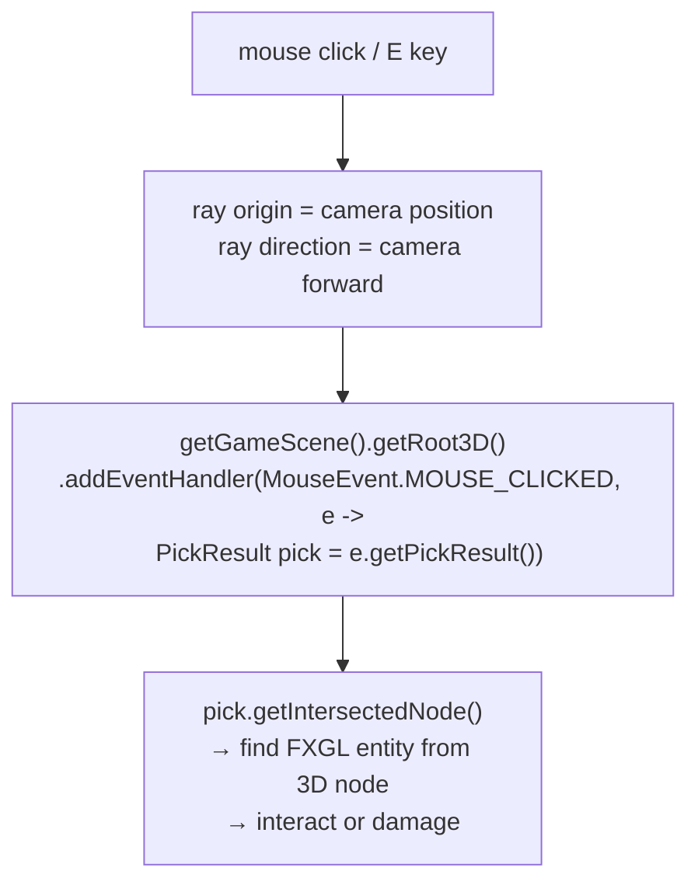
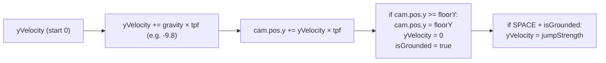
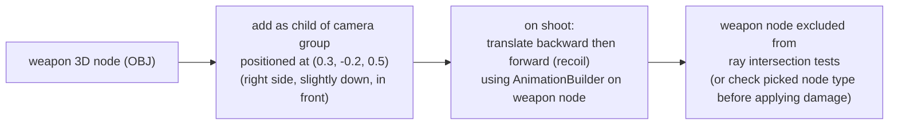

# Game Type — First-Person 3D

Covers first-person exploration, FPS, and first-person puzzle games. Camera IS the player eye, WASD movement in 3D, mouse look, weapon view model, interaction raycasting.

## Actors and Primary Use Cases

## Camera Setup

## Mouse Look

## WASD Movement in 3D

## Interaction / Shooting Raycast

## Simulated Gravity

## Weapon View Model

