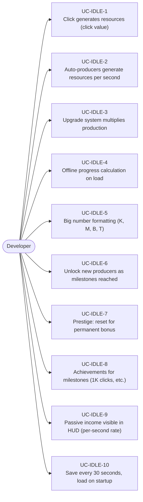
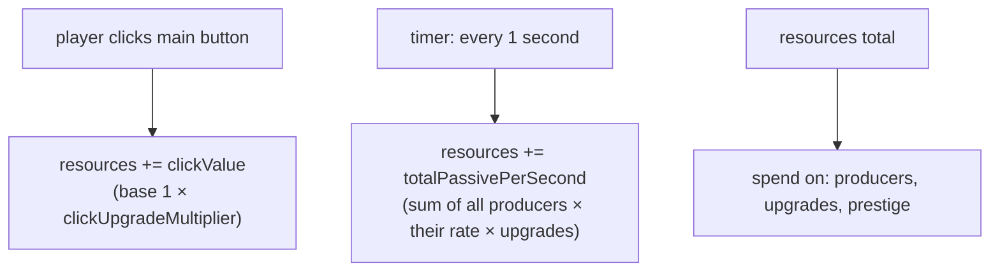
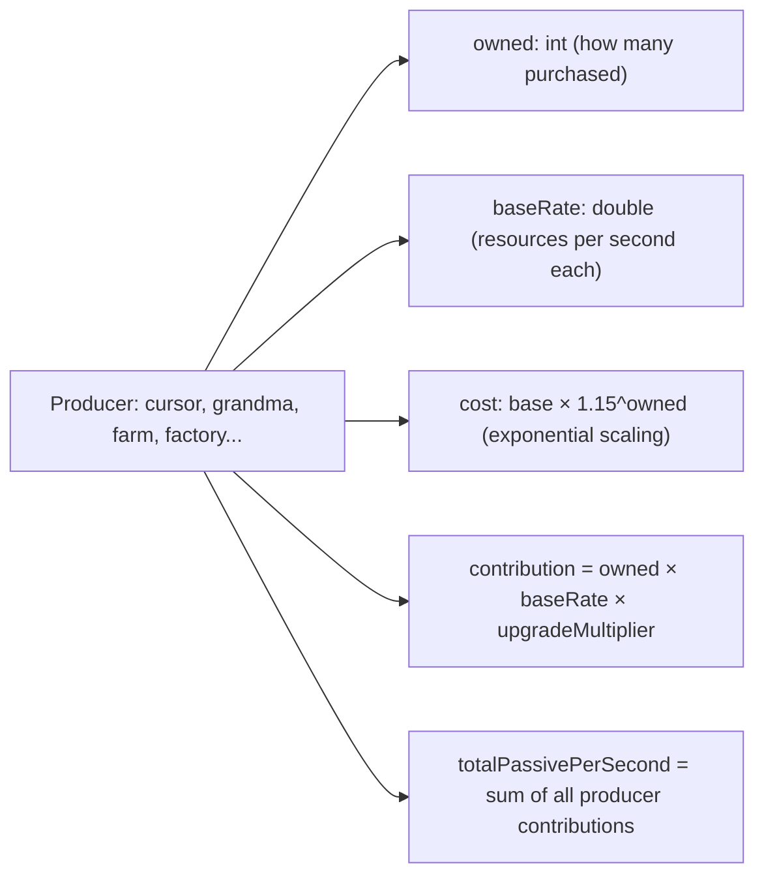
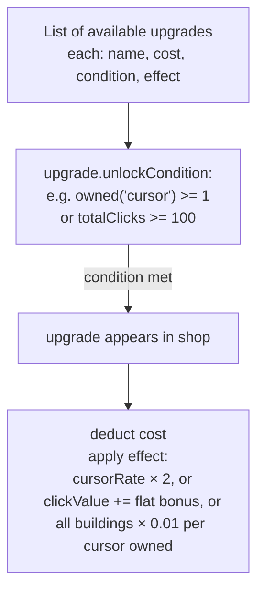
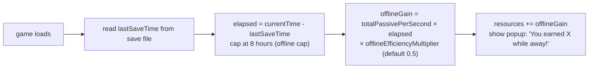
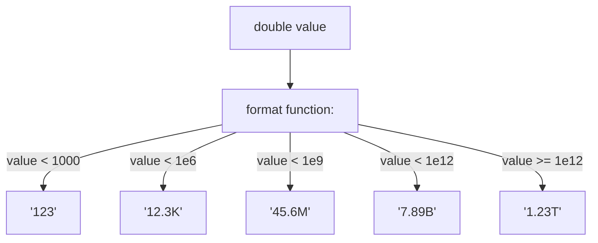
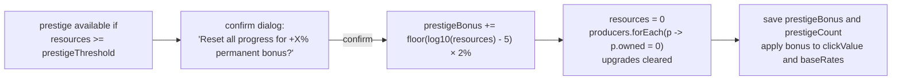

# Game Type — Idle / Clicker Game

Covers incremental games (Cookie Clicker, Adventure Capitalist style). Click to generate resources, buy auto-producers, unlock upgrades, offline progress, prestige reset.

## Actors and Primary Use Cases

## Core Production Loop

## Producer System

## Upgrade System

## Offline Progress

## Big Number Formatting

## Prestige System

