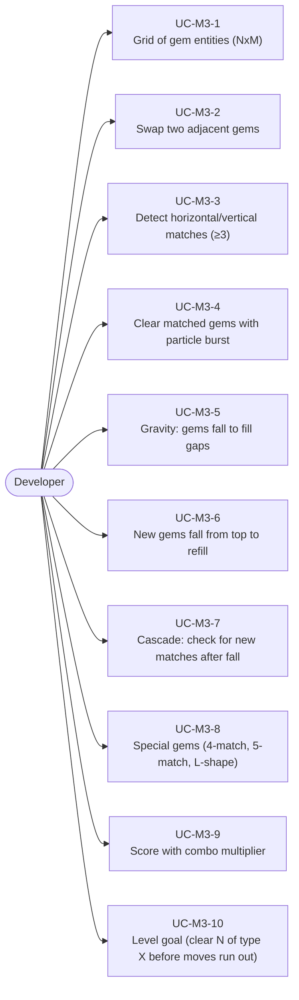
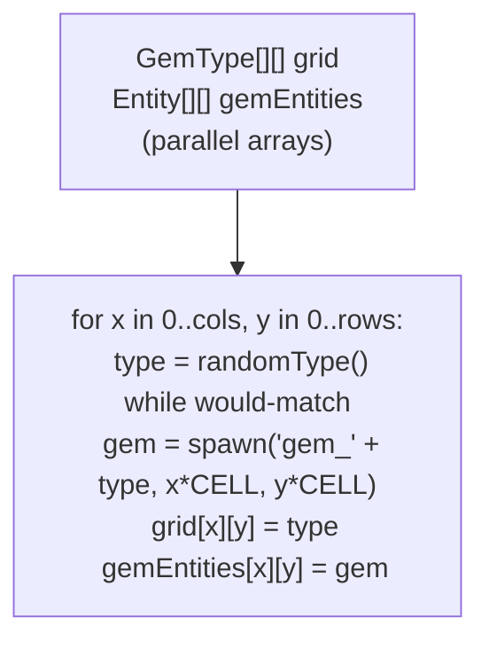
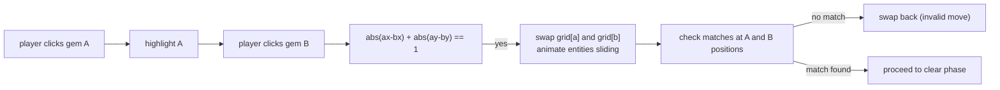
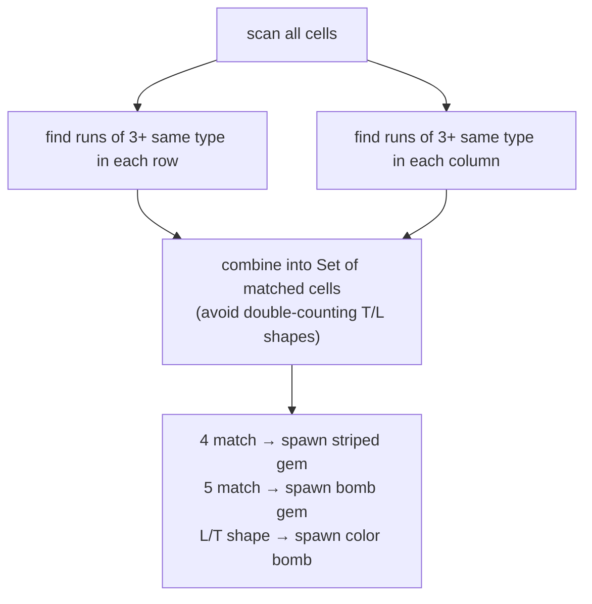
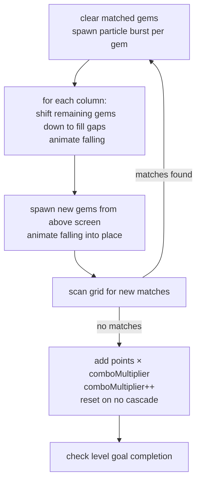
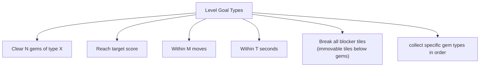

# Game Type — Match-3 / Puzzle Grid

Covers Candy Crush-style grid games. Swap gems, detect 3-in-a-row, cascade after clear, special gems from 4+ matches, score multipliers.

## Actors and Primary Use Cases

## Grid Data Structure

## Swap Logic

## Match Detection

## Cascade Loop

## Level Goal Types

