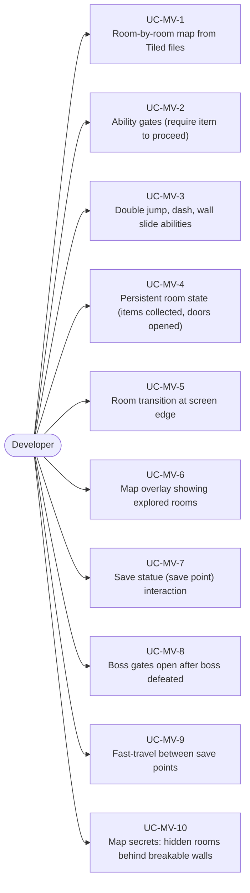
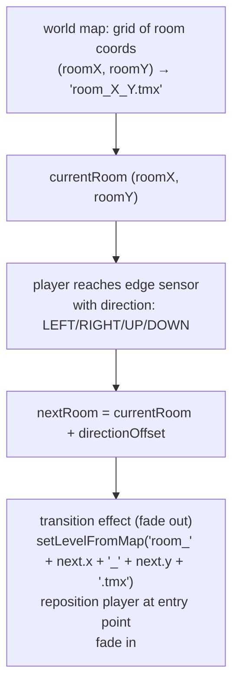
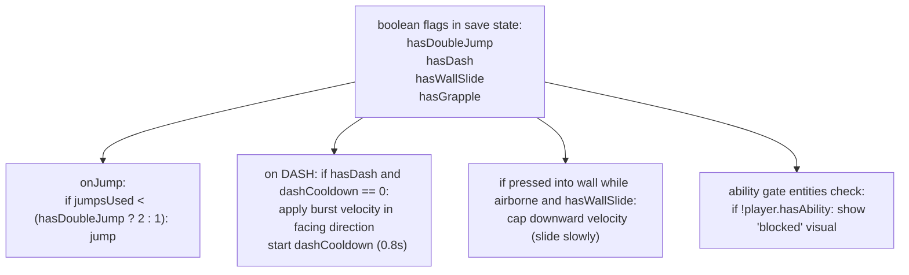
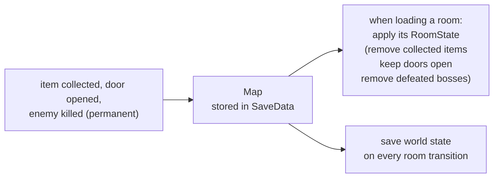
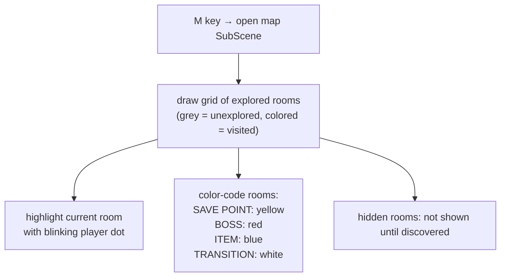
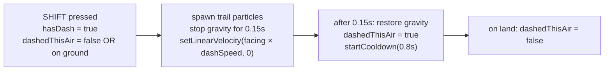

# Game Type — Metroidvania

Covers non-linear platformers with interconnected rooms, ability-gated progression (double jump, dash, wall slide), persistent map exploration, and backtracking.

## Actors and Primary Use Cases

## Room Management

## Ability System

## Persistent Room State

## Map Overlay

## Dash Ability Implementation

