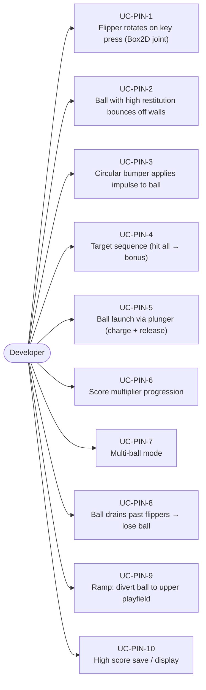
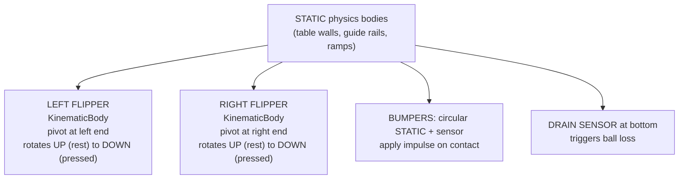
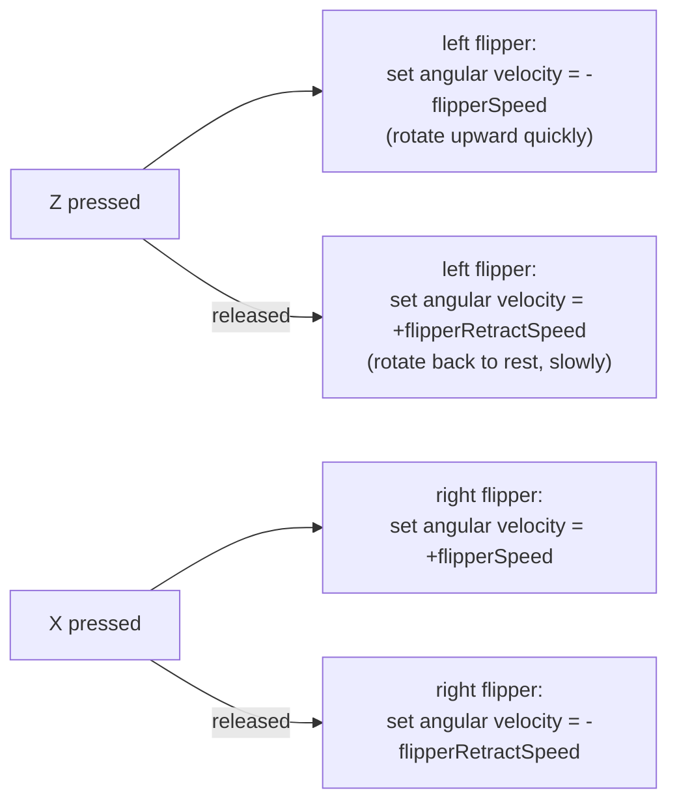
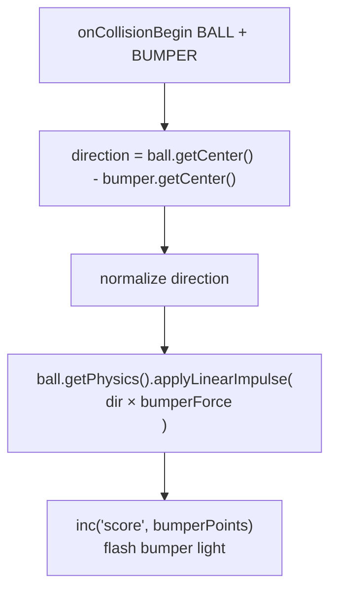
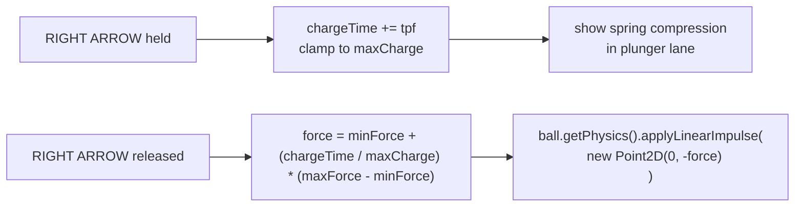
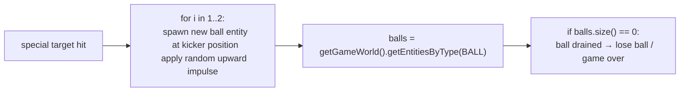

# Game Type — Pinball

Covers physics-based pinball with flippers, bumpers, ramps, targets, multi-ball, and score multipliers.

## Actors and Primary Use Cases

## Table Layout

## Flipper Mechanics

## Bumper Impulse

## Plunger Launch

## Multi-Ball

