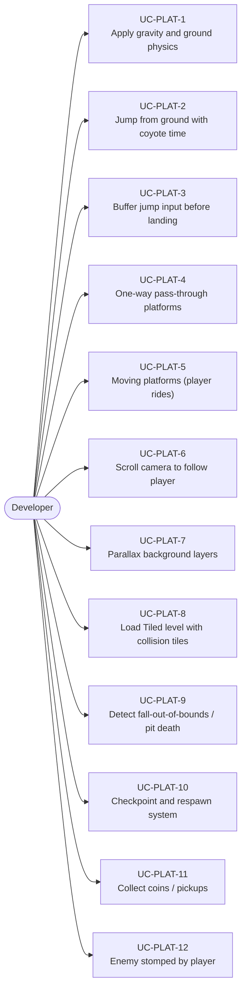
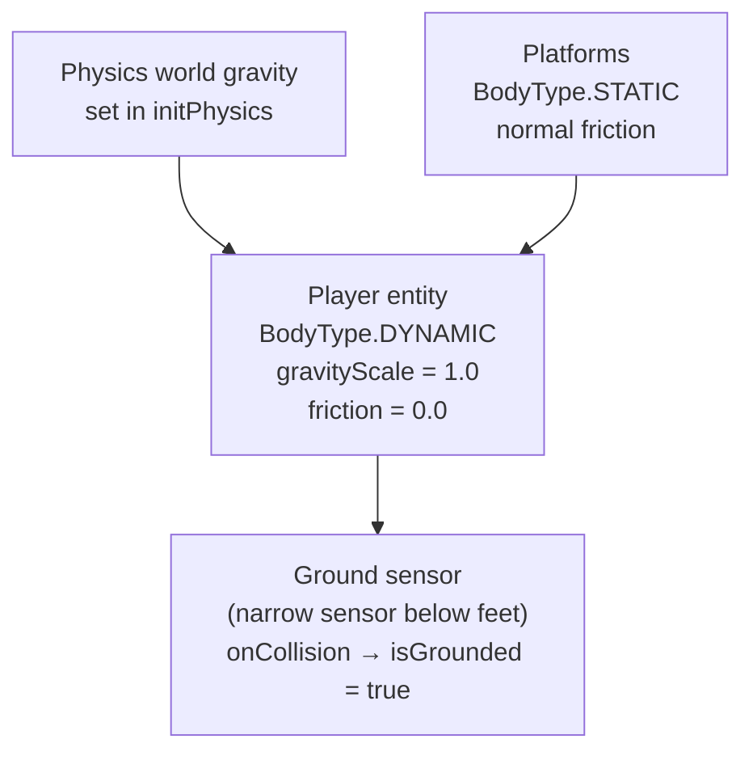
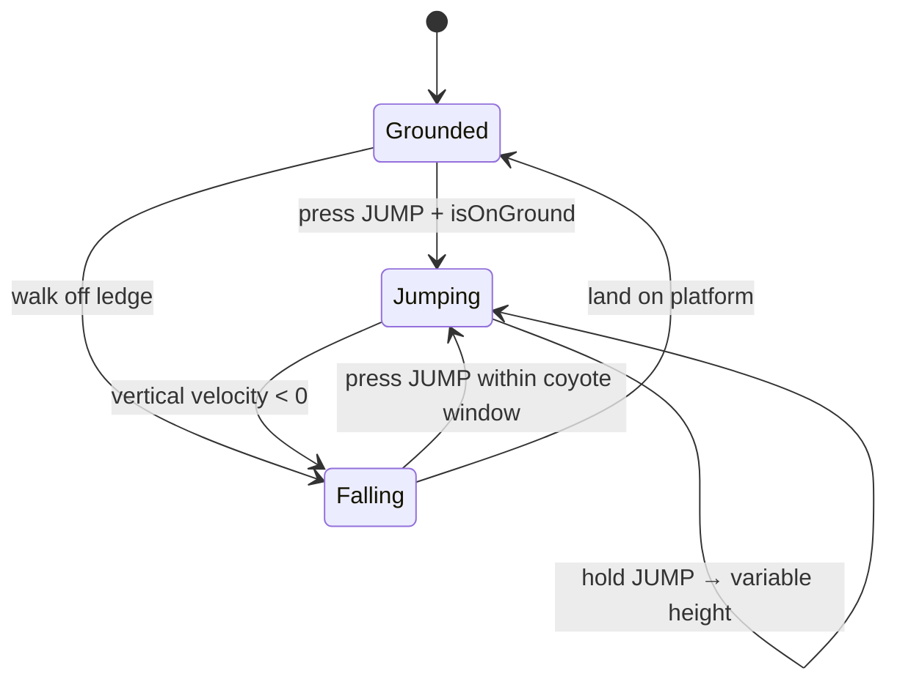
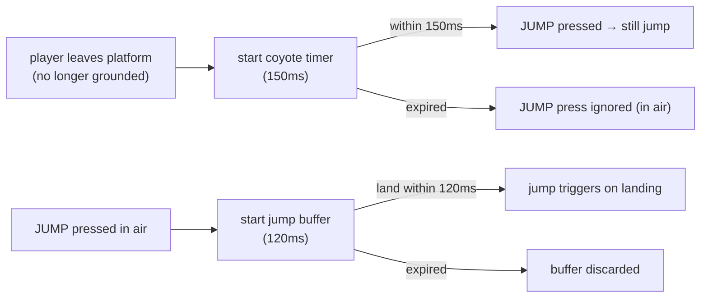
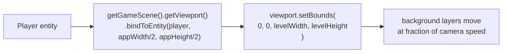
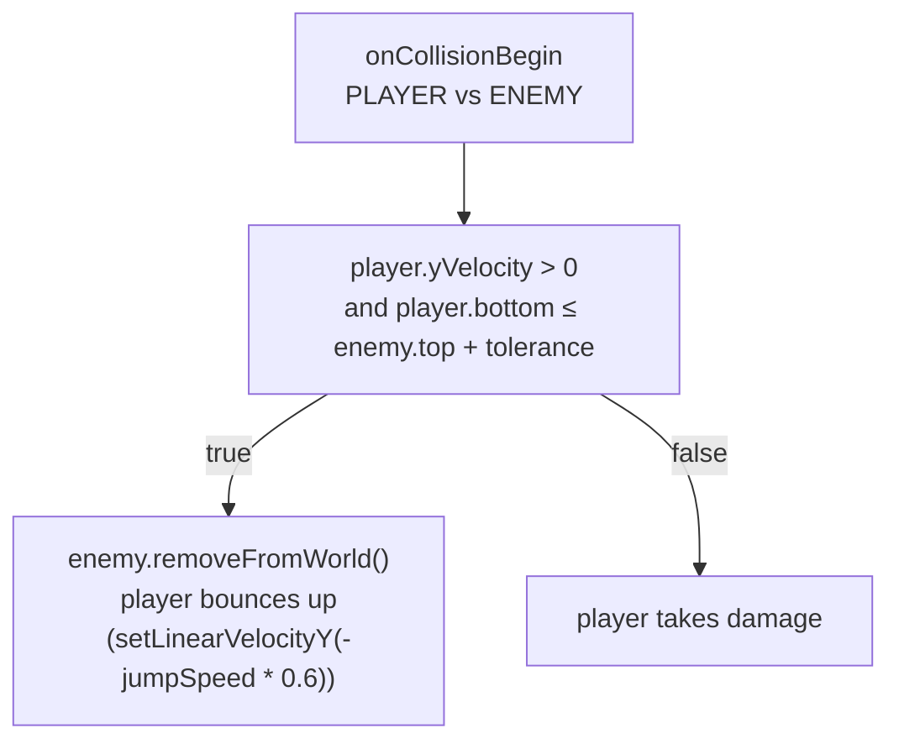

# Game Type — Side-Scroller Platformer

Covers Mario-style, precision platformer, and run-and-jump games. Character moves left/right, jumps on platforms, navigates vertically structured levels.

## Actors and Primary Use Cases

## Core Physics Setup

## Jump State Machine

## Coyote Time + Jump Buffer

## Level Scroll Pattern

## Enemy Stomp Pattern

