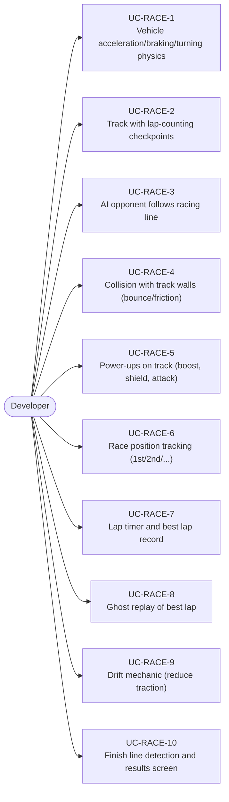
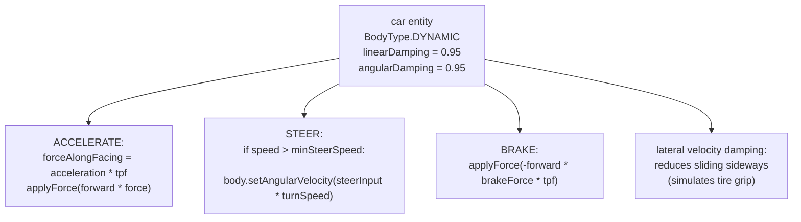
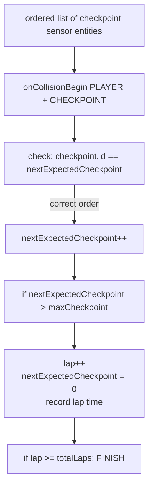
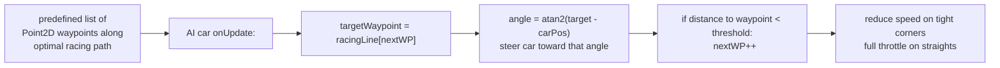
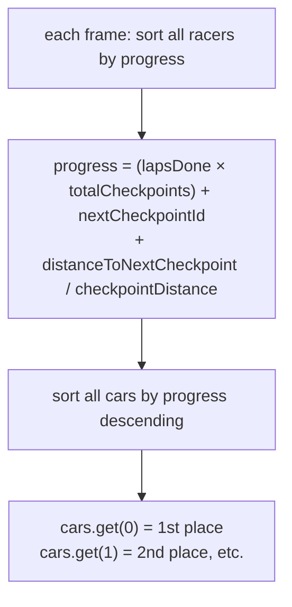
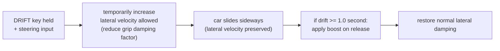

# Game Type — Racing Game

Covers top-down and 3D racing games with circuit tracks, lap counting, vehicle physics, AI opponents, and checkpoint systems.

## Actors and Primary Use Cases

## Vehicle Physics

## Checkpoint Lap System

## AI Racing Line

## Race Position Tracking

## Drift Mechanic

