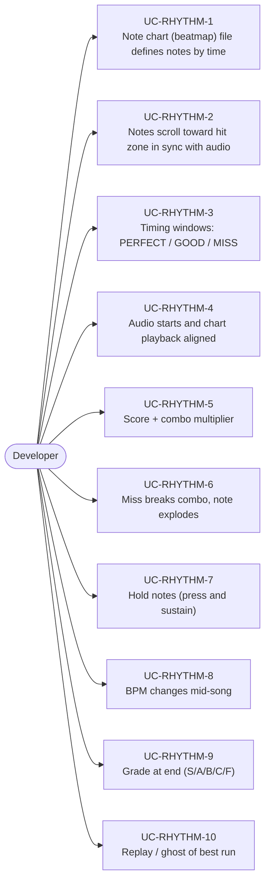
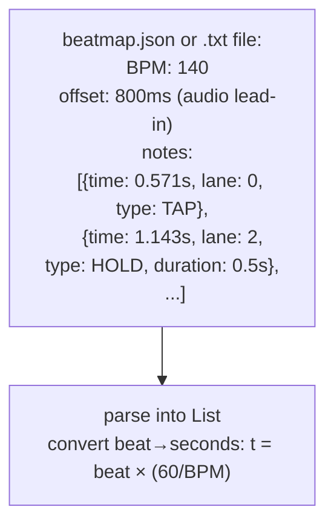
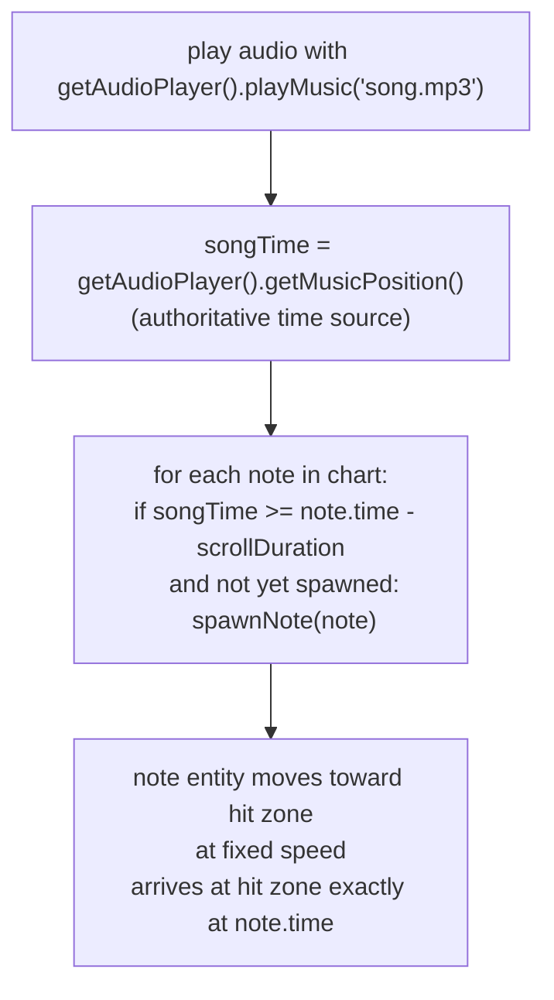
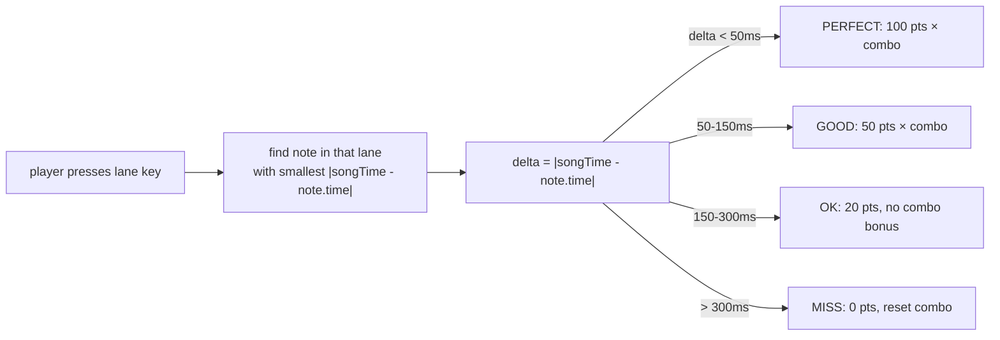
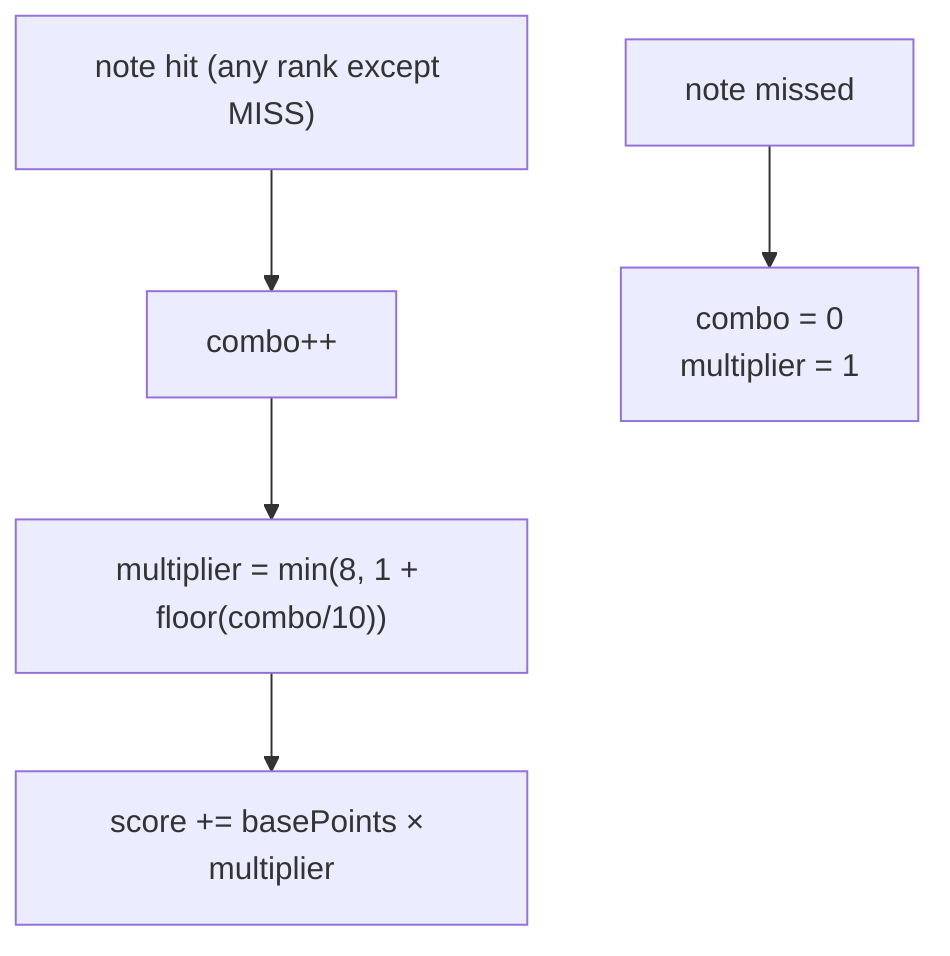
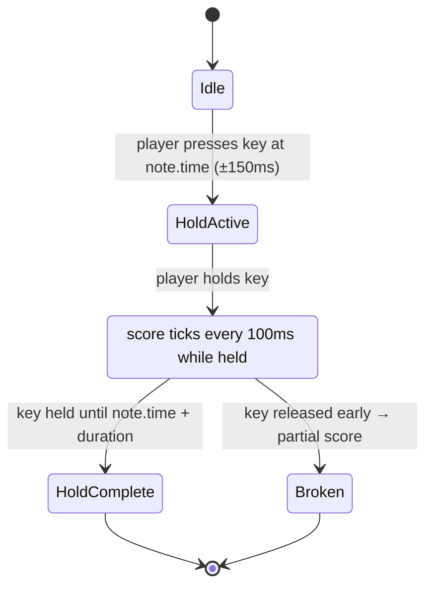
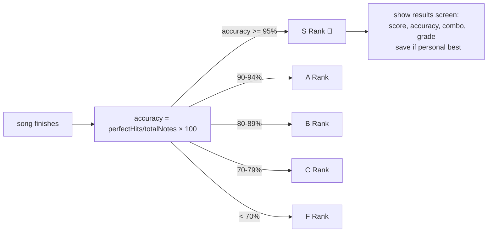

# Game Type — Rhythm Game

Covers music-based games (Guitar Hero, osu!, DDR style). Notes fall or appear in sync with audio, player times inputs, scoring by accuracy window.

## Actors and Primary Use Cases

## Note Chart Format

## Playback Synchronization

## Timing Windows

## Combo and Score

## Hold Note

## End-of-Song Grade

