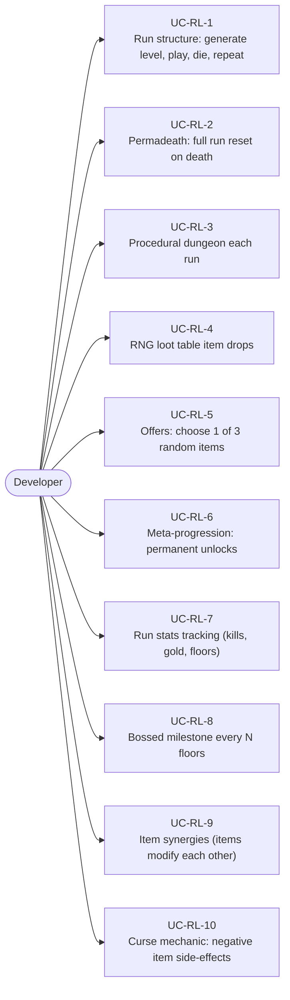
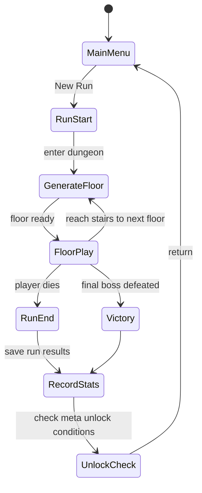
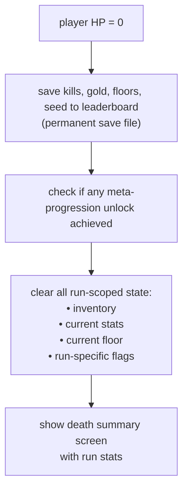
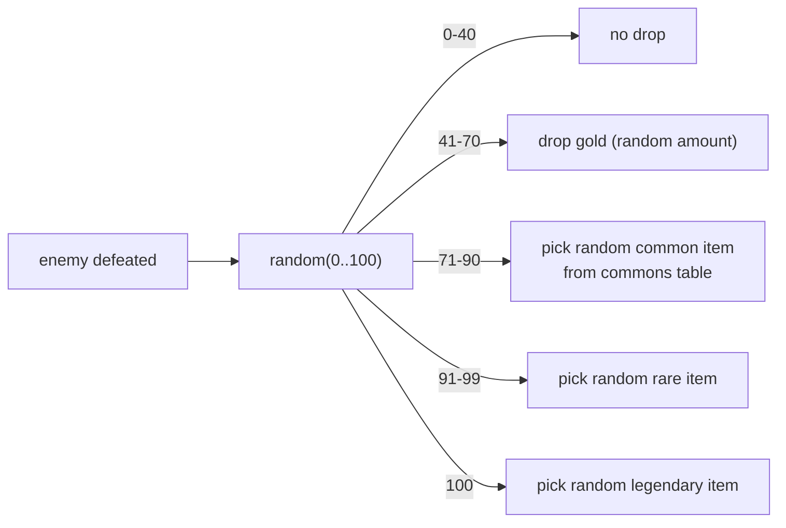
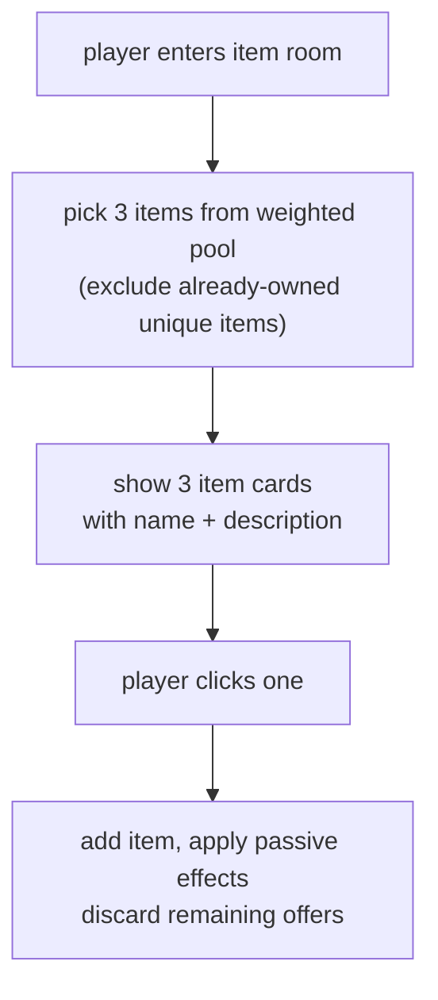
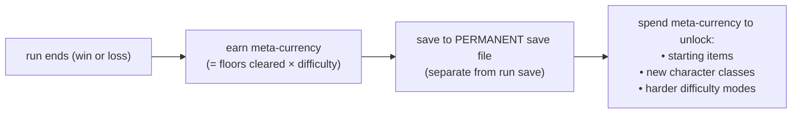

# Game Type — Roguelike / Roguelite

Covers run-based games with procedural generation, permadeath, and meta-progression. Each run is unique; death resets the run but some permanent unlocks persist.

## Actors and Primary Use Cases

## Run Lifecycle

## Permadeath State Reset

## RNG Loot Table

## Item Offer Screen

## Meta-Progression

