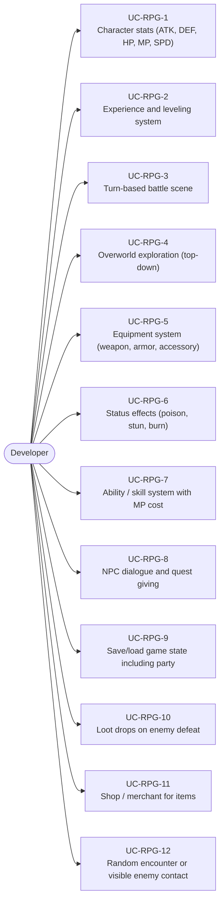
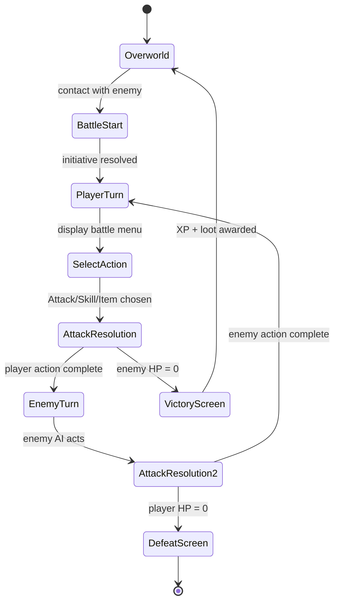
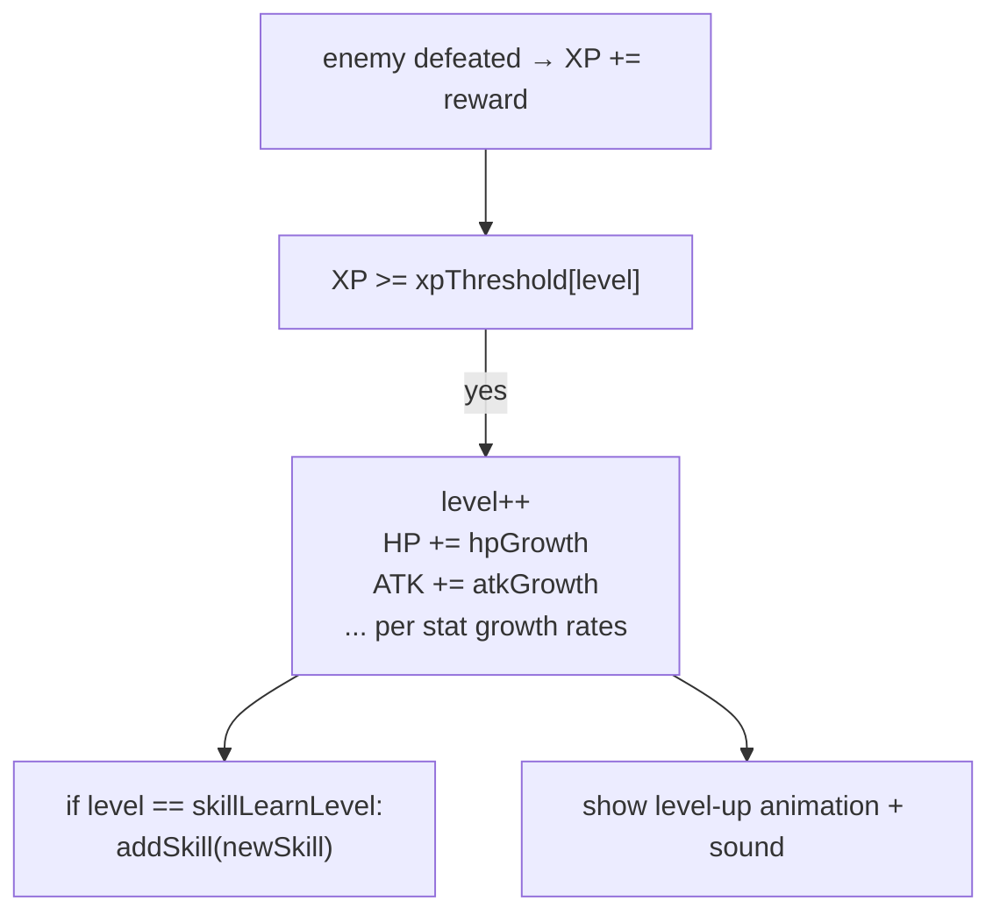
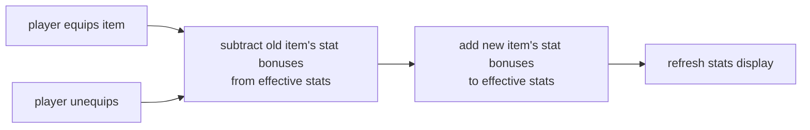
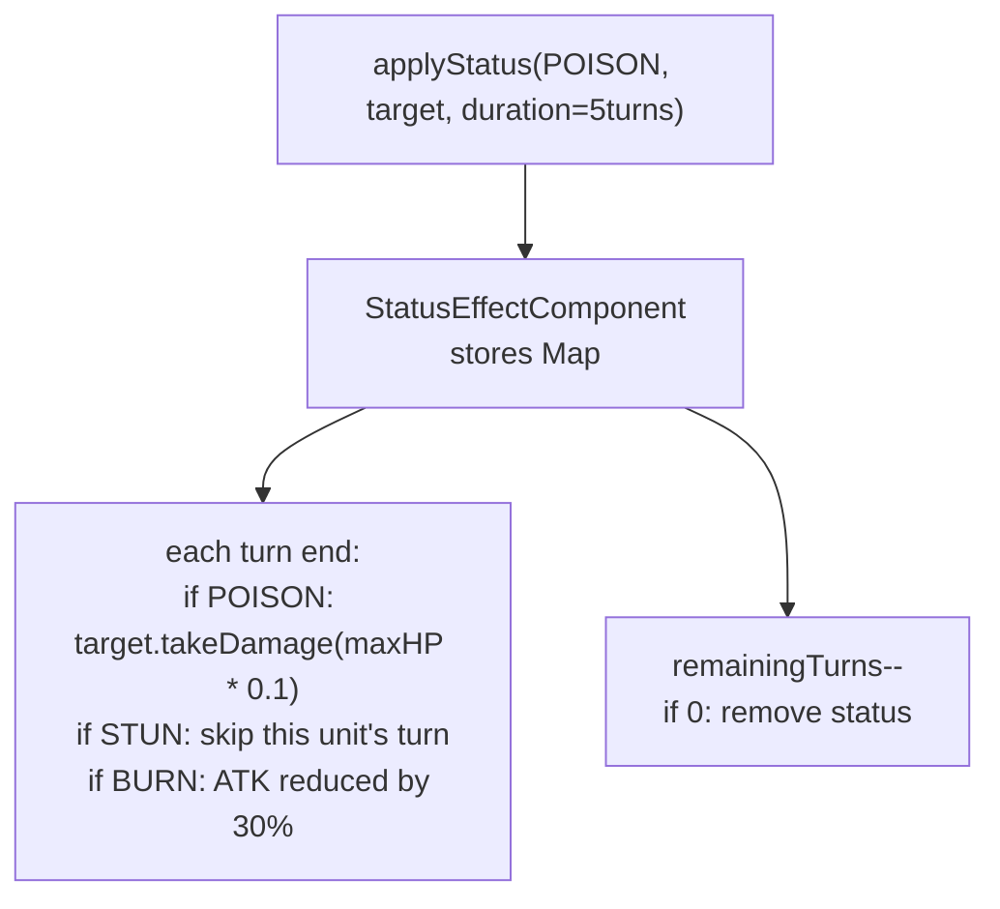
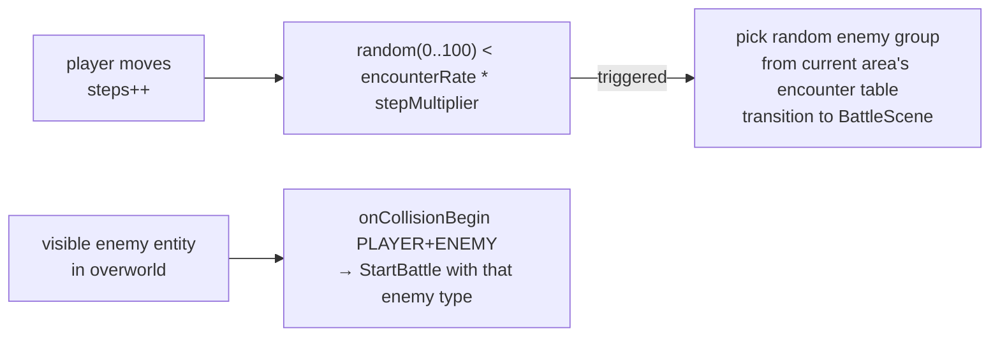

# Game Type — RPG / JRPG

Covers role-playing games with stats, combat encounters, overworld exploration, NPCs, equipment, and level progression.

## Actors and Primary Use Cases

## Battle Scene Flow

## Stats and Leveling

## Equipment Stat Modification

## Status Effect Pattern

## Random Encounter / Contact

