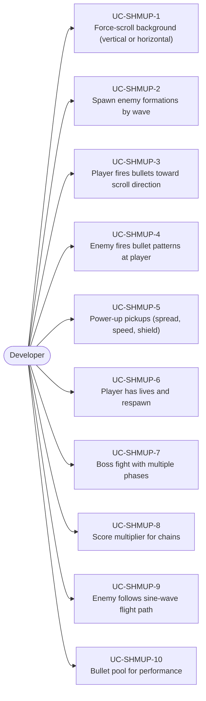
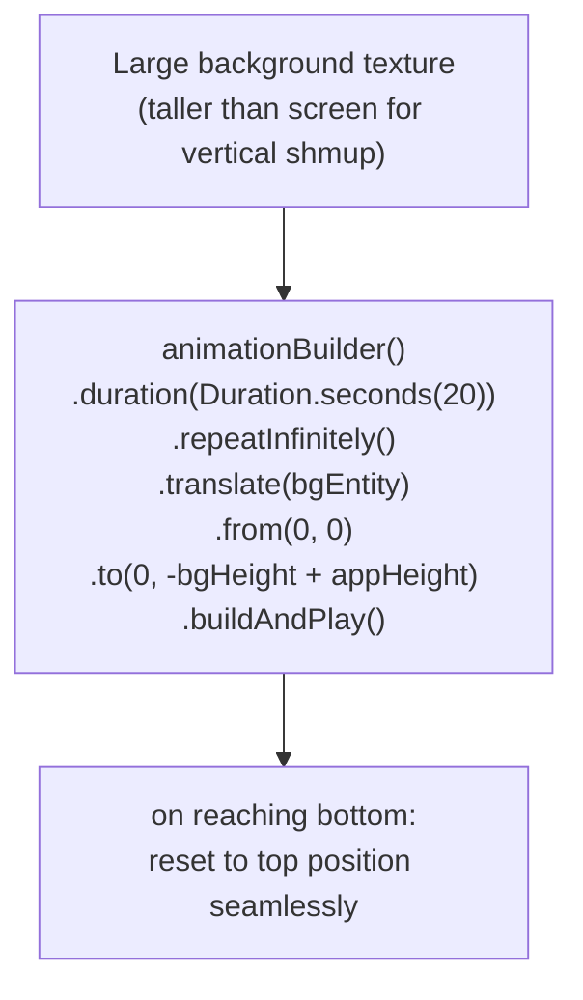
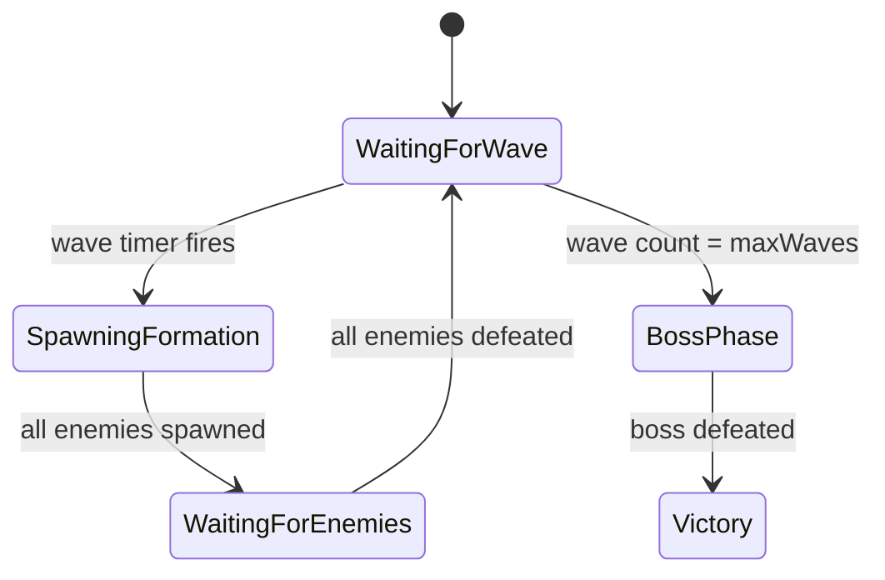
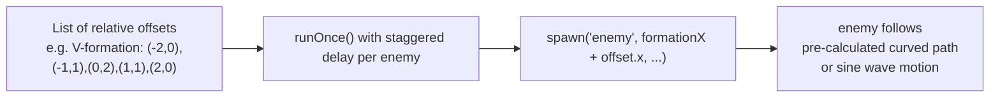
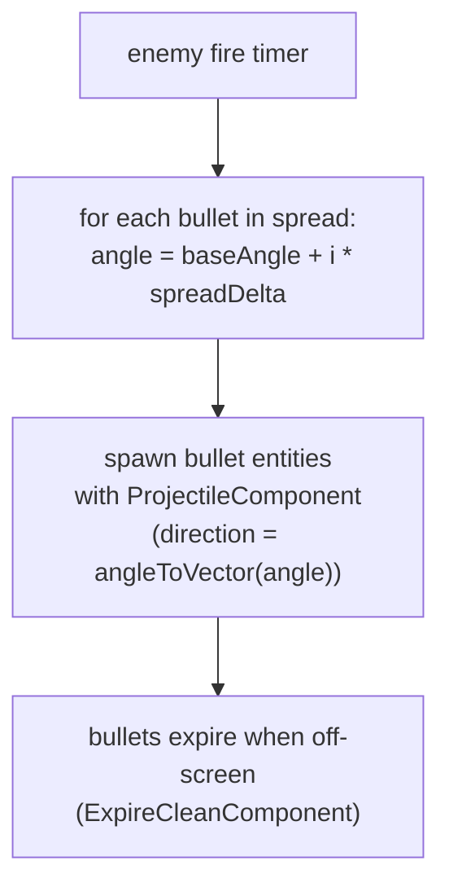
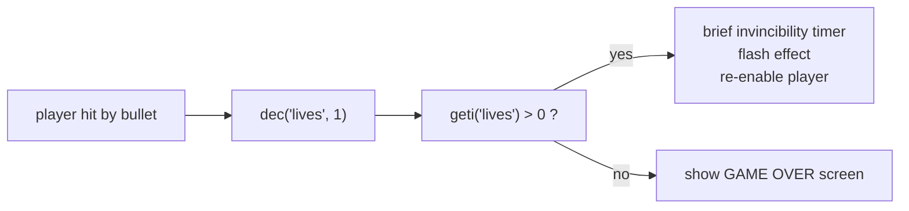

# Game Type — Shoot 'em Up (Shmup)

Covers vertical and horizontal scrolling shooters, space shooters, and forced-scroll shoot 'em ups. Player ship fires at waves of enemies, collects power-ups, manages lives.

## Actors and Primary Use Cases

## World Scroll Pattern

## Wave Spawner State Machine

## Enemy Formation Pattern

## Bullet Pattern (Fan Spread)

## Lives and Respawn

