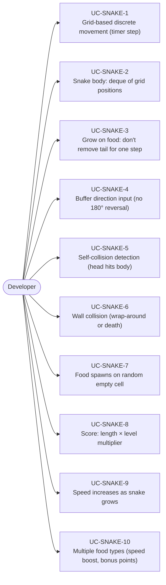
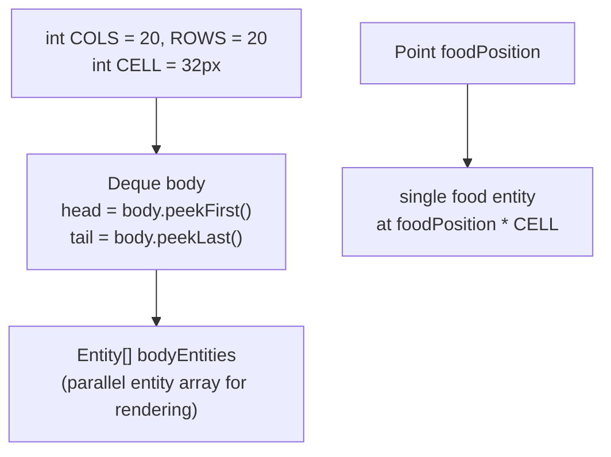
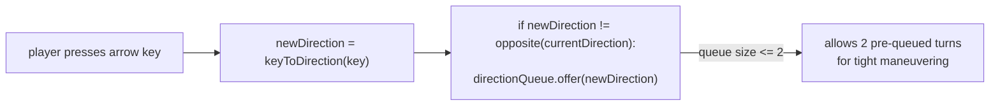
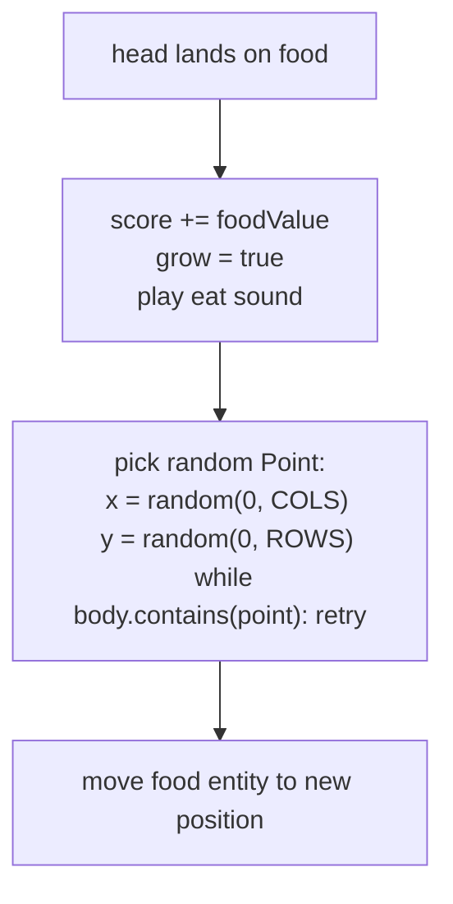
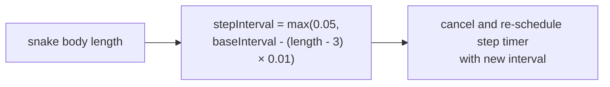
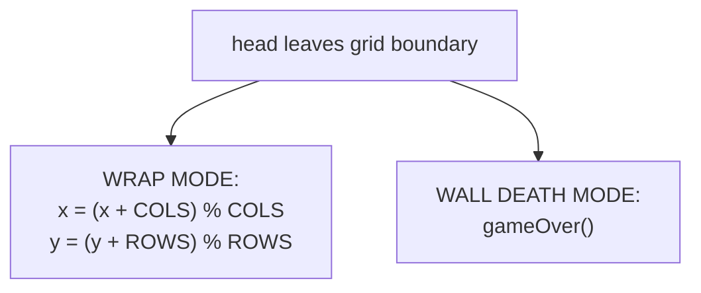

# Game Type — Snake

Covers classic Snake and modern variants. Grid-based discrete movement, snake grows on food, self-collision, wall collision, direction queueing.

## Actors and Primary Use Cases

## Grid and Data Structures

## Step Logic

```mermaid
flowchart LR
    StepTimer["timer fires\nevery stepInterval seconds"] --> ConsumeDir["direction = directionQueue.poll()\n(apply buffered input)"]
    ConsumeDir --> CalcNewHead["newHead = head + direction"]
    CalcNewHead --> CheckWall["if newHead outside grid:\n  gameOver() OR wrap around"]
    CheckWall --> CheckSelf["if body.contains(newHead): gameOver()"]
    CheckSelf --> CheckFood["if newHead == foodPosition: grow = true"]
    CheckFood --> MoveBody["body.addFirst(newHead)\nif grow: grow=false (tail stays)\nelse: body.removeLast()"]
    MoveBody --> UpdateEntities["update entity positions\nto match body positions"]
```

## Direction Buffer

## Food Placement

## Speed Scaling

## Wrap vs Wall Death

