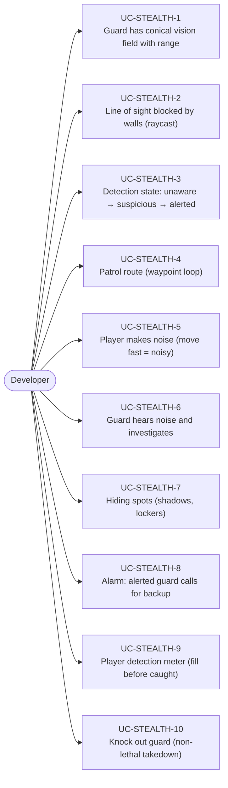
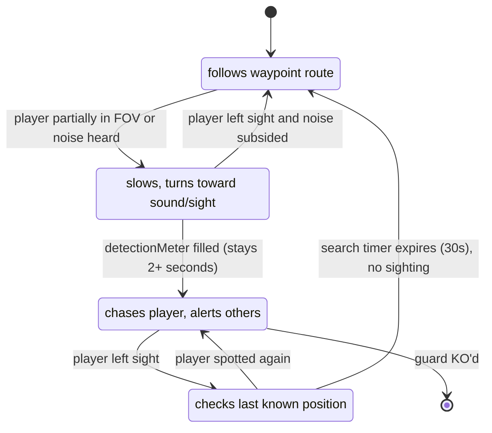
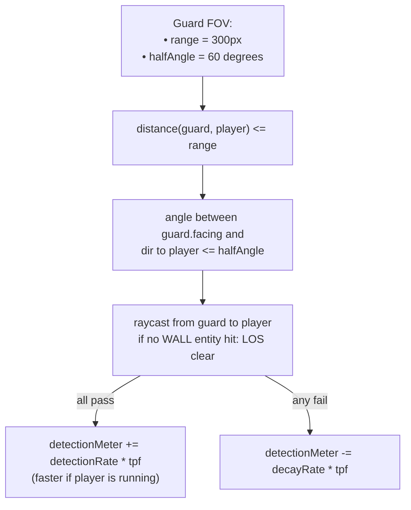
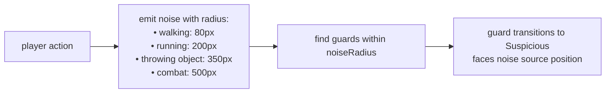
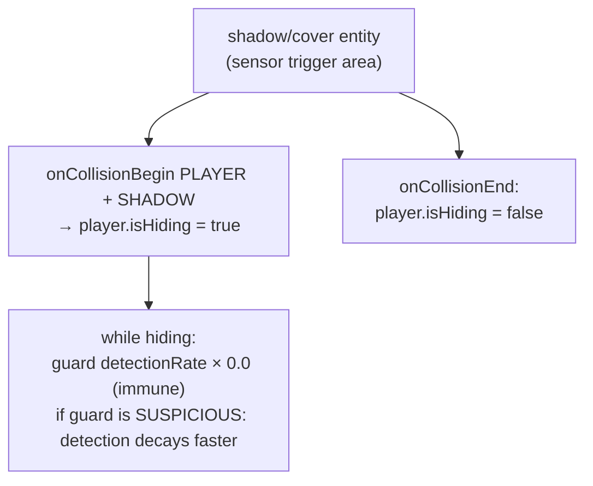
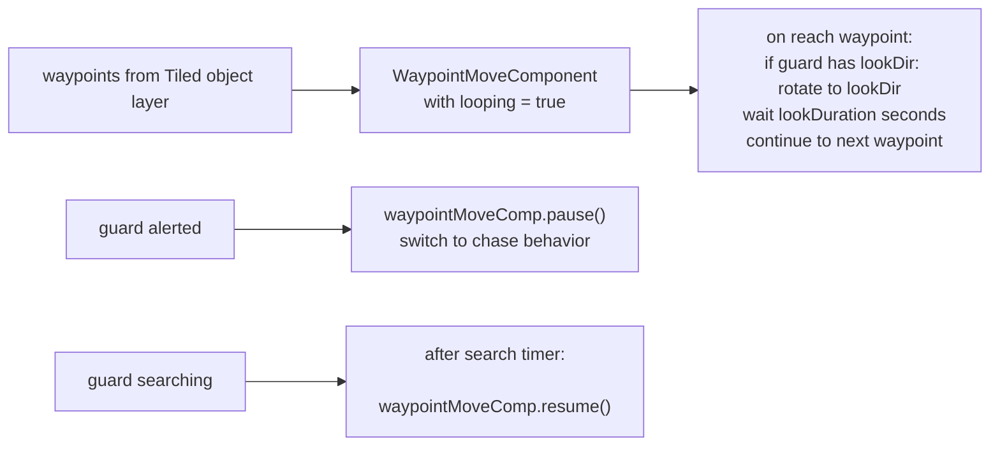

# Game Type — Stealth Game

Covers games where players must avoid detection by guards. Line-of-sight cones, patrol routes, detection state machines, noise mechanics, cover and shadows.

## Actors and Primary Use Cases

## Guard Detection State Machine

## Vision Cone Detection

## Noise System

## Cover / Hiding Mechanic

## Guard Patrol

