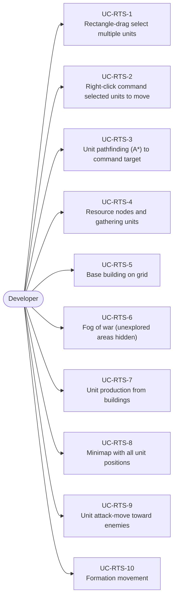
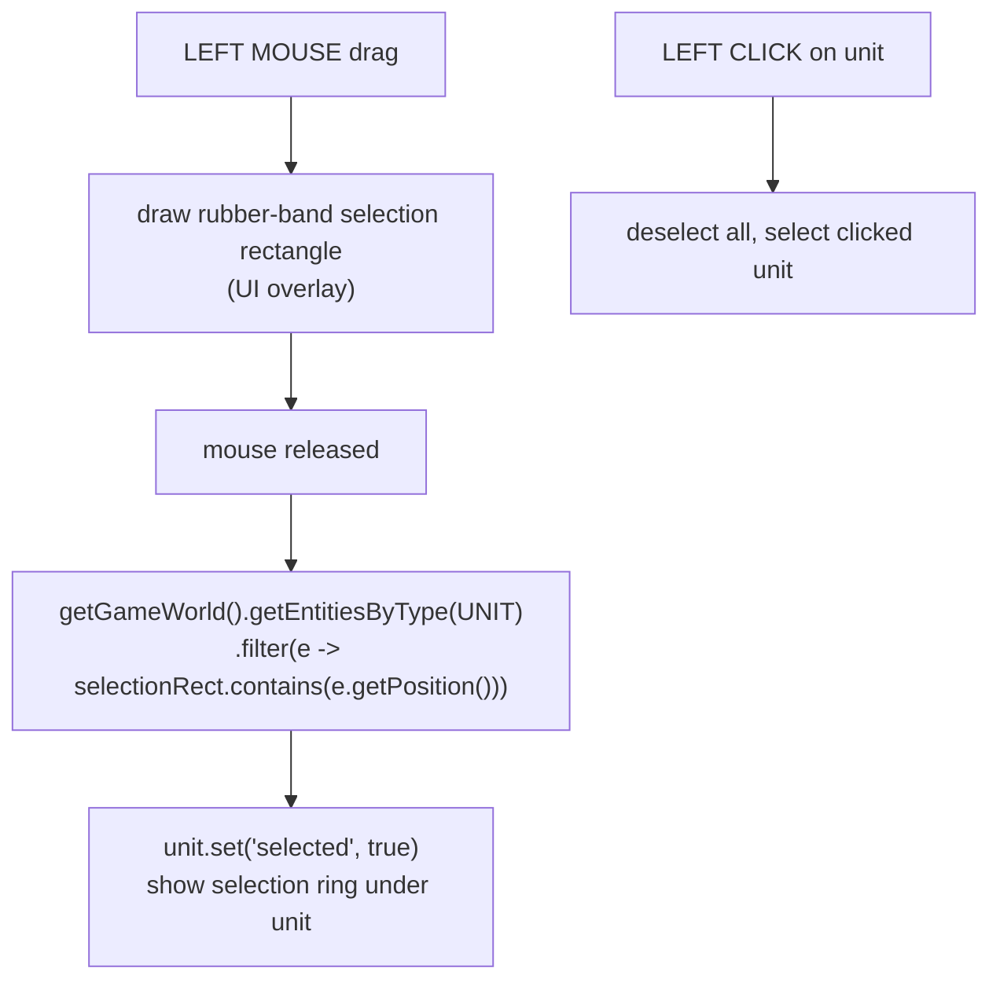
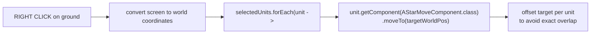
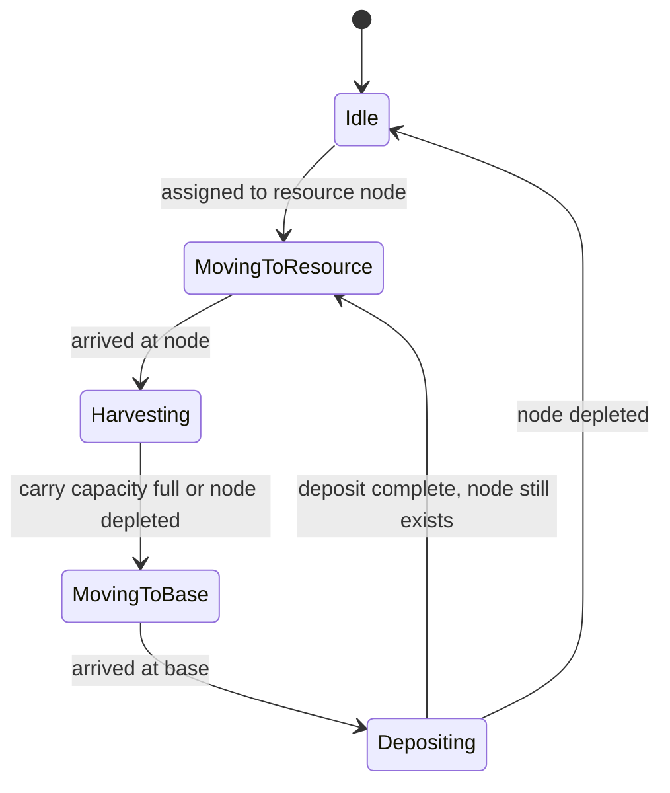
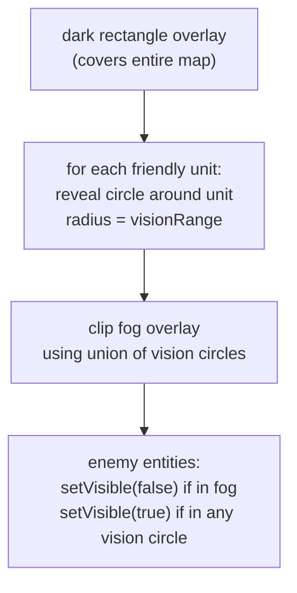
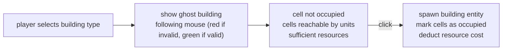

# Game Type — Real-Time Strategy (RTS)

Covers games where the player manages units and resources in real time. Unit selection, movement commands, resource gathering, base building.

## Actors and Primary Use Cases

## Unit Selection

## Move Command

## Resource Gathering Loop

## Fog of War

## Building Placement

