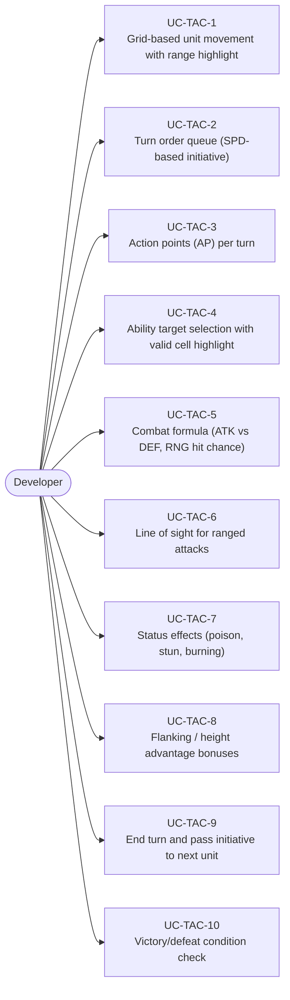
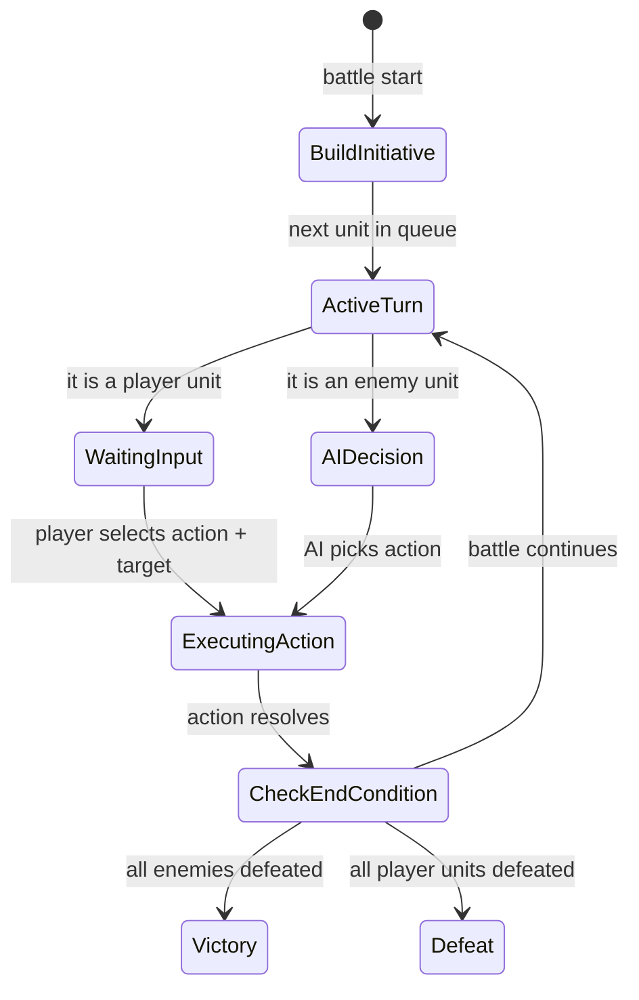
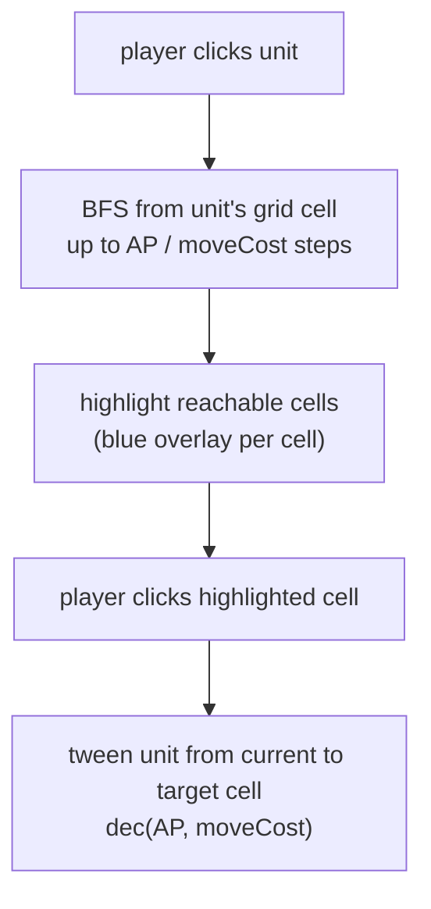
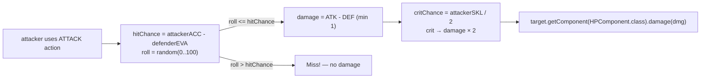
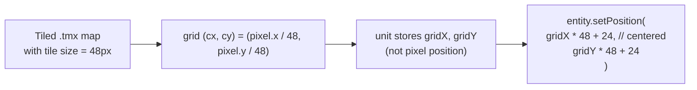

# Game Type — Turn-Based Tactical (Tactics RPG)

Covers grid-based turn-order games like Fire Emblem, XCOM, Chess. Units act on a grid, spend action points, combat is resolved via formulas.

## Actors and Primary Use Cases

## Turn Order State Machine

## Movement Range Highlight

## Combat Resolution

## Grid Coordinate System

