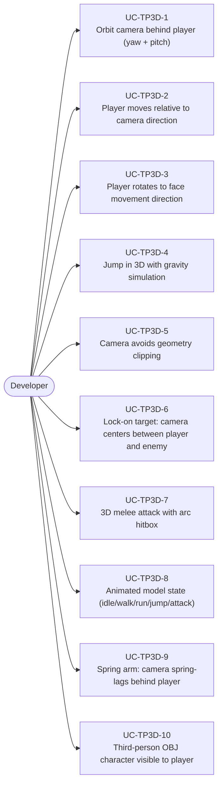
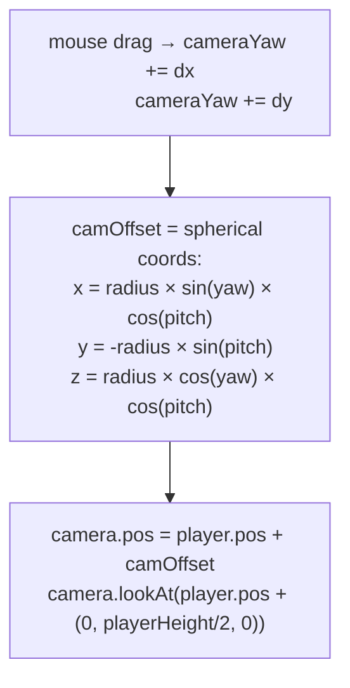
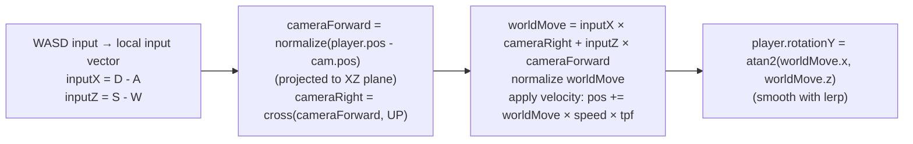
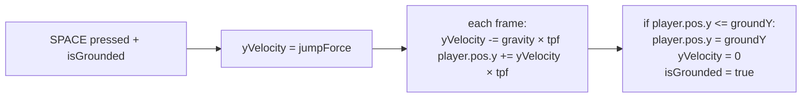
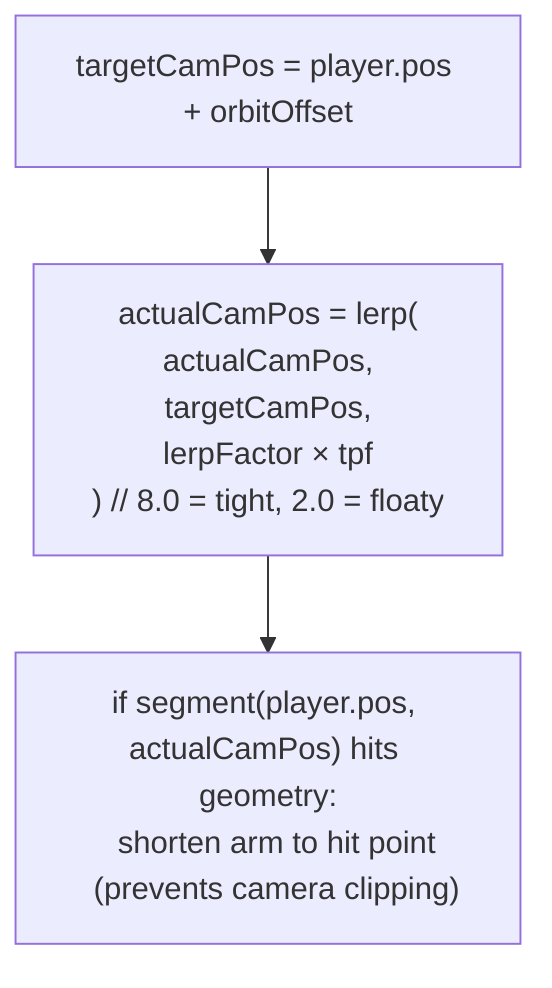
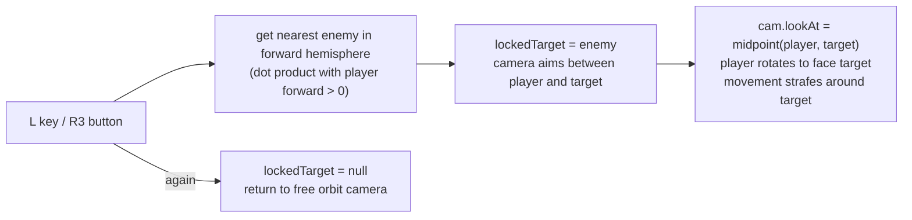
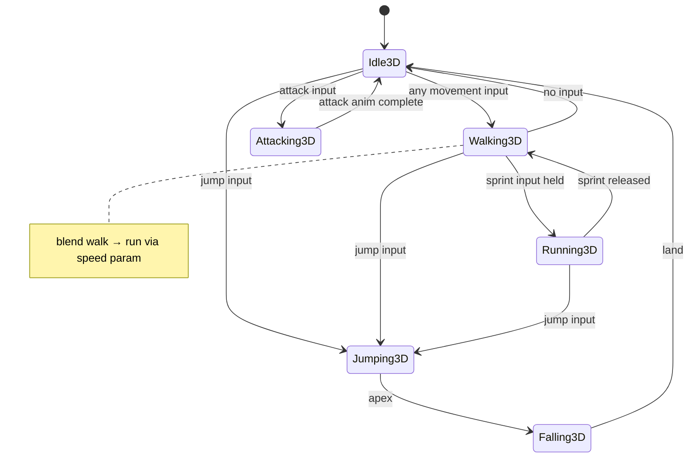

# Game Type — Third-Person 3D

Covers third-person action, adventure, and platformer games in 3D. Camera orbits behind and above the player, character faces movement direction, jump and combat in 3D space.

## Actors and Primary Use Cases

## Orbit Camera

## Player Movement Relative to Camera

## Jump in 3D

## Spring Arm (Camera Lag)

## Lock-On System

## Animated Character Model

