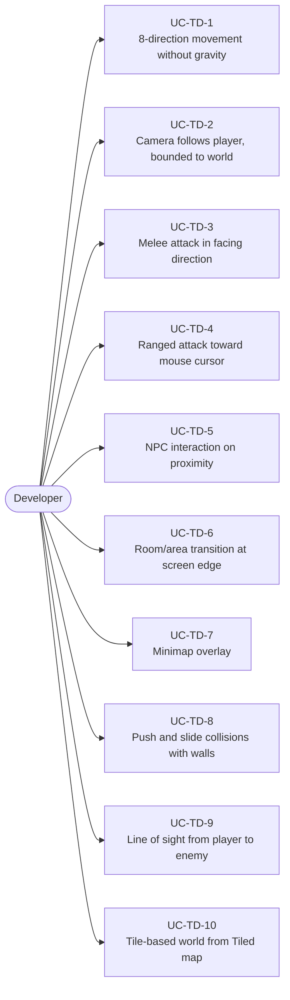
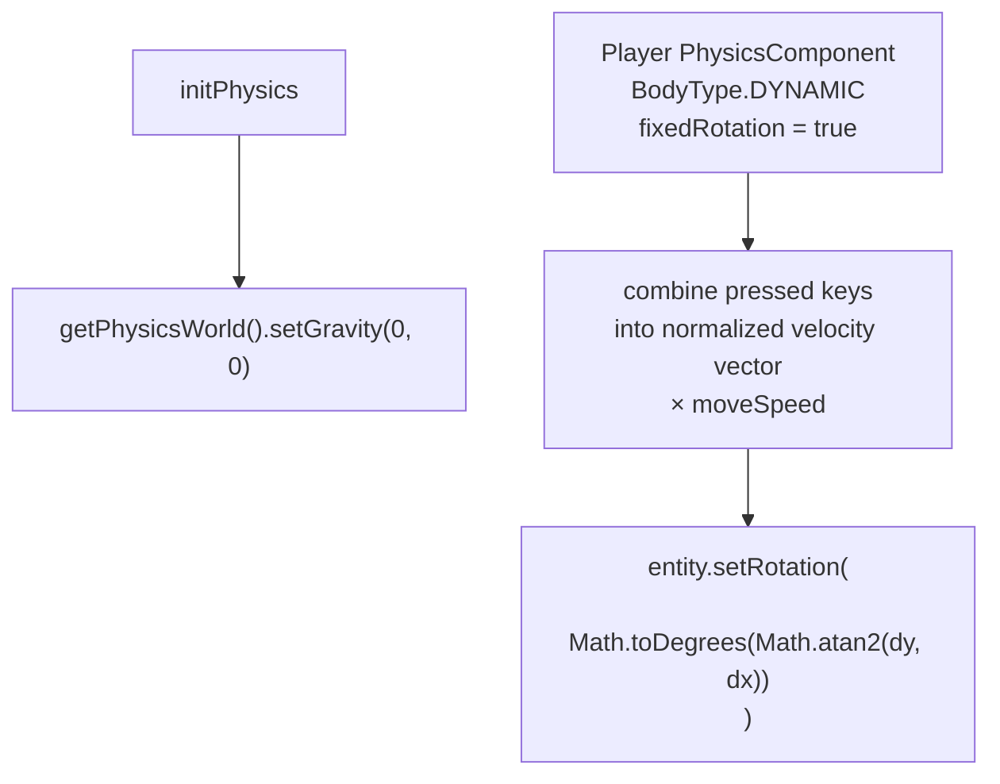
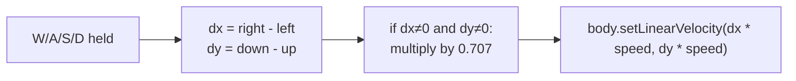
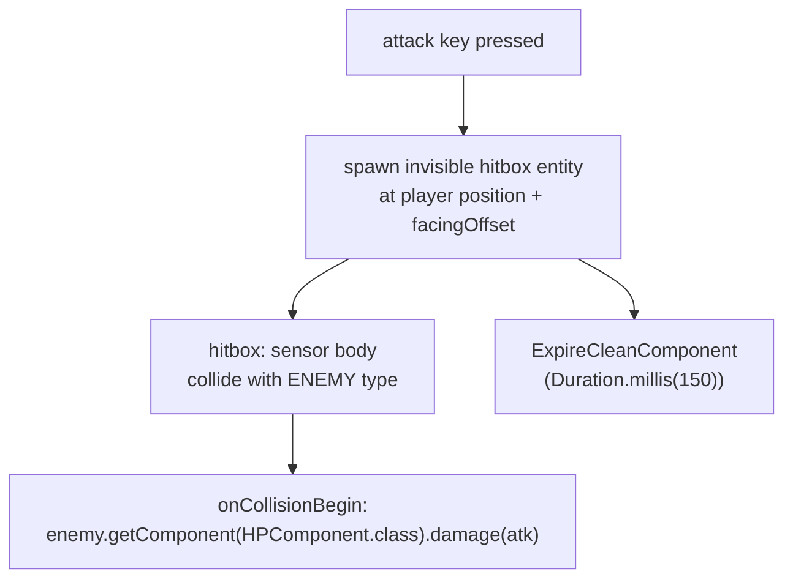
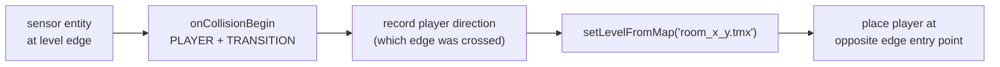
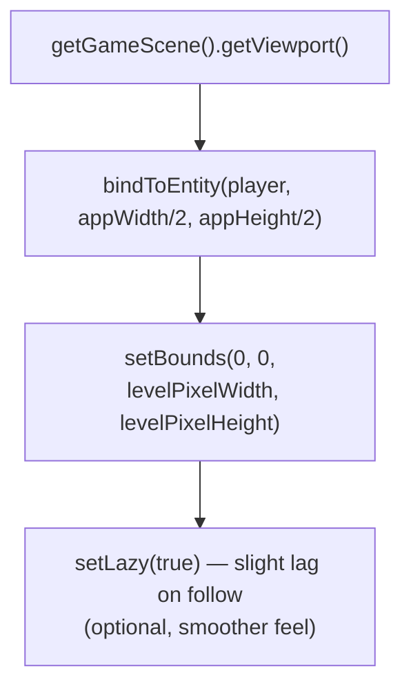

# Game Type — Top-Down 2D

Covers Zelda-style, twin-stick shooter, and top-down RPG games. Bird's eye view, 8-direction movement, no gravity.

## Actors and Primary Use Cases

## Movement Without Gravity

## 8-Direction Input Pattern

## Melee Attack Arc

## Area Transition Pattern

## Camera + World Bounds

