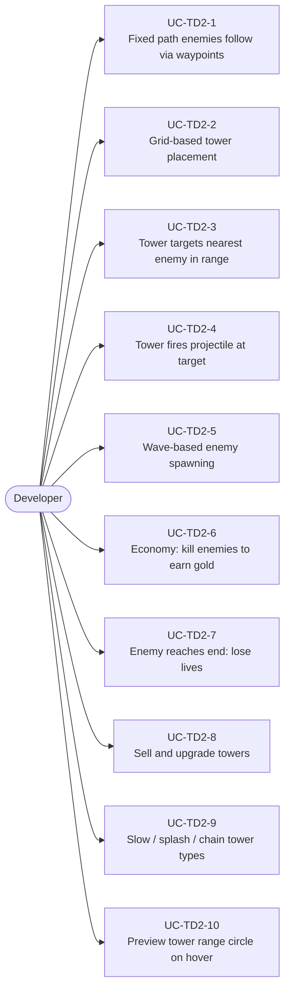
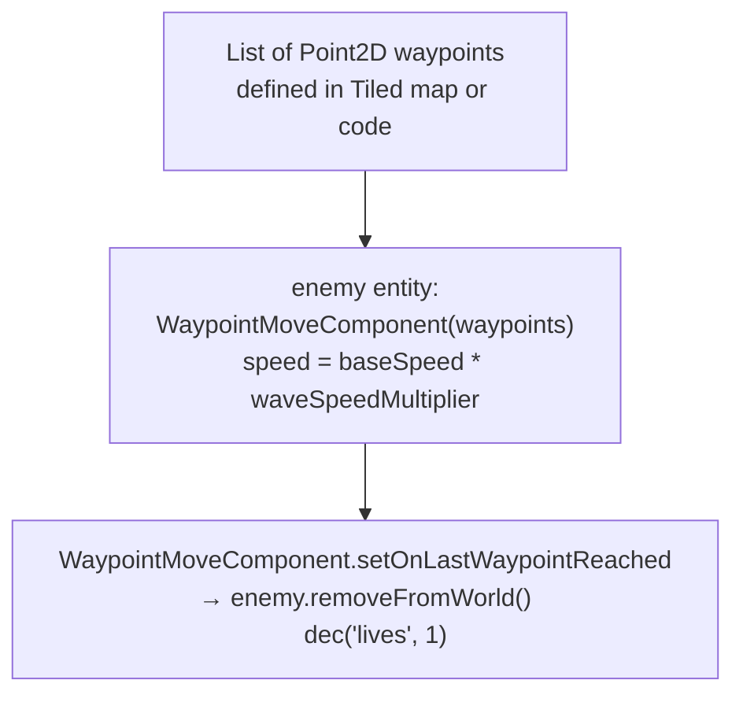
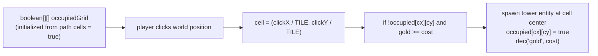
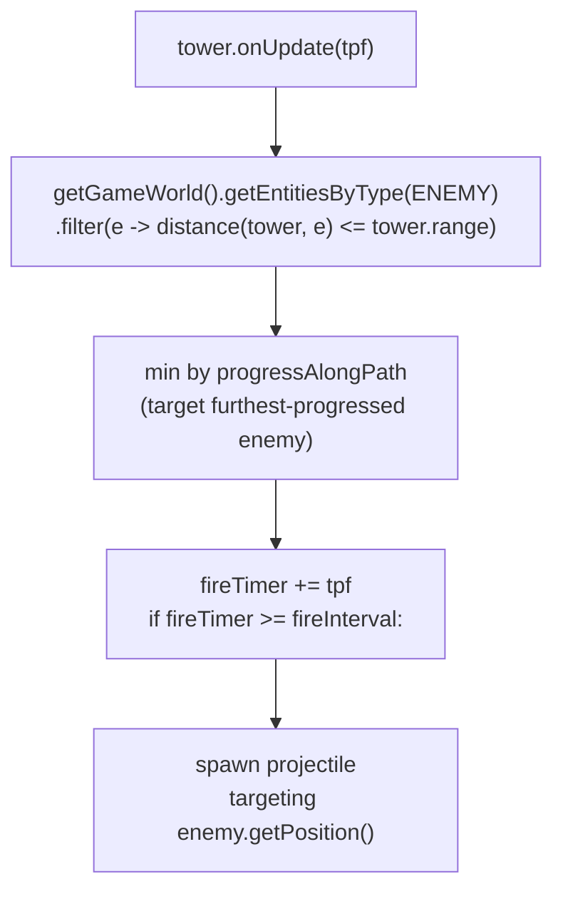
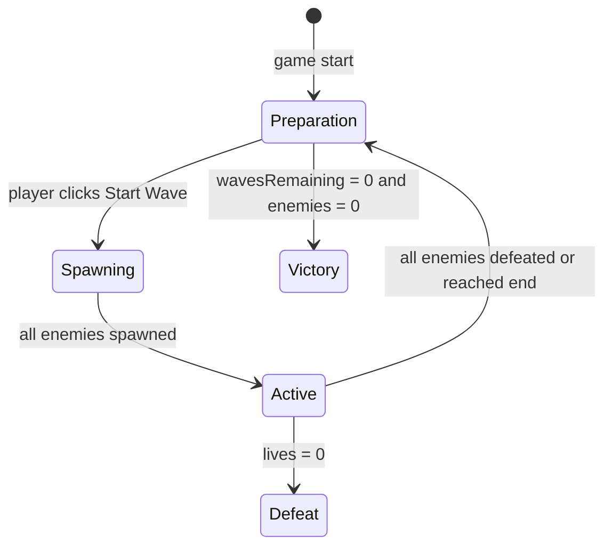
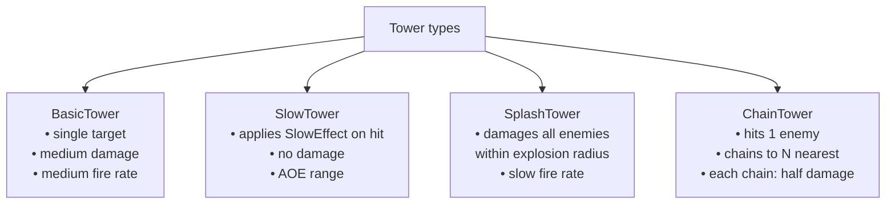

# Game Type — Tower Defense

Covers games where enemies follow a fixed path and the player places defensive towers along the path to stop them.

## Actors and Primary Use Cases

## Enemy Path System

## Tower Placement Grid

## Tower Targeting

## Wave System

## Tower Types Pattern

