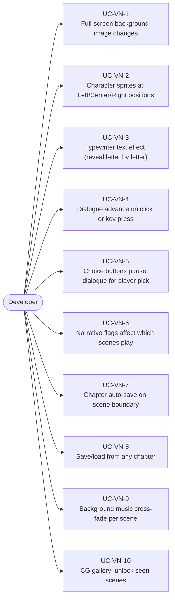
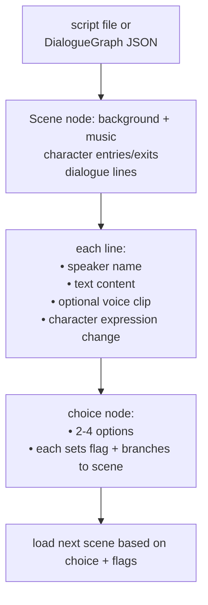
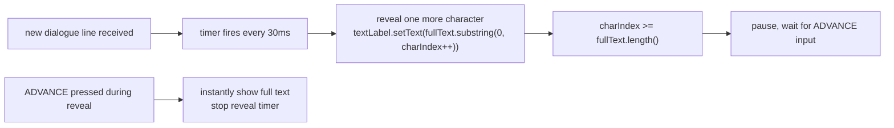
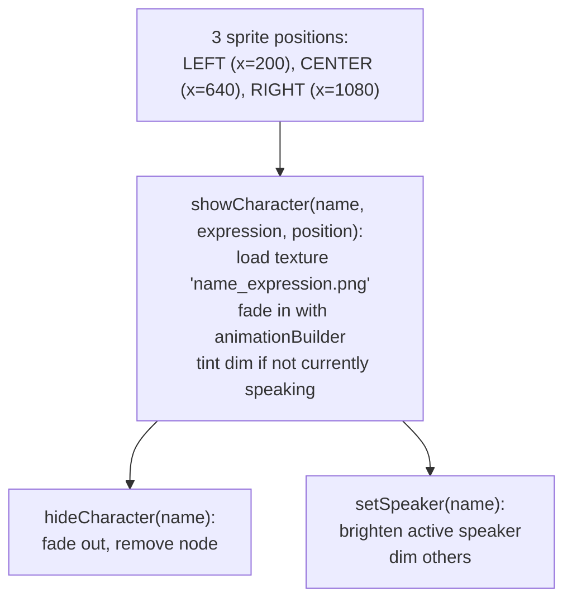
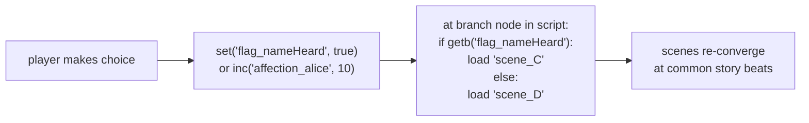
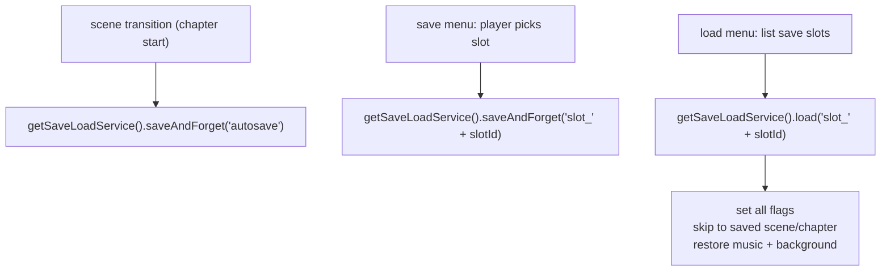
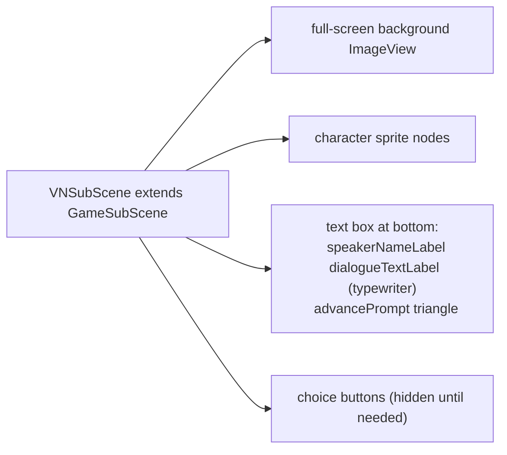

# Game Type — Visual Novel

Covers story-driven games with backgrounds, character sprites, typewriter dialogue, branching choices, and flags affecting narrative routes.

## Actors and Primary Use Cases

## Scene Structure

## Typewriter Text Effect

## Character Sprite Management

## Narrative Flag System

## Auto-Save Pattern

## VN Scene as GameSubScene

