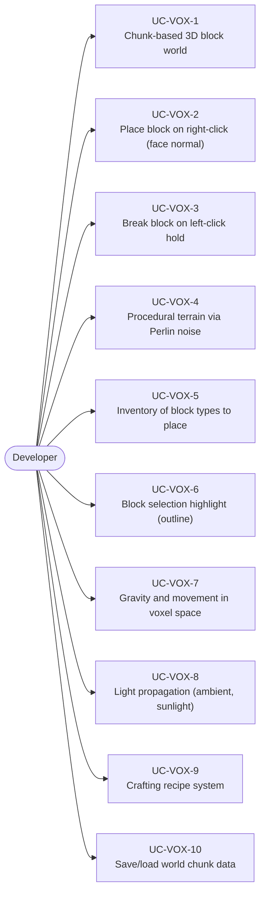
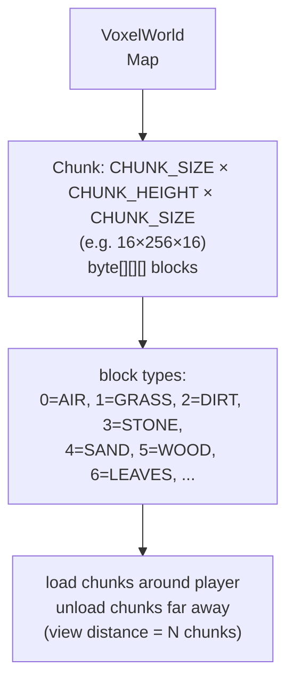
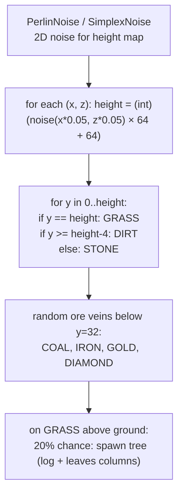
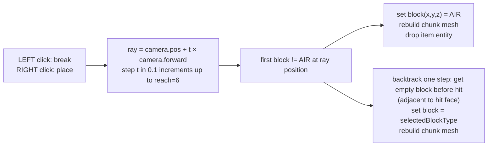
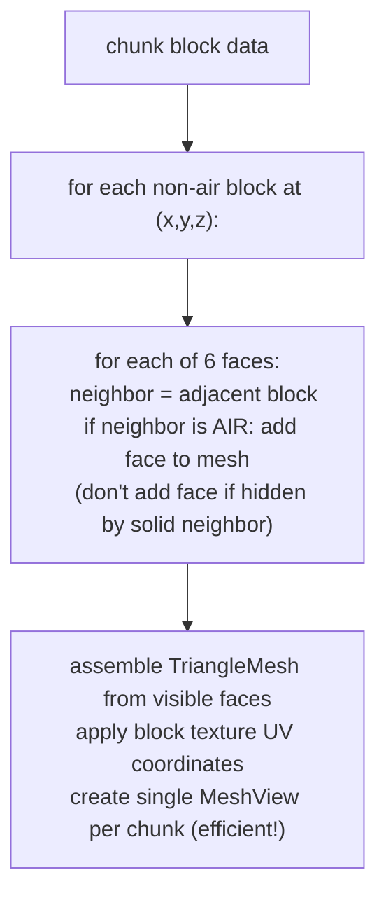
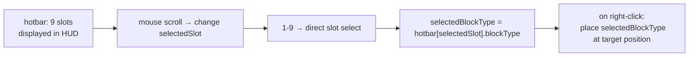
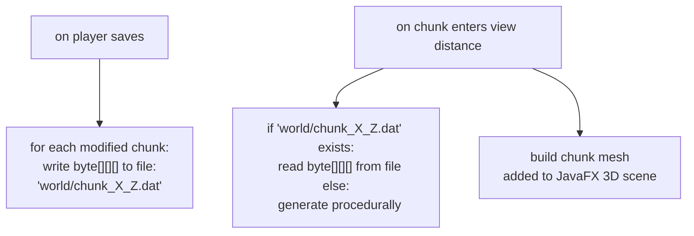

# Game Type — Voxel World

Covers Minecraft-style 3D voxel games. Block grid world, place/remove blocks via 3D raycasting, procedural terrain, chunk-based loading, crafting.

## Actors and Primary Use Cases

## World Structure

## Terrain Generation

## Block Raycast (Place / Break)

## Mesh Building (Face Culling)

## Inventory and Block Selection

## Save / Load Chunks

