# Use Cases — AI: Pathfinding, GOAP & Sense AI

Covers A* pathfinding, DFS pathfinding, dungeon/maze generation, Goal-Oriented Action Planning,
and sense-based AI.

## Actors and Primary Use Cases

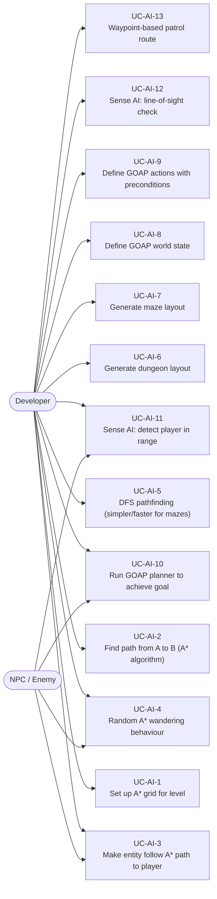

## A* Pathfinding Setup

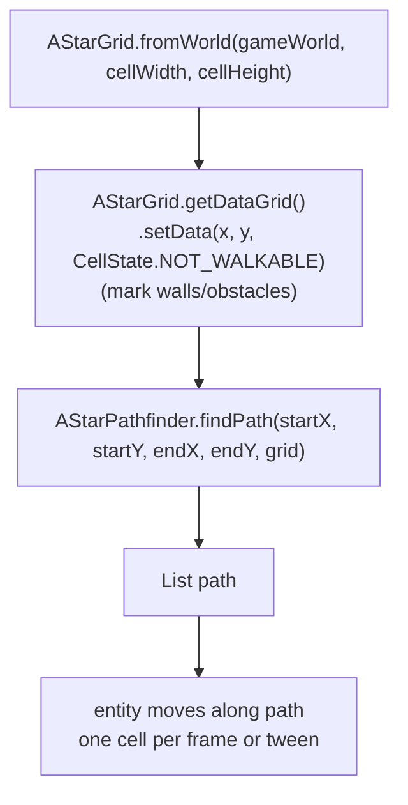

## AStarMoveComponent Usage

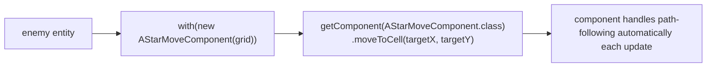

## Random A* Wandering

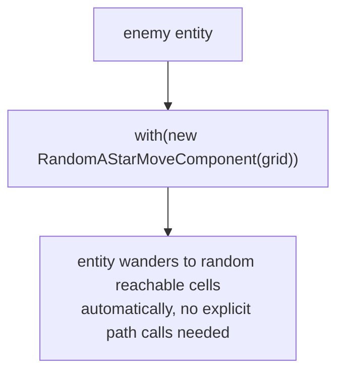

## GOAP Architecture

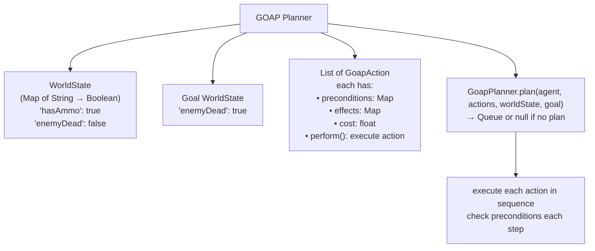

## GOAP Action Example

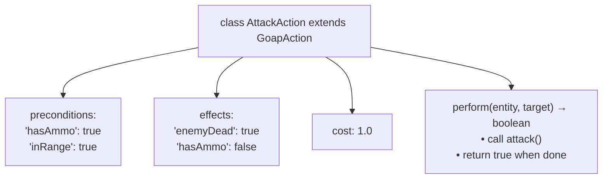

## GOAP Finite State Machine (FSM) Integration

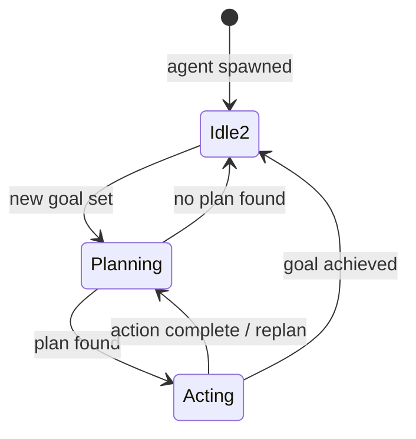

## Sense AI Use Case

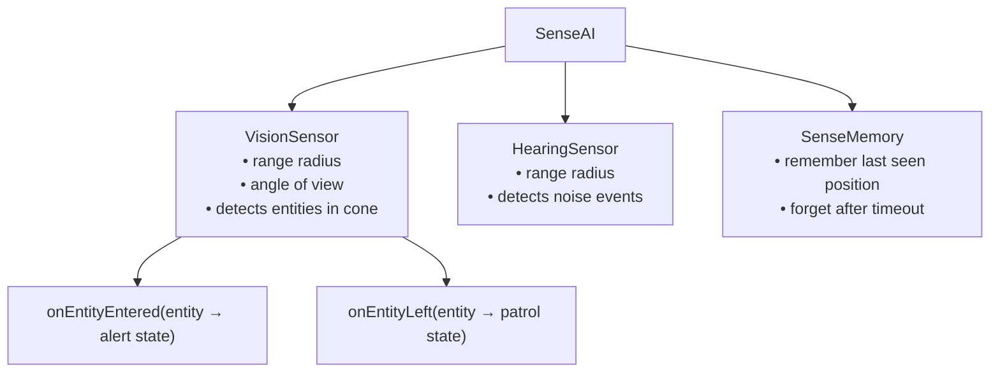

## Waypoint Patrol Use Case

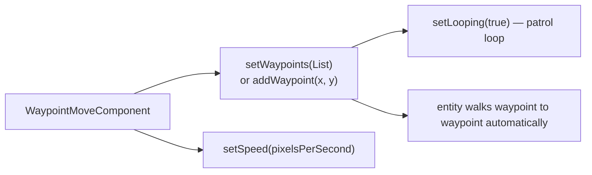

## Dungeon Generation Use Case

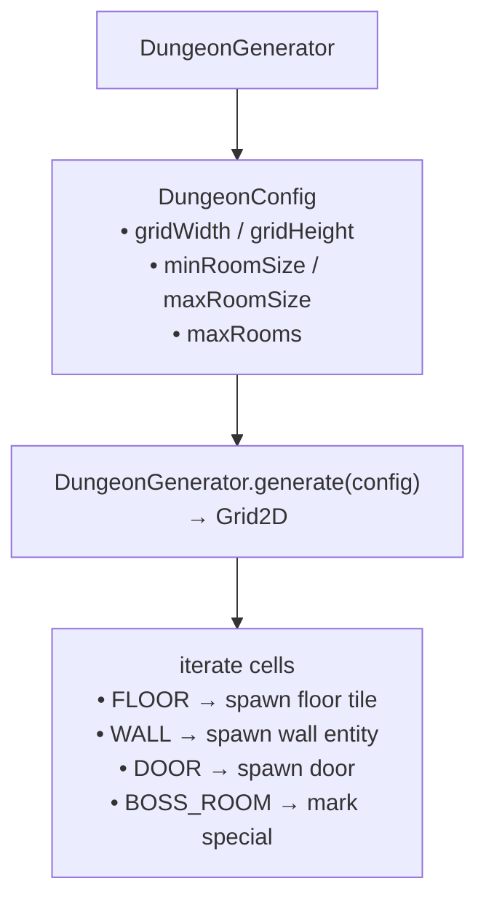

## Maze Generation Use Case

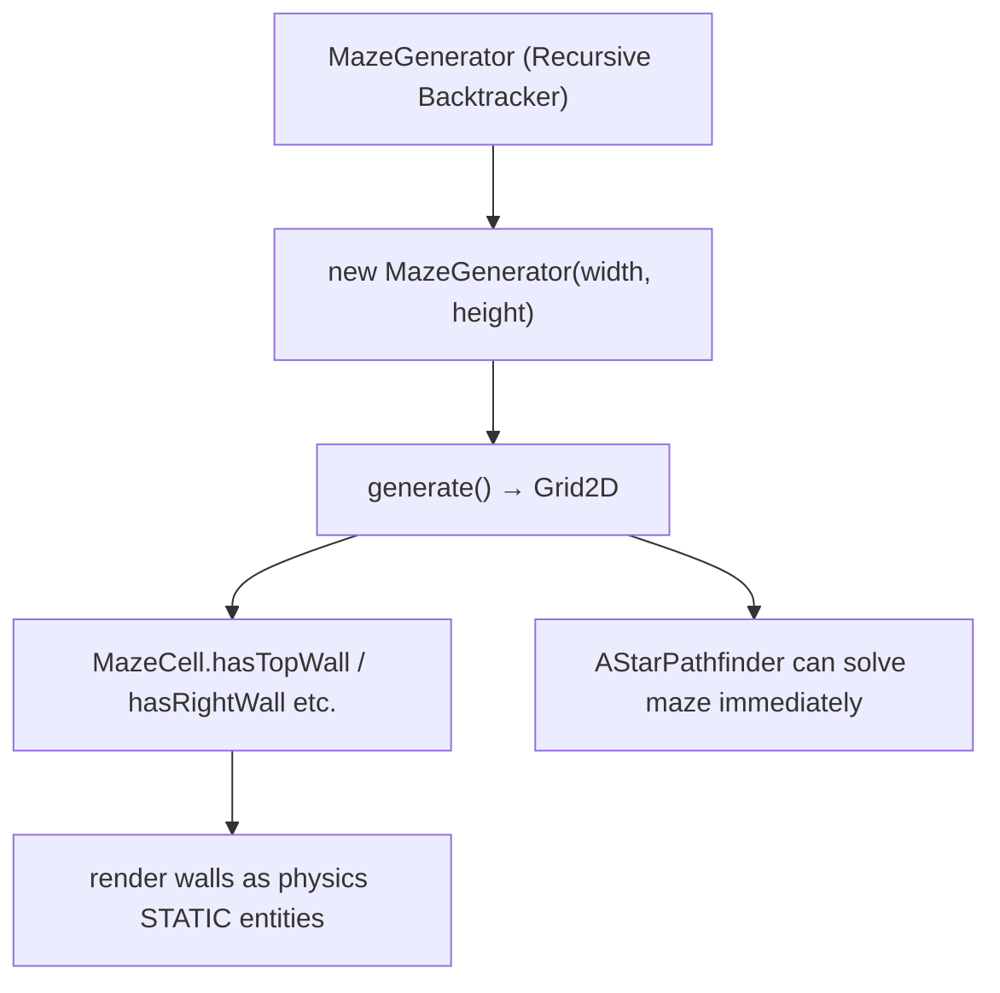
