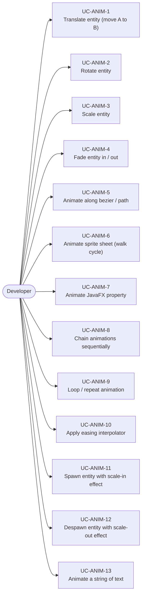
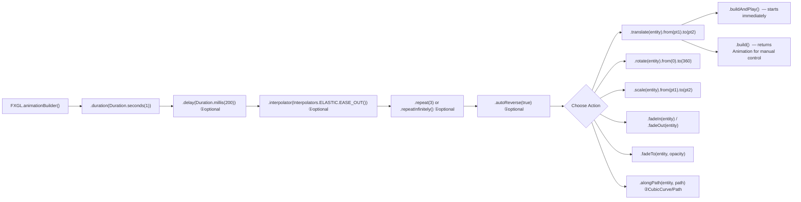
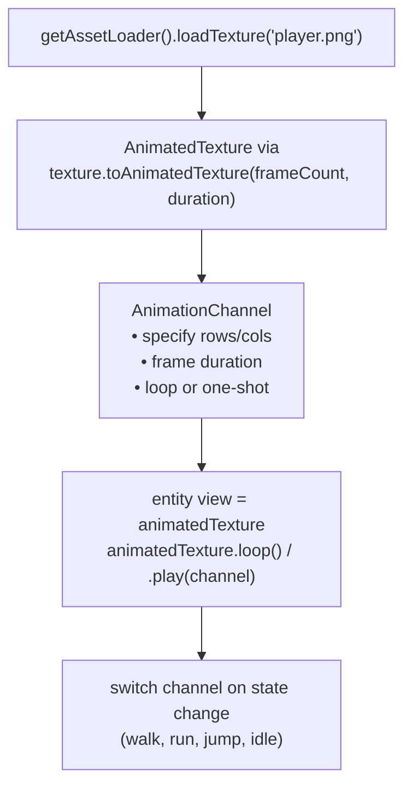
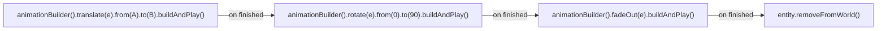
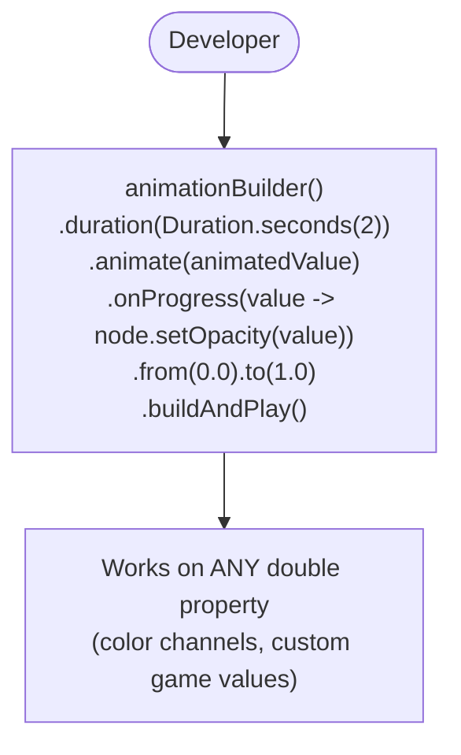
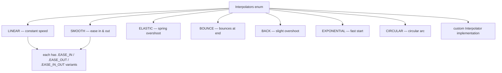
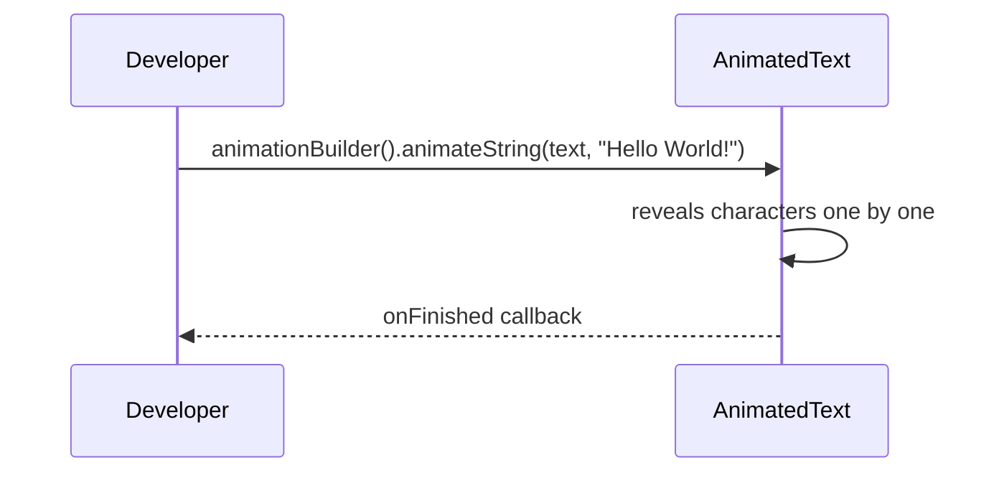

# Use Cases — Animation

Covers the AnimationBuilder DSL, sprite sheet animation, path animation, property animation,
and sequential / chained animations.

## Actors and Primary Use Cases

## AnimationBuilder DSL Flow

## Sprite Sheet Animation Use Case

## Sequential Animation Pattern

## Property Animation Use Case

## Interpolator Selection

## Animated String Use Case

