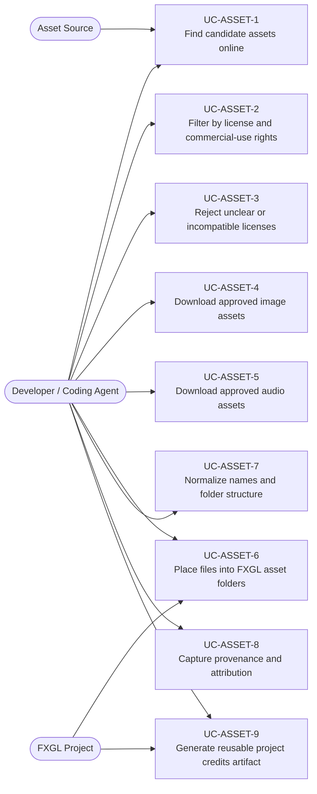
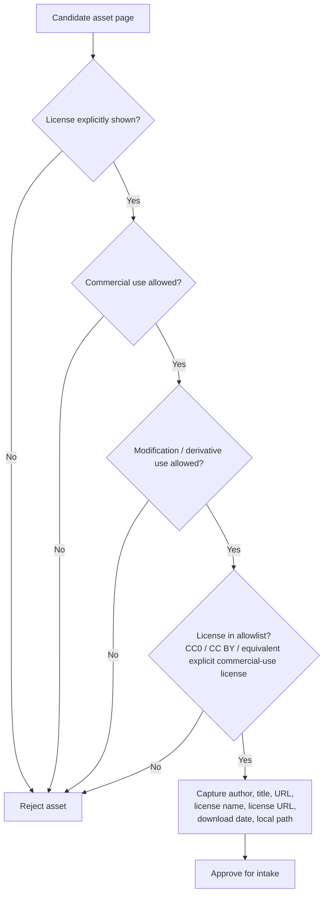
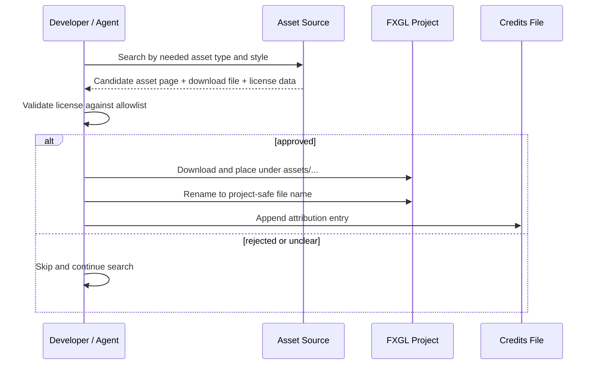
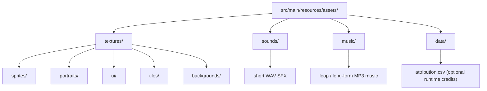
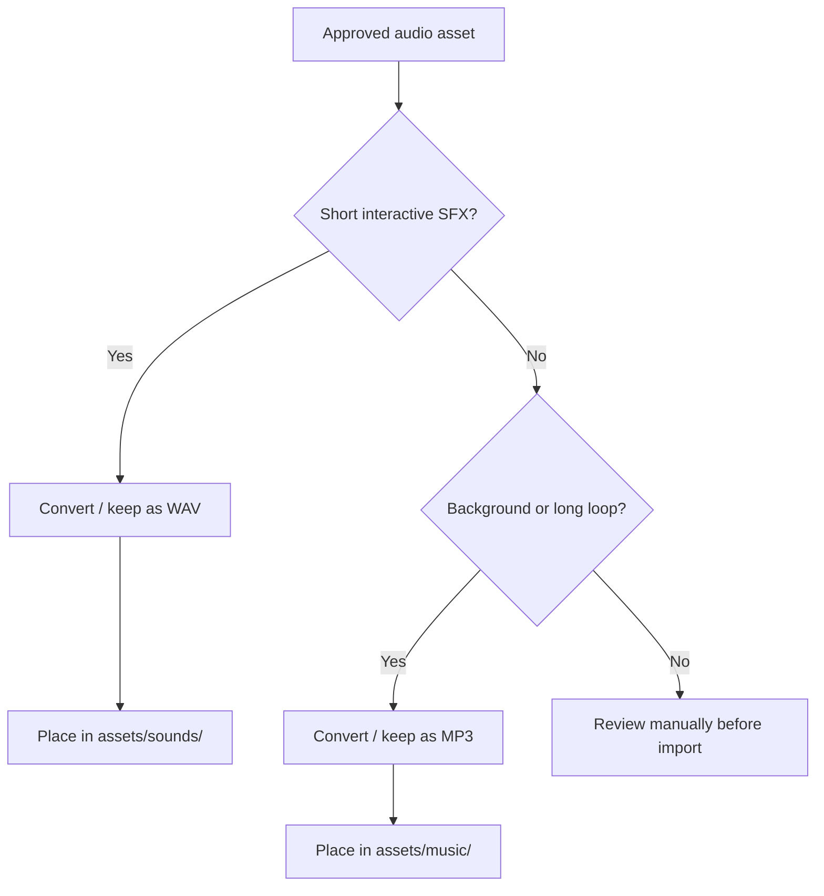
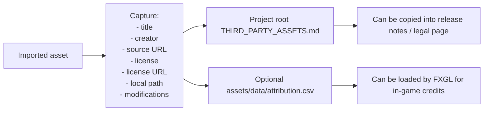

# Use Cases — Free Asset Sourcing, Attribution & FXGL Project Intake

Covers commercially safe free asset discovery, license filtering, download, project organization,
and attribution capture for FXGL games.

## Actors and Primary Use Cases

## License Decision Flow

## Asset Intake Pipeline

## FXGL Project Organization

## Audio Routing Decision

## Attribution Artifact Generation

