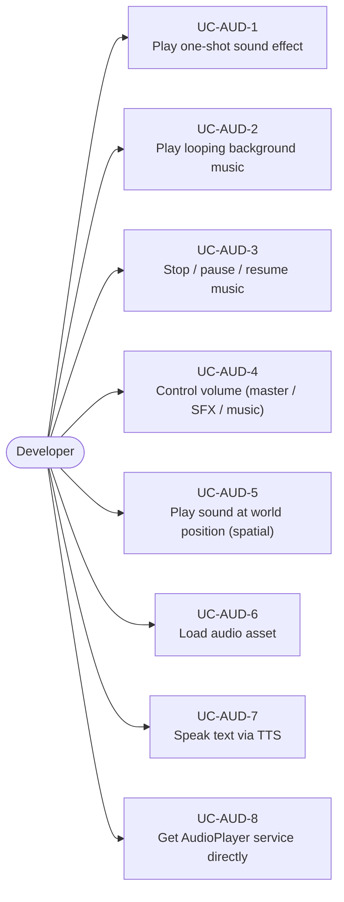
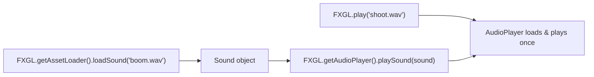
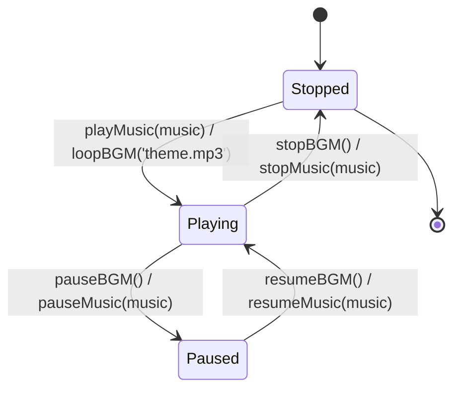
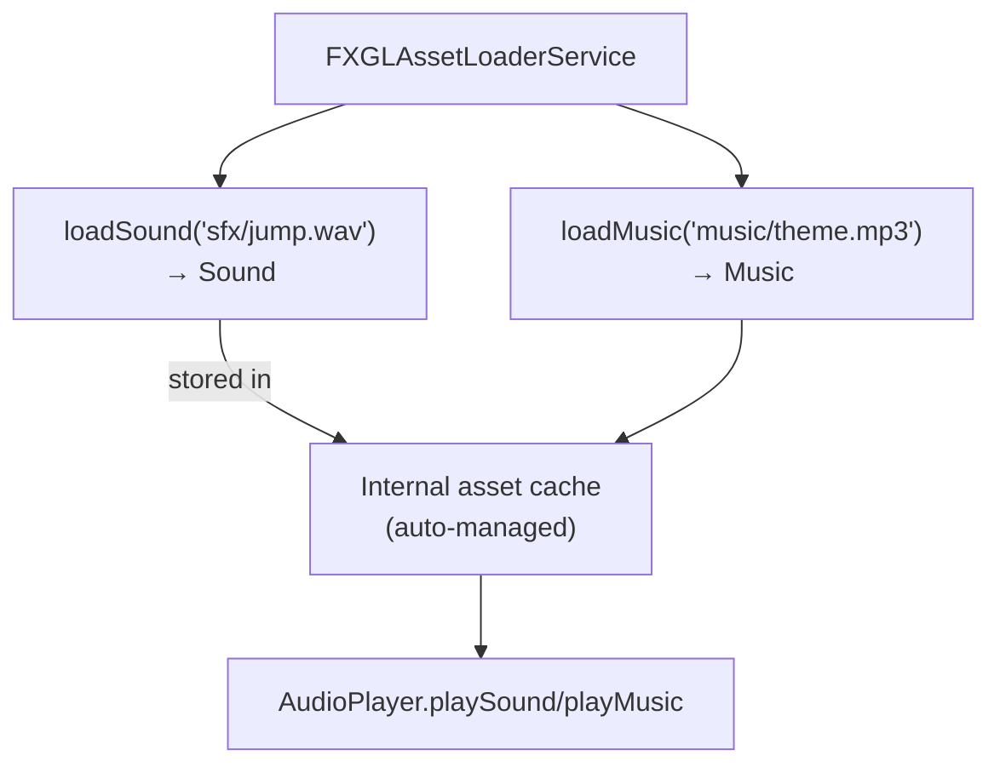
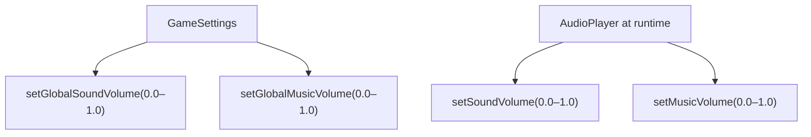
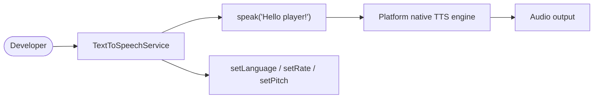
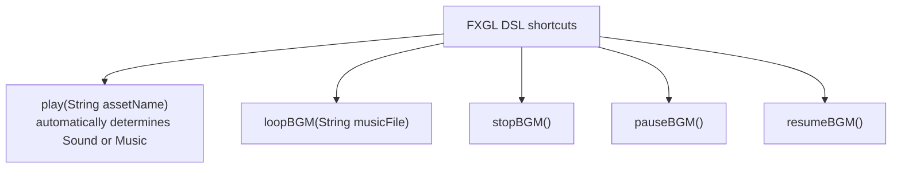

# Use Cases — Audio

Covers sound effects, background music, audio configuration, and text-to-speech.

## Actors and Primary Use Cases

## Sound Effect Playback

## Music (Background) Lifecycle

## Audio Asset Loading

## Volume Control Use Case

## Text-to-Speech Use Case (fxgl-intelligence module)

## Convenience DSL Methods

