# Use Cases — Developer Tools & Debugging

Covers the developer menu, in-game console, entity inspector, profiler, debug camera,
application modes, and graph visualisation.

## Actors and Primary Use Cases

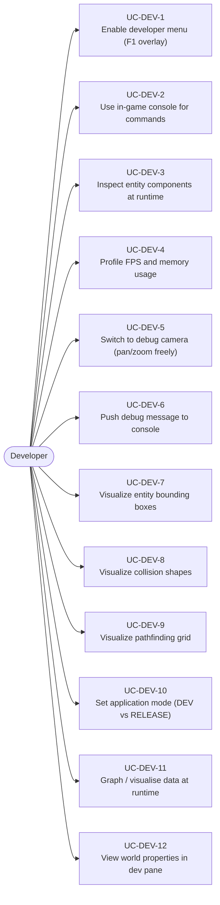

## Enabling Dev Tools

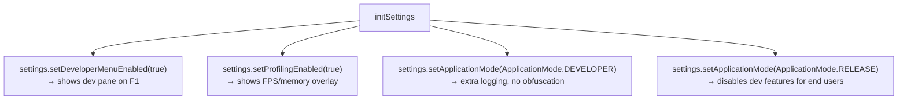

## Developer Menu (DevPane) Contents

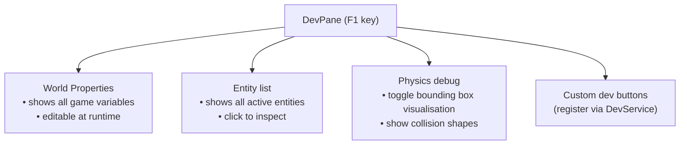

## Entity Inspector Use Case

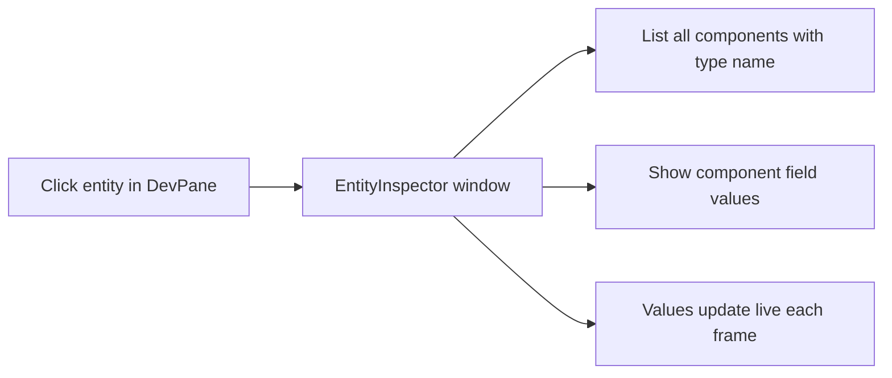

## In-Game Console

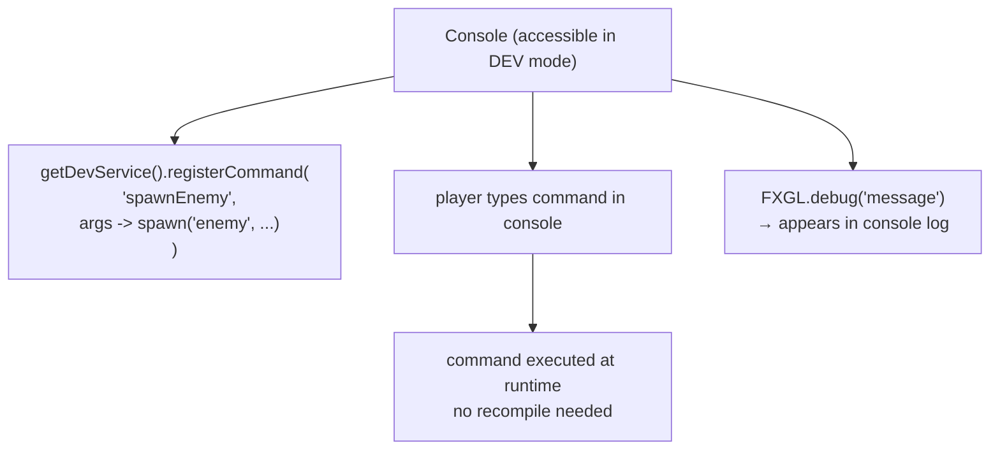

## Profiler Window

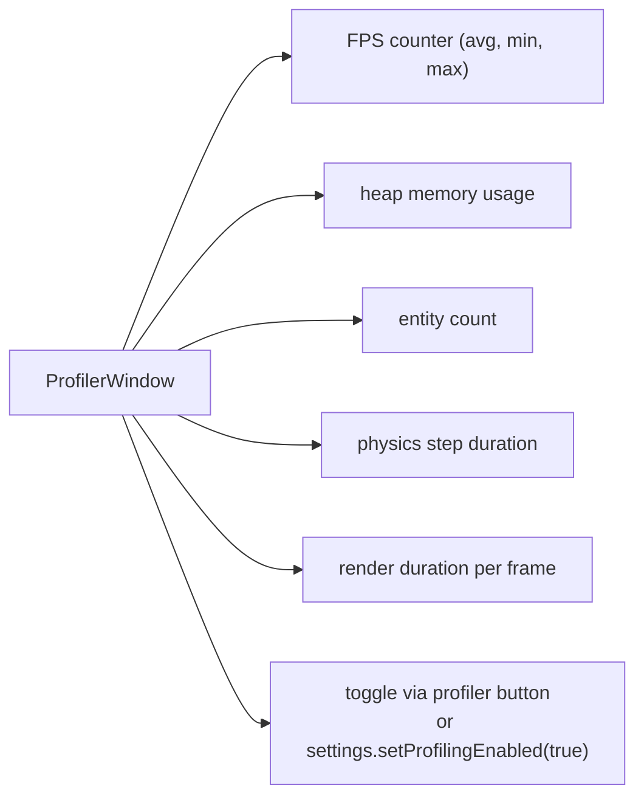

## Debug Camera Use Case

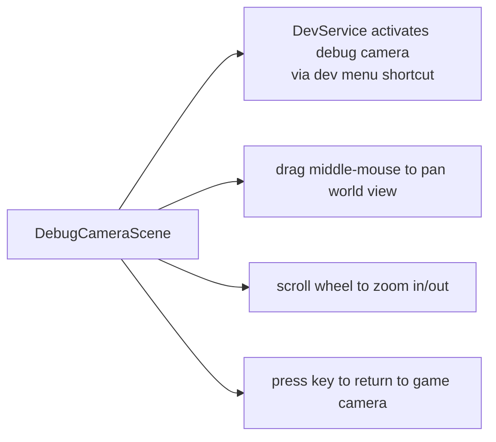

## Bounding Box Visualisation

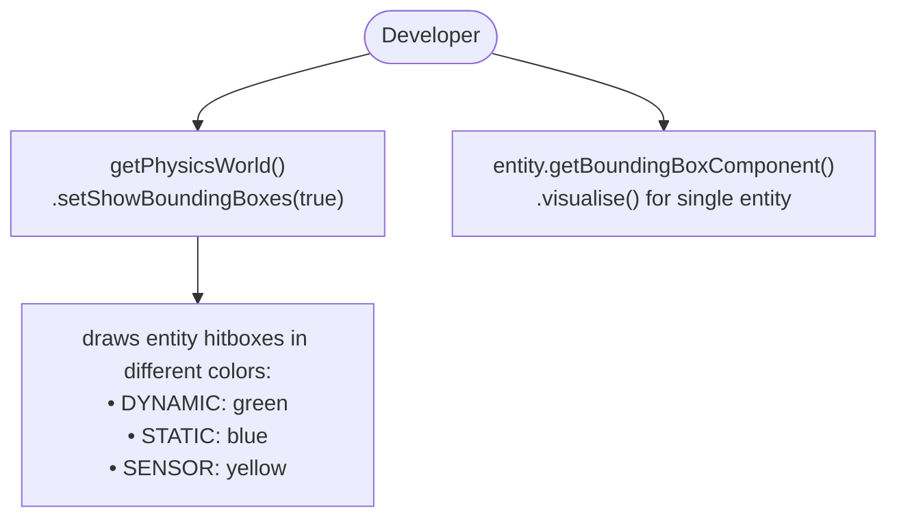

## Graph Visualisation Use Case

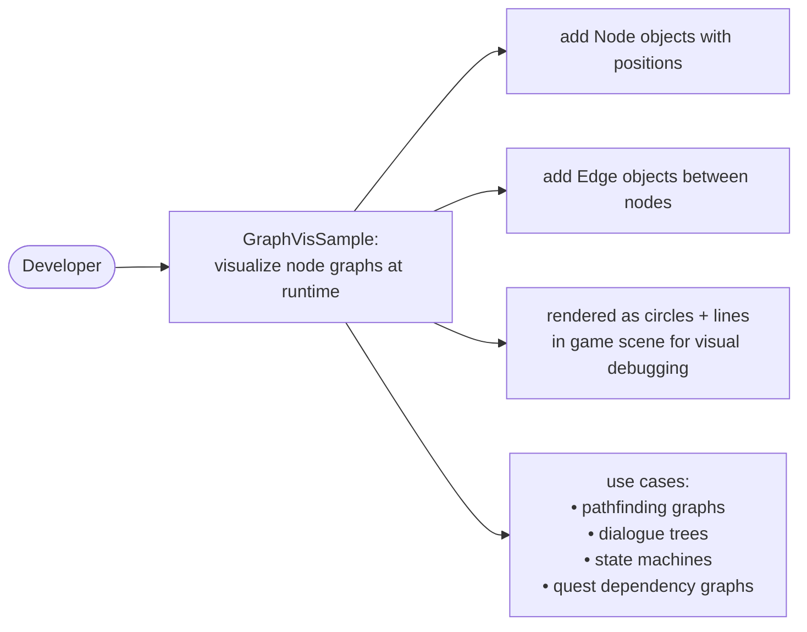

## Application Mode Comparison

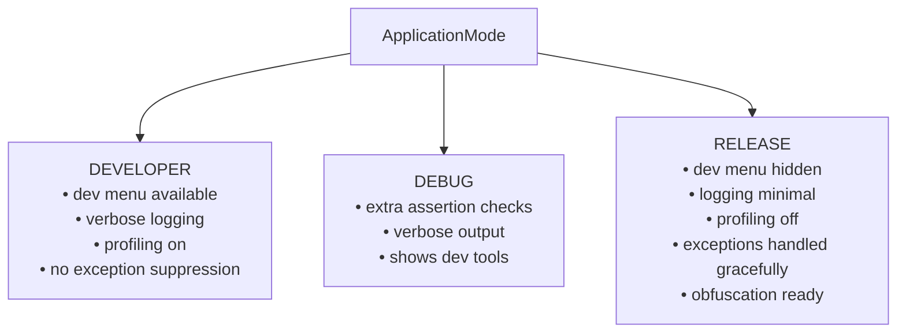

## Custom Dev Commands Pattern

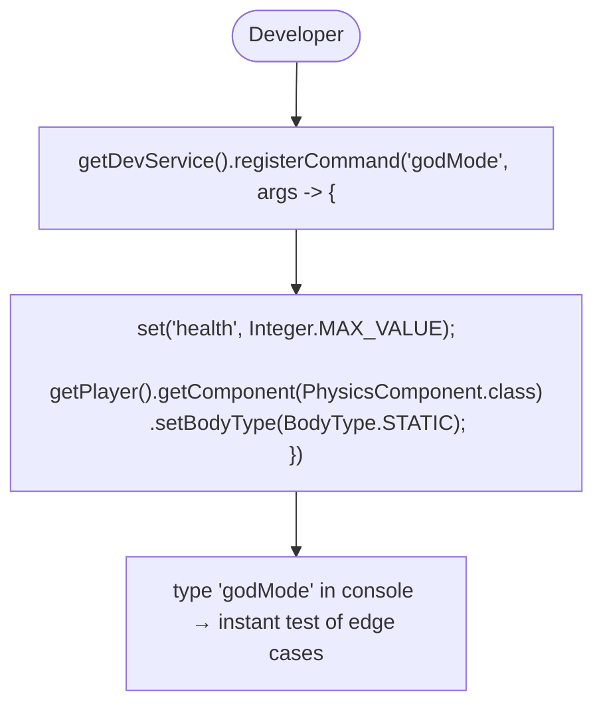
