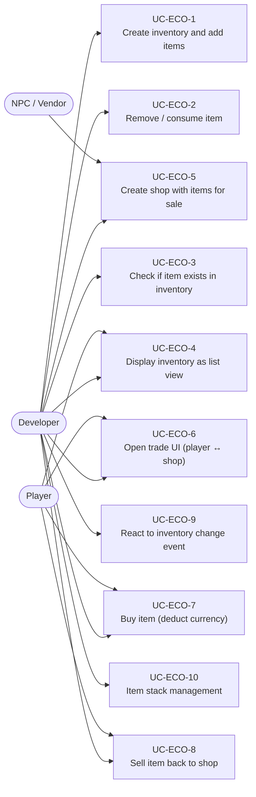
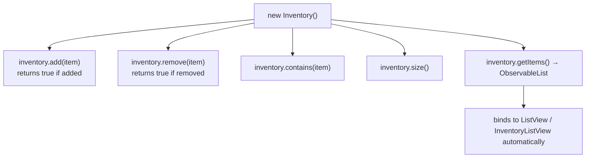
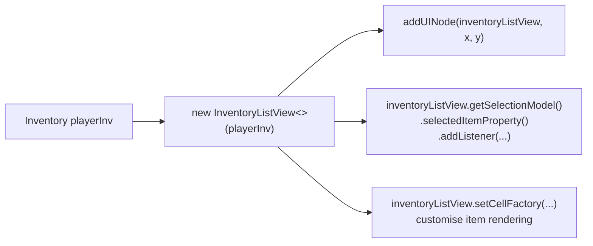
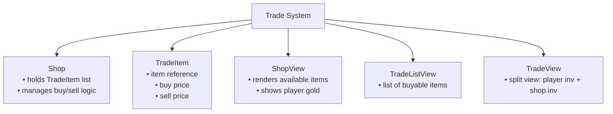
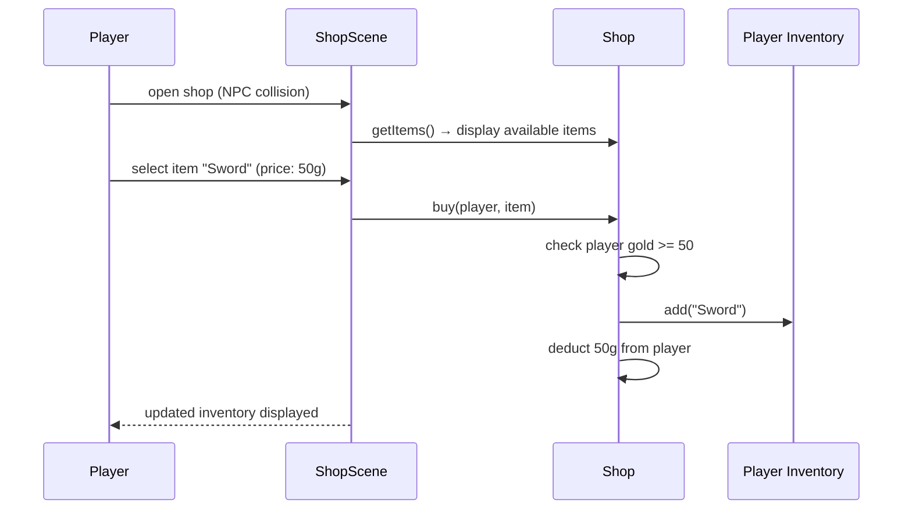
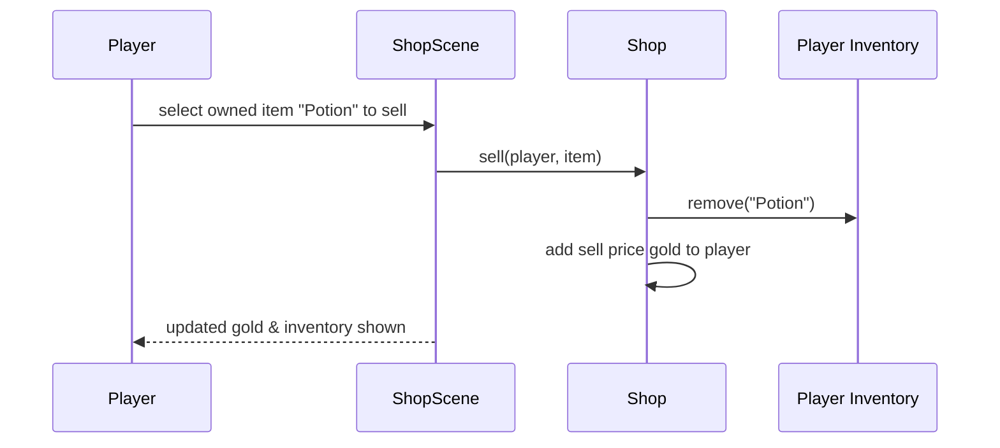
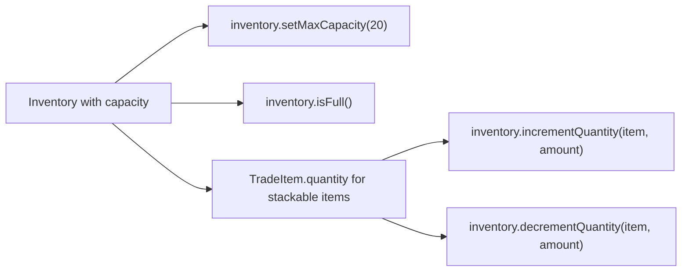
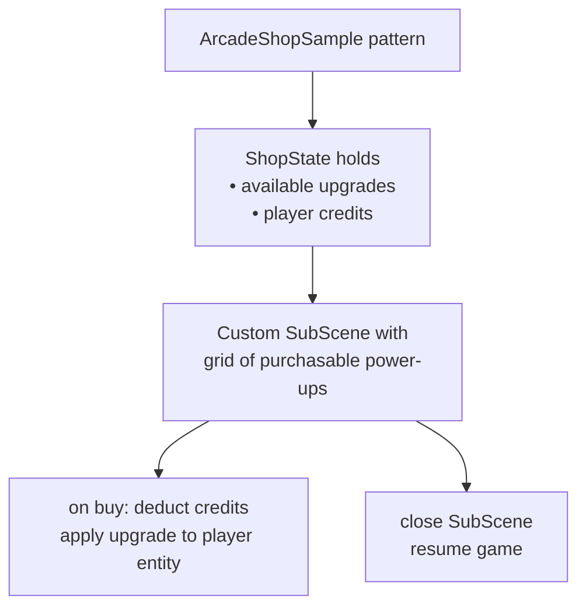

# Use Cases — Inventory & Trade / Shop

Covers the Inventory system, InventoryListView, Trade system, Shop, ShopView, and the arcade shop pattern.

## Actors and Primary Use Cases

## Inventory System API

## InventoryListView Use Case

## Trade System Architecture

## Trade / Buy Flow

## Sell Flow

## Item Stack Management

## Arcade Shop Pattern (special layout)

