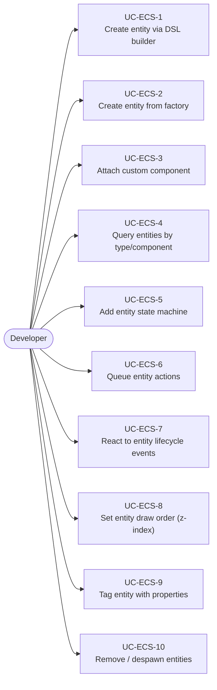
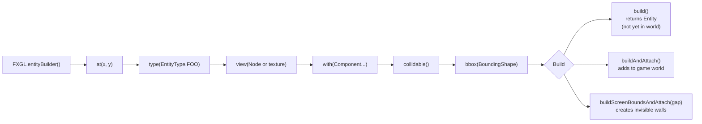
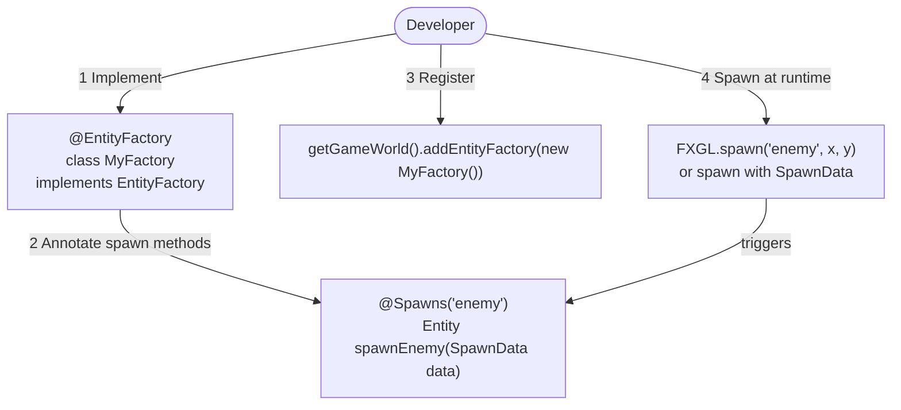
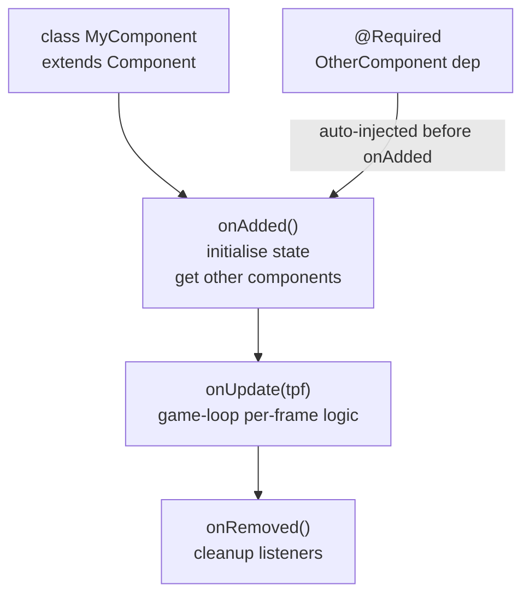
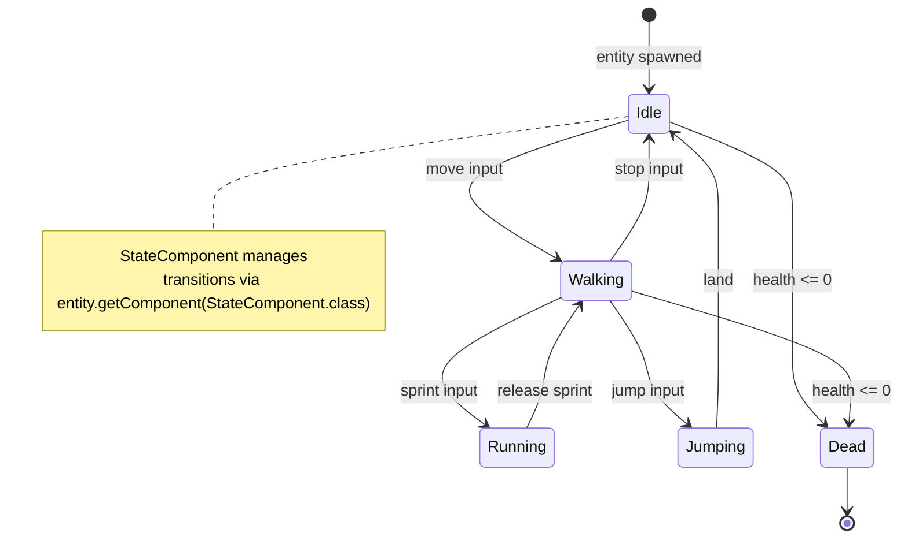
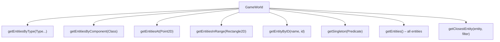
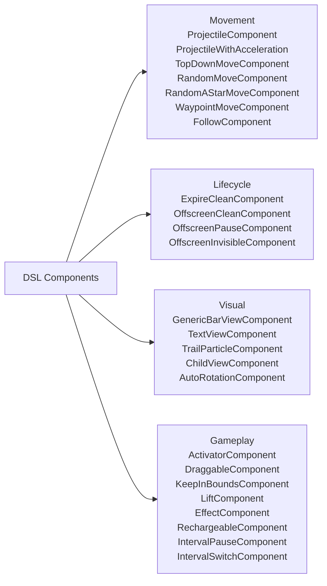
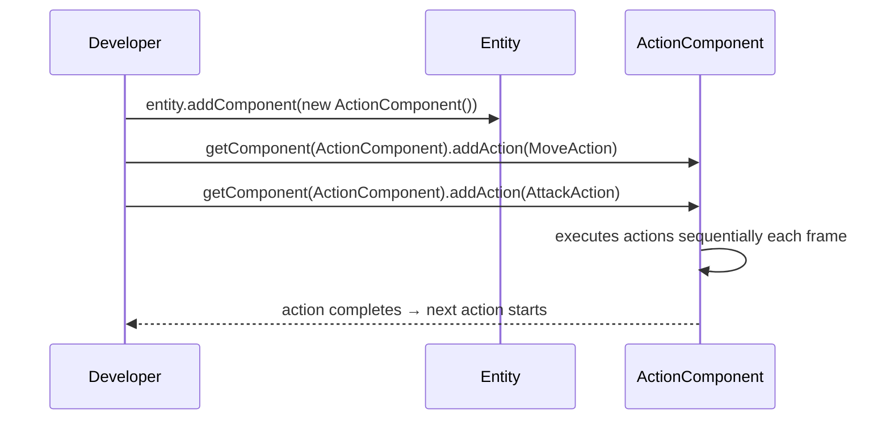

# Use Cases — Entity–Component System (ECS)

Covers entity creation, the component model, factories, state machines, and action queues.

## Actors and Primary Use Cases

## EntityBuilder DSL Flow

## Entity Factory Pattern

## Custom Component Lifecycle

## Entity State Machine

## Entity Queries

## Built-in DSL Components (Ready-made behaviours)

## Entity Action Queue

