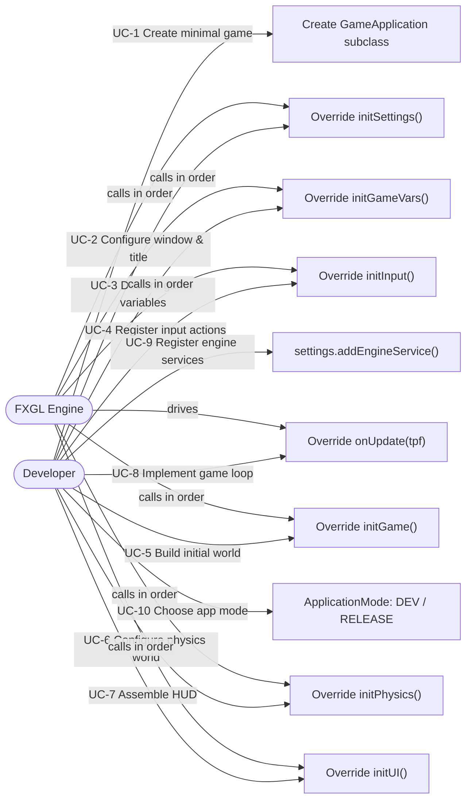
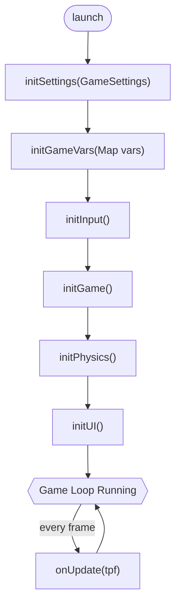
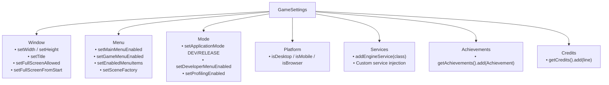
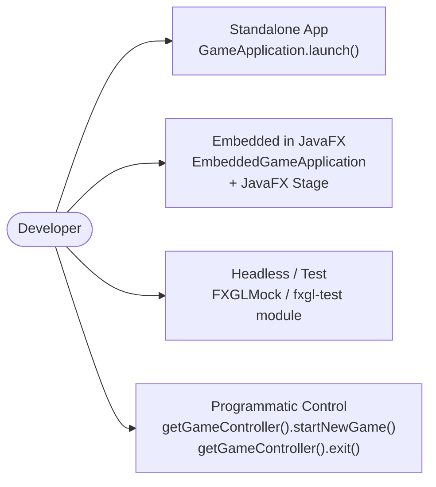
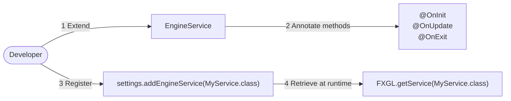

# Use Cases — Game Application Lifecycle

Covers the bootstrap process, lifecycle hooks, settings configuration, and application modes.

## Actors and Primary Use Cases

## Game Initialisation Order

## Settings Configuration Use Cases

## Embedded & Special Modes

## Custom Engine Service Use Case

