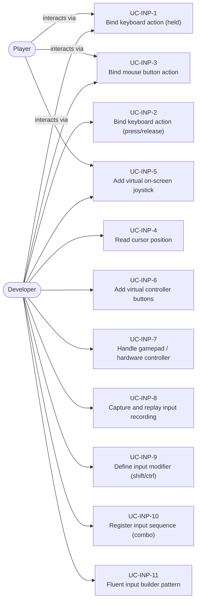
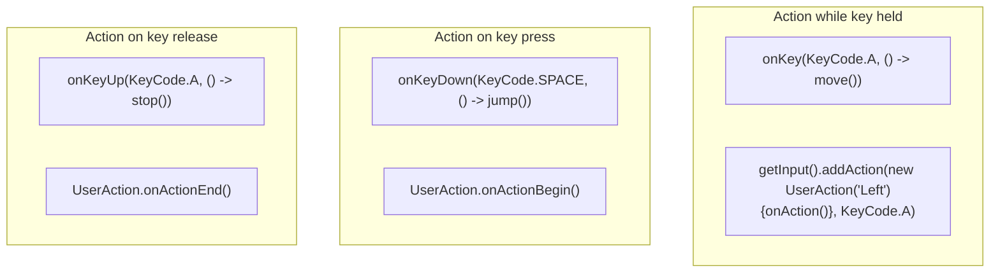
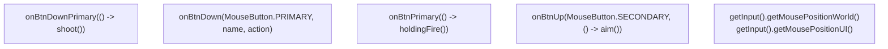
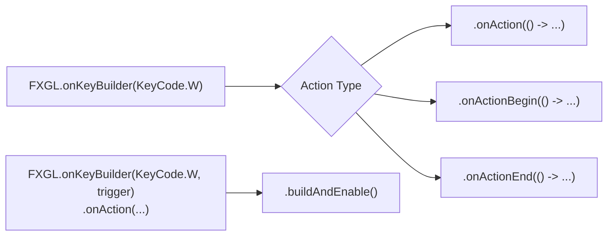
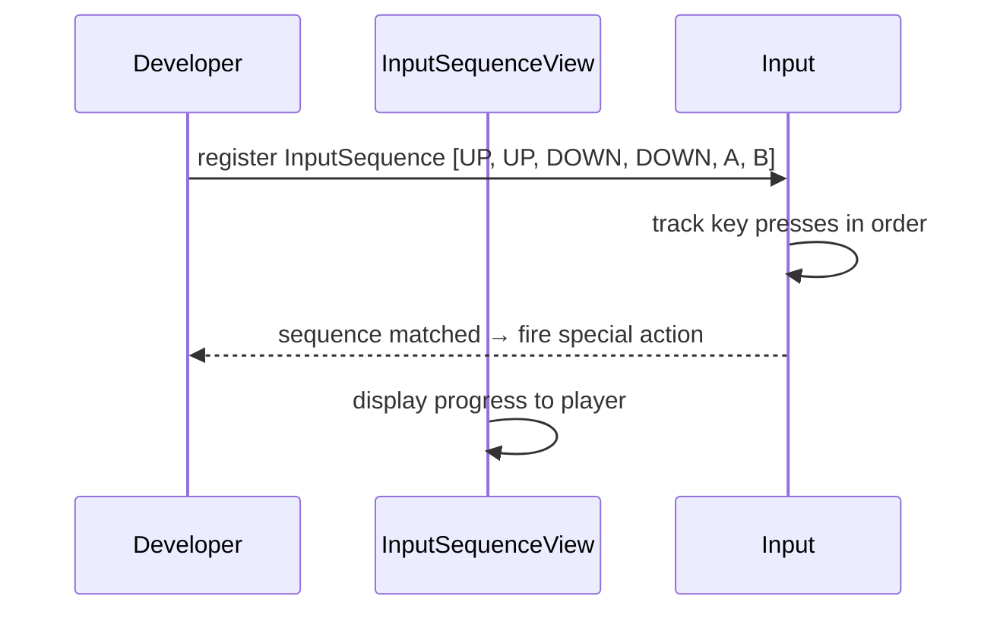
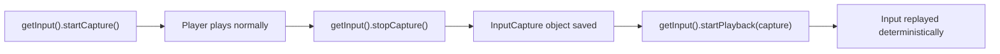
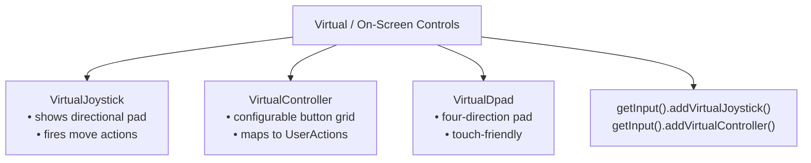
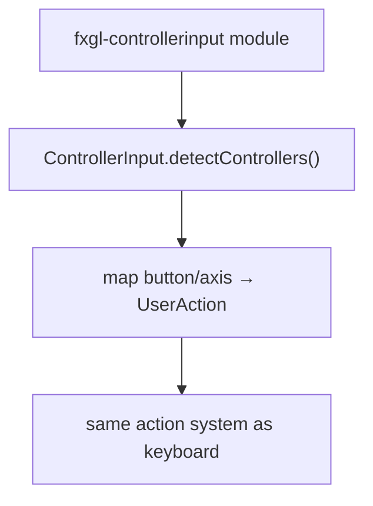
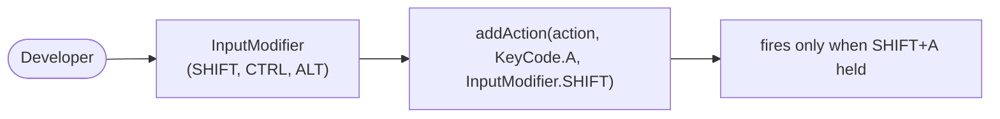

# Use Cases — Input Handling

Covers keyboard, mouse, virtual controls, gamepad, input capture/replay, and key sequences.

## Actors and Primary Use Cases

## Keyboard Binding Patterns

## Mouse Binding Patterns

## Fluent Input Builder

## Input Sequence (Combo) Use Case

## Input Capture & Replay Use Case

## Virtual Controls Use Case

## Hardware Controller (Gamepad) Use Case

## Input Modifier Use Case

