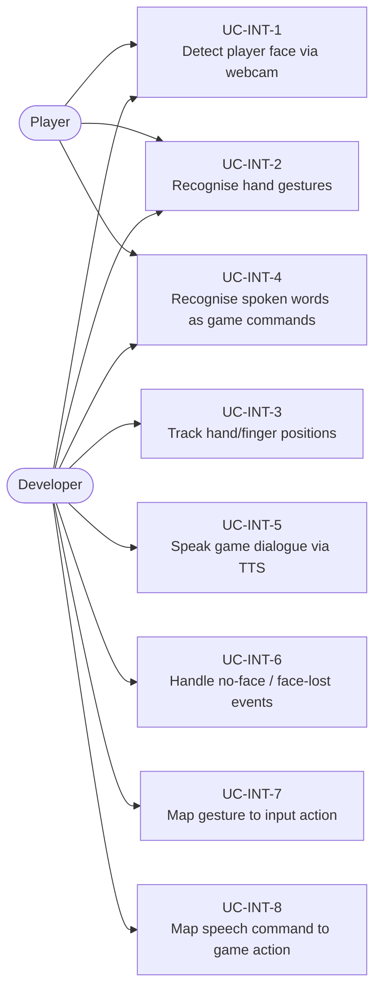
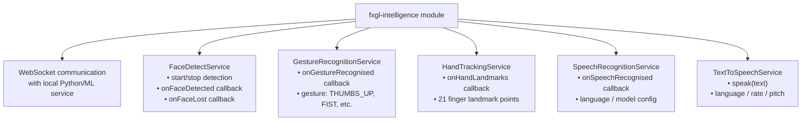
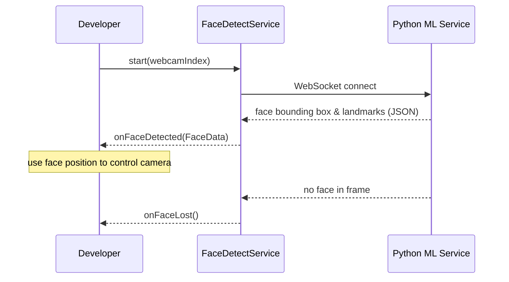
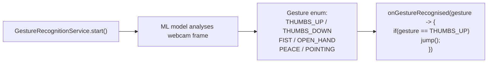
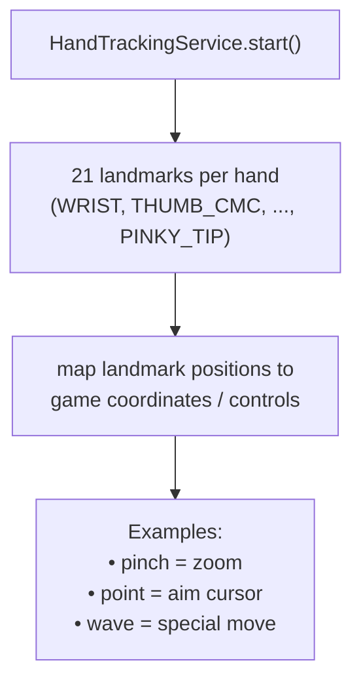
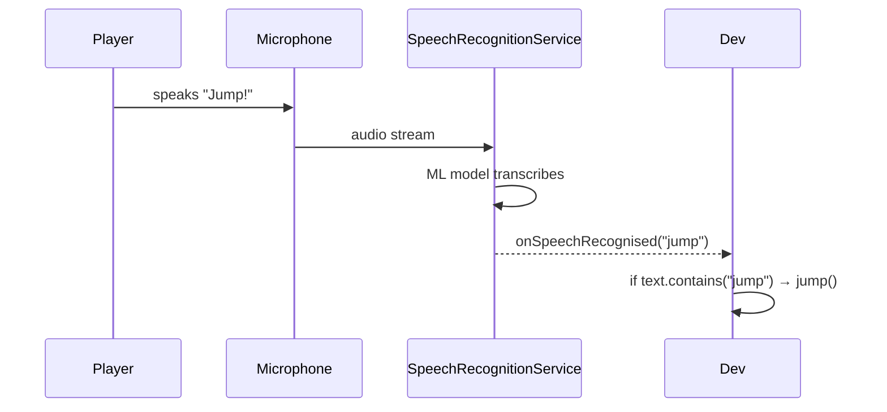
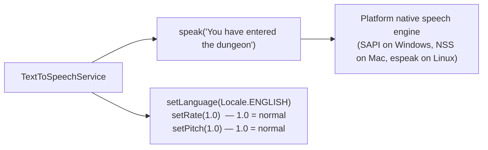
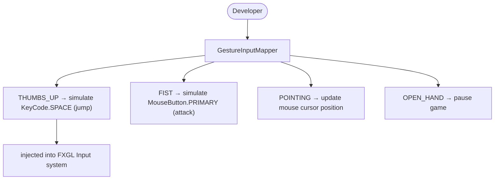
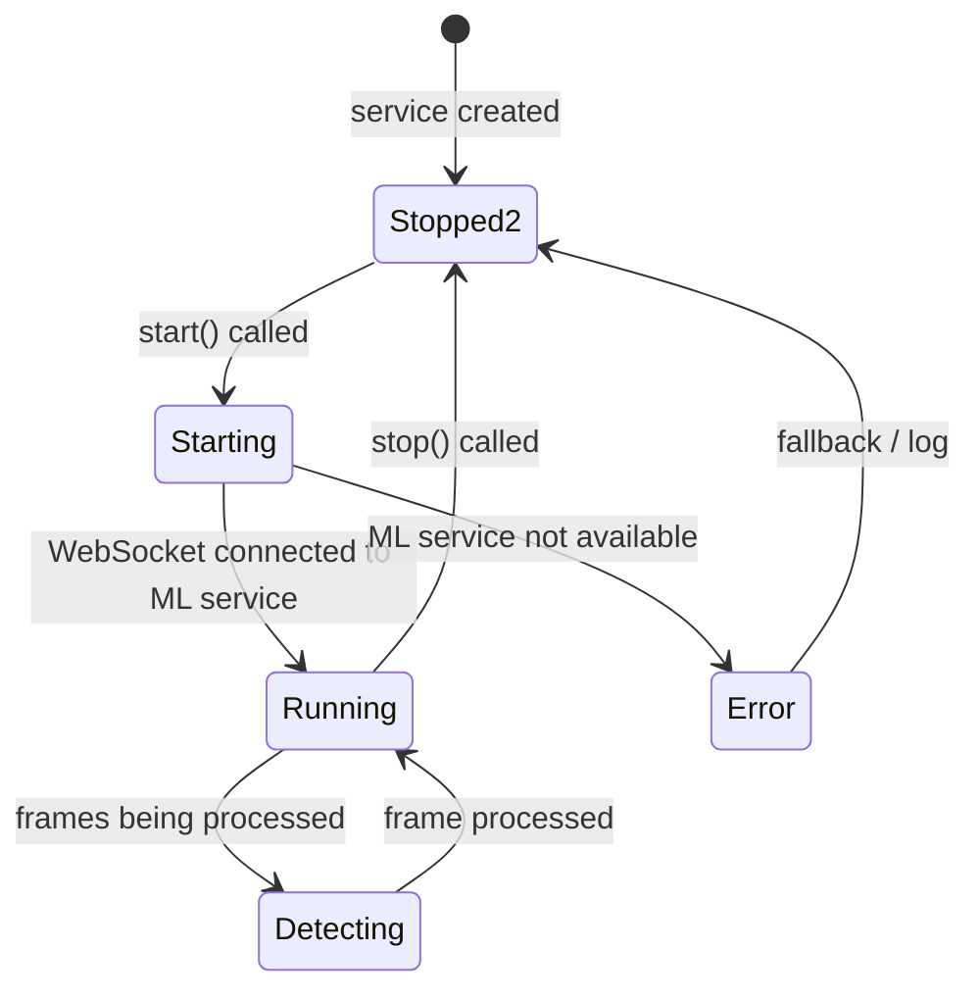

# Use Cases — Intelligence (ML-powered Features)

Covers the `fxgl-intelligence` module: face detection, gesture recognition, hand tracking,
speech recognition, and text-to-speech. These are powered by external ML models via WebSocket.

## Actors and Primary Use Cases

## Intelligence Module Architecture

## Face Detection Use Case

## Gesture Recognition Use Case

## Hand Tracking Use Case

## Speech Recognition Use Case

## Text-to-Speech Use Case

## Gesture → Input Action Mapping

## Intelligence Service Lifecycle

