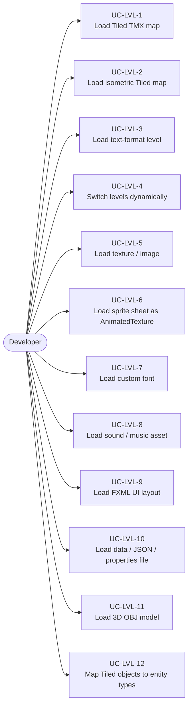
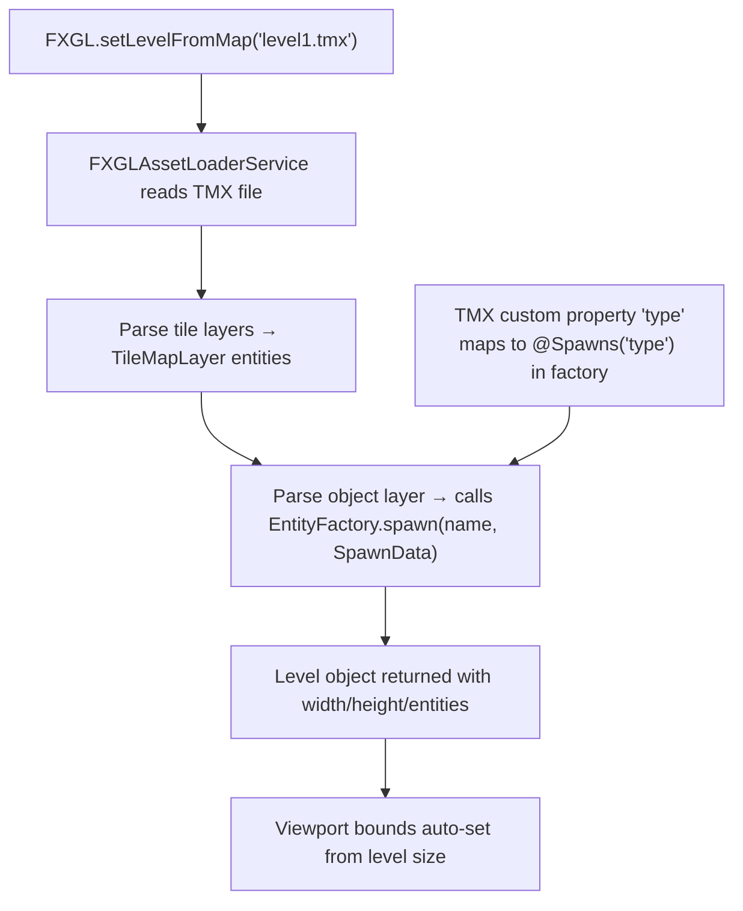
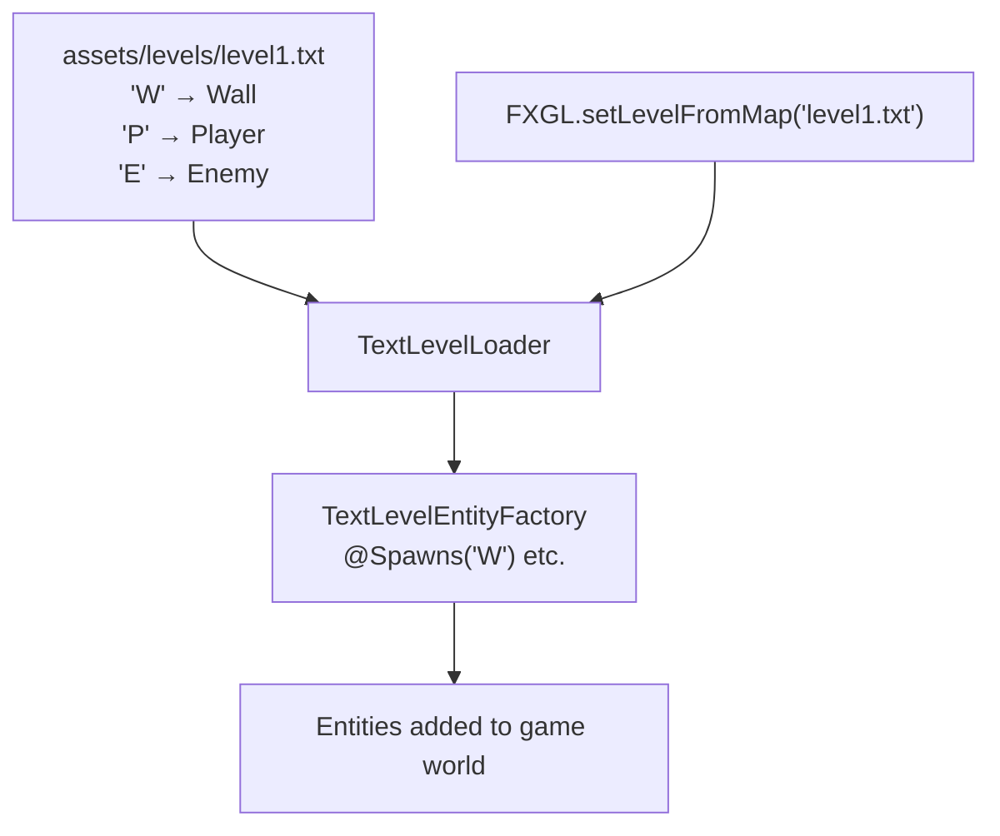
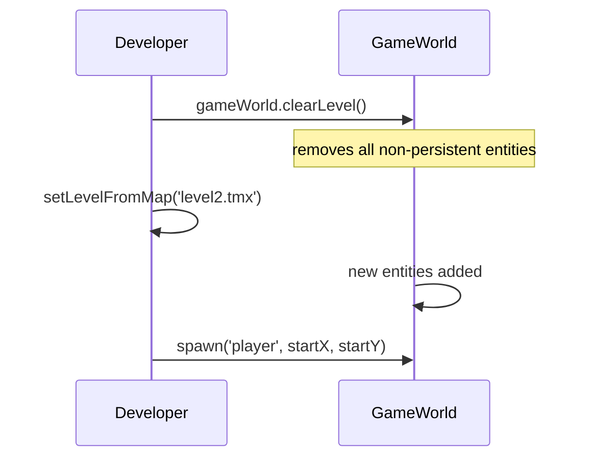
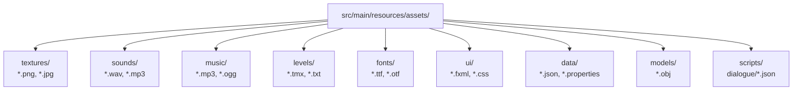
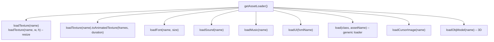
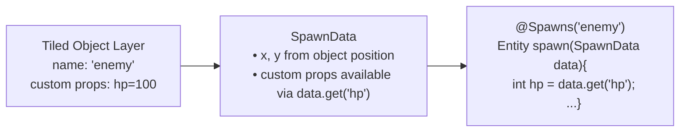
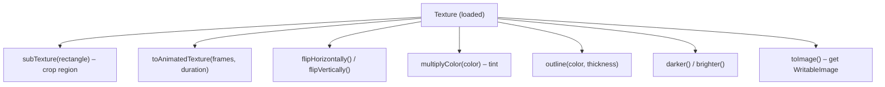

# Use Cases — Level Loading & Asset Management

Covers Tiled TMX map loading, isometric maps, text-level format, and the asset loader service.

## Actors and Primary Use Cases

## Tiled Map Loading Flow

## Text Level Format

## Dynamic Level Switching

## Asset Directory Convention

## Asset Loader API

## Tiled Object → Entity Type Mapping

## Texture Processing Use Cases

