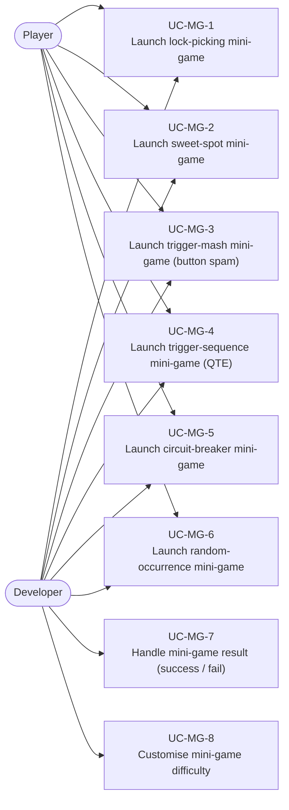
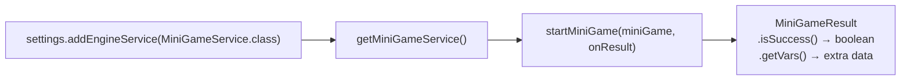
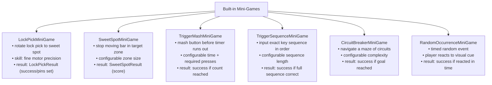
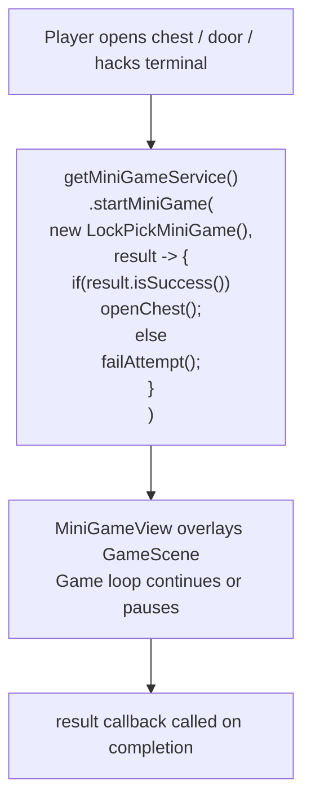
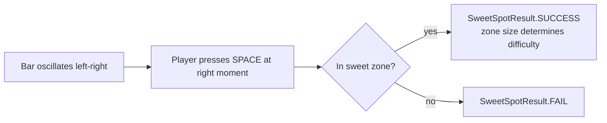
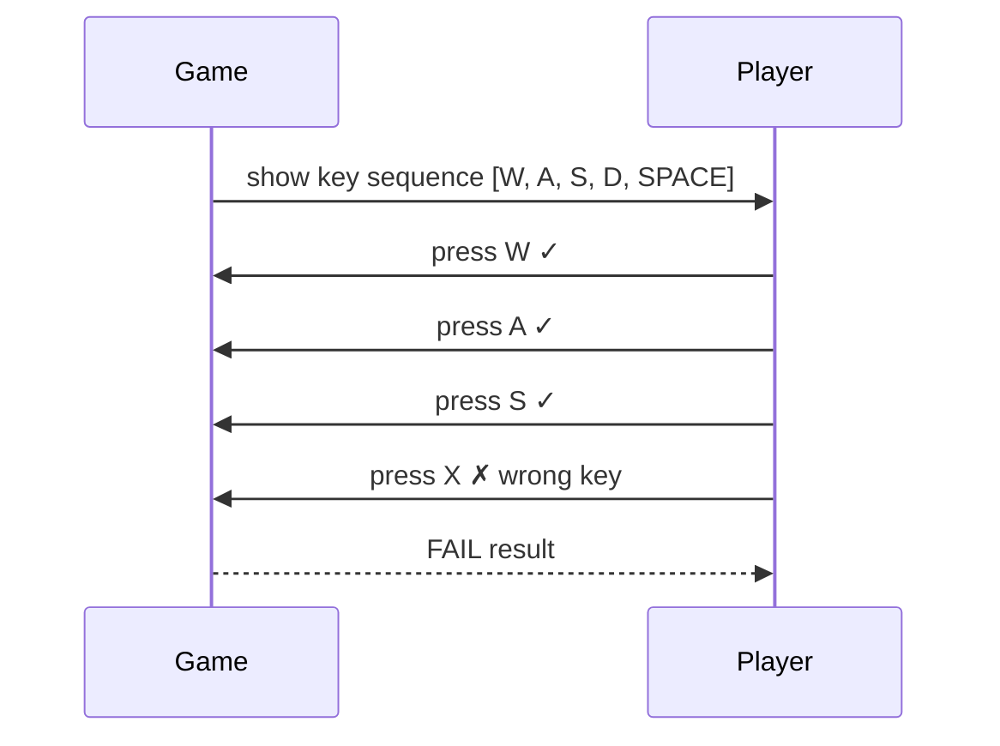
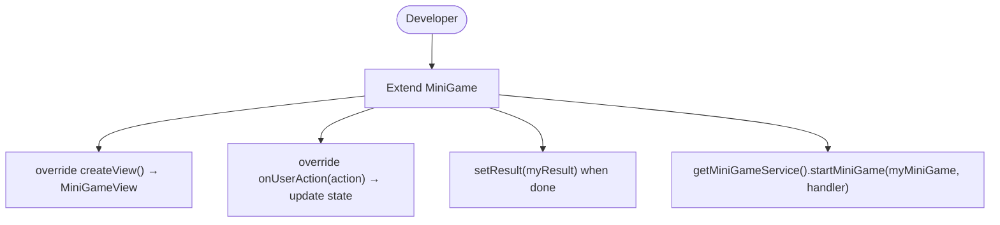

# Use Cases — Mini-Game System

Covers the six built-in mini-games: LockPicking, SweetSpot, TriggerMash, TriggerSequence,
CircuitBreaker, and RandomOccurrence.

## Actors and Primary Use Cases

## MiniGameService Registration

## Mini-Game Catalogue

## Mini-Game Invocation Pattern

## Sweet Spot Mini-Game Flow

## Trigger Sequence (QTE) Flow

## Custom Mini-Game (Extensibility)

