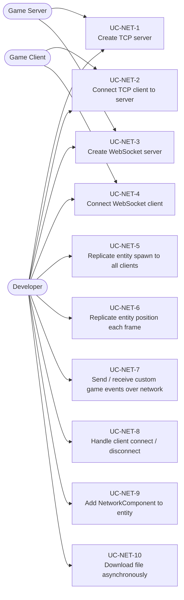
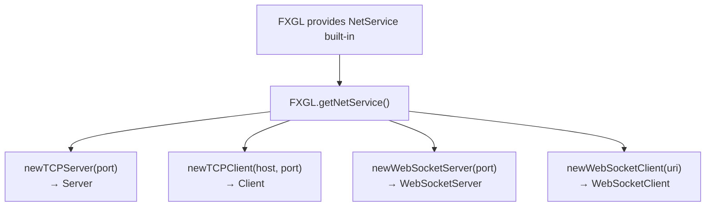
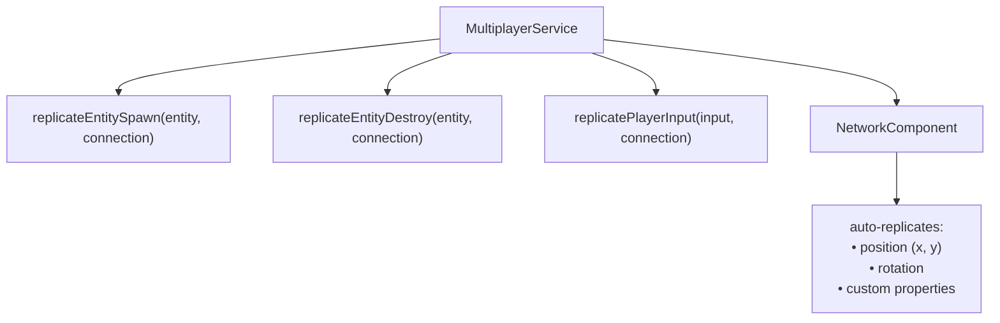
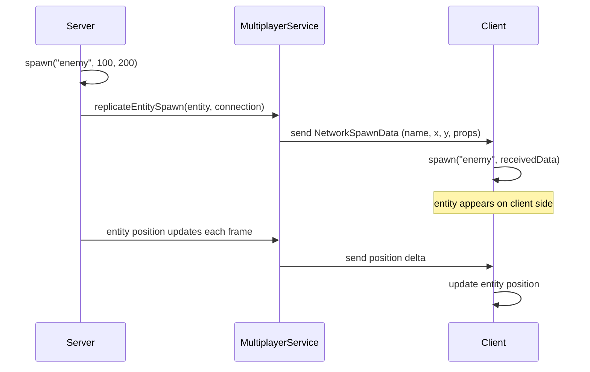
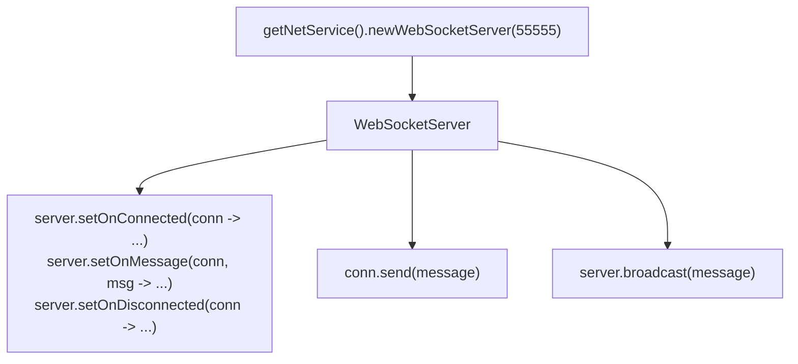
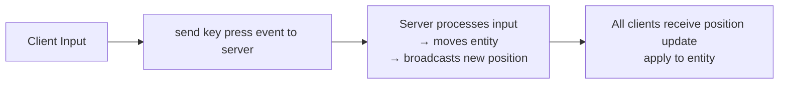
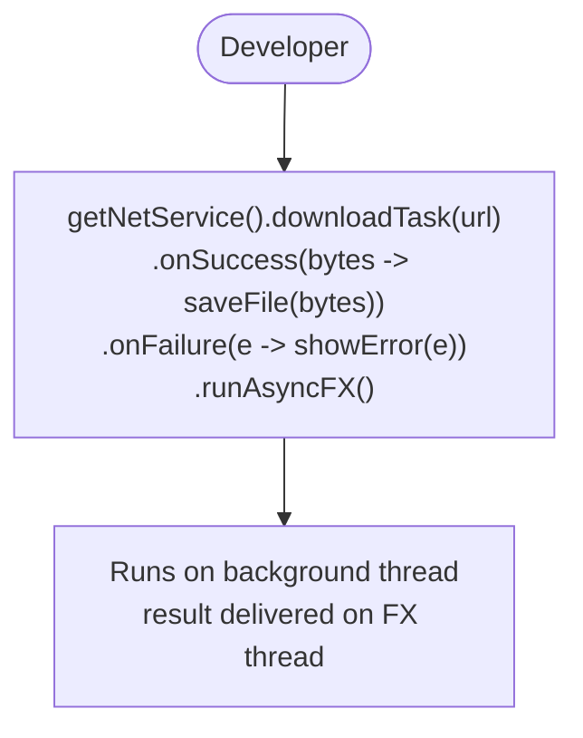
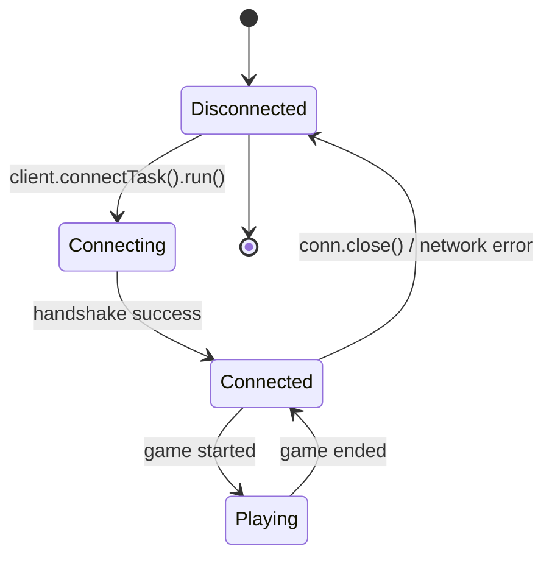
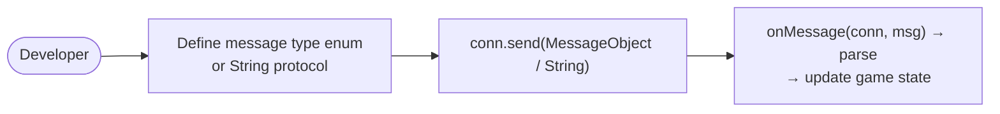

# Use Cases — Multiplayer & Networking

Covers MultiplayerService, entity replication, NetworkComponent, WebSocket transport, and TCP/UDP networking.

## Actors and Primary Use Cases

## Network Service Setup

## MultiplayerService Architecture

## Entity Replication Flow

## WebSocket Server Use Case

## Input Replication Pattern (authoritative server)

## File Download Use Case

## Connection Lifecycle

## Custom Protocol Message

