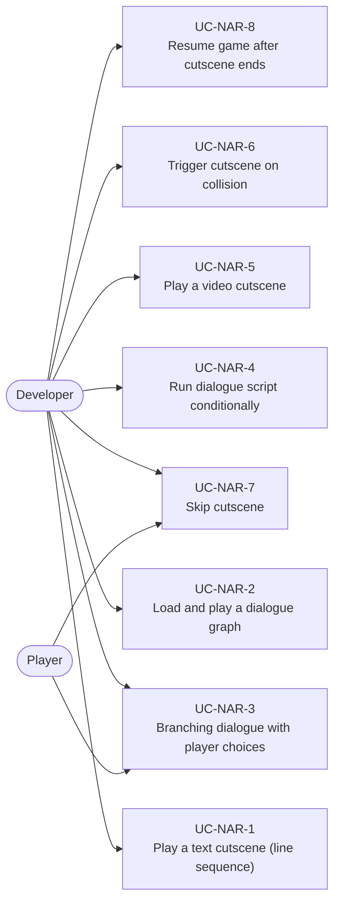
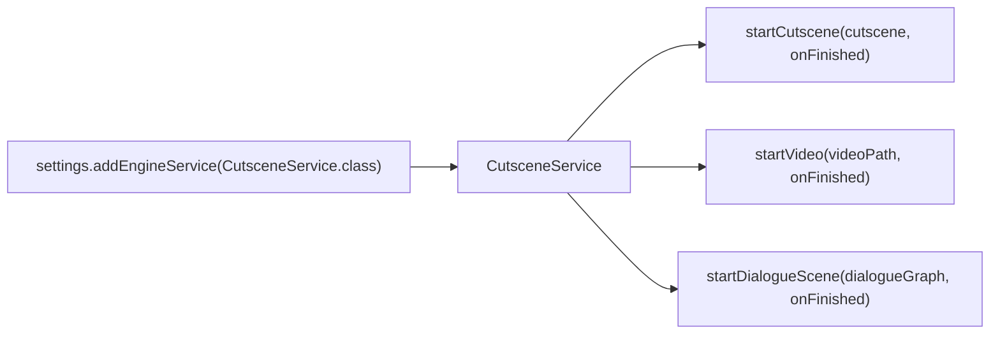
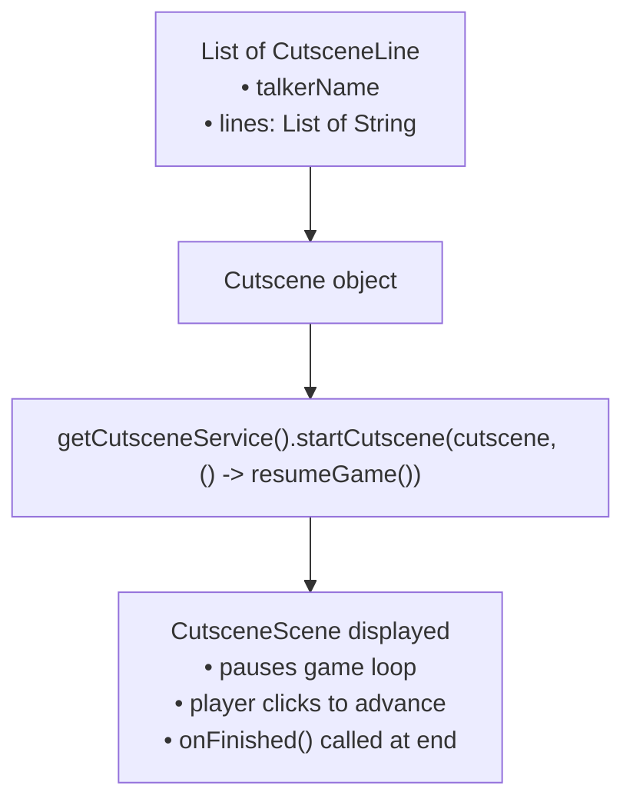
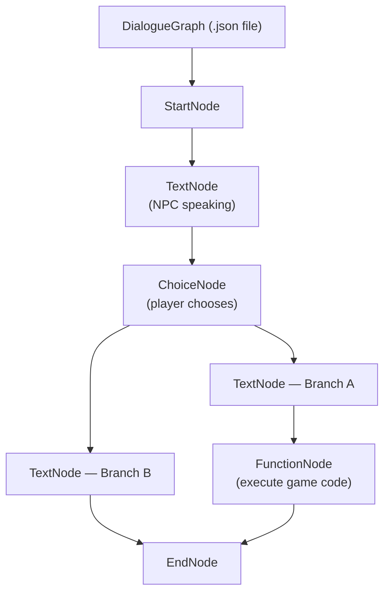
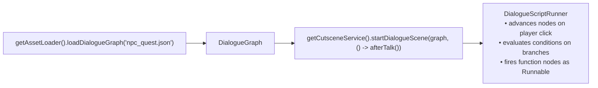
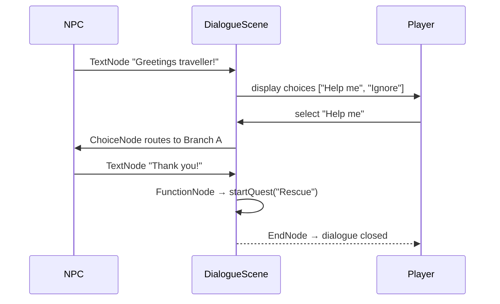
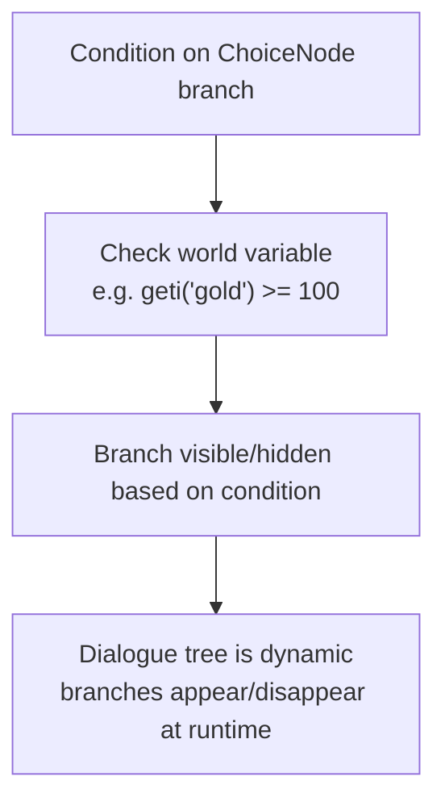
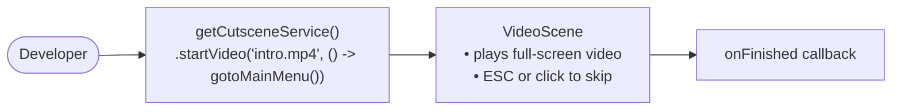
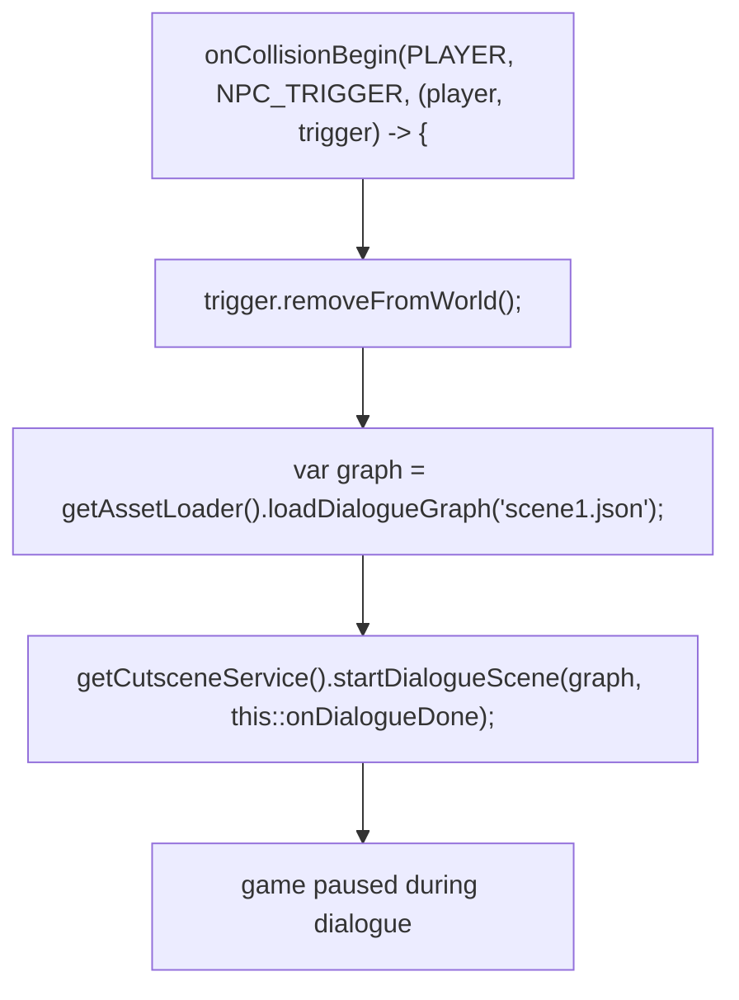

# Use Cases — Cutscenes, Dialogue & Video

Covers the CutsceneService, dialogue graphs, the dialogue script runner, and video scenes.

## Actors and Primary Use Cases

## CutsceneService API

## Text Cutscene Structure

## Dialogue Graph Structure

## Dialogue Graph Loading & Playback

## Branching Dialogue Use Case

## Dialogue Script Conditions

## Video Scene Use Case

## Collision-Triggered Cutscene Pattern

