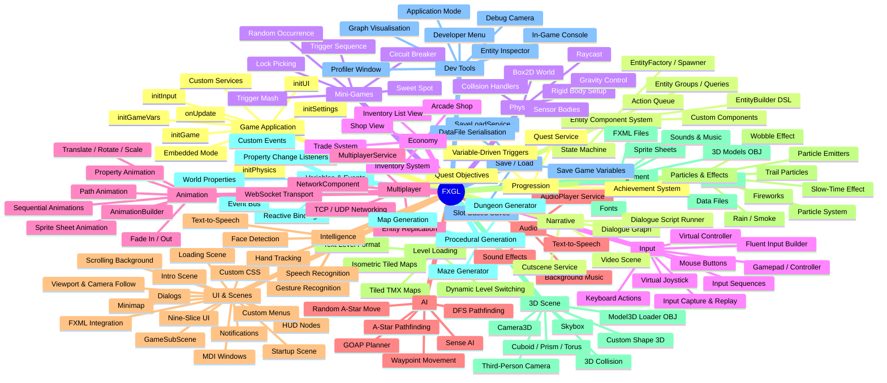

# FXGL — Full Domain Overview

A bird's-eye view of every skill area derivable from the FXGL core library.

```mermaid
mindmap
  root((FXGL))
    Game Application
      initSettings
      initGameVars
      initInput
      initGame
      initPhysics
      initUI
      onUpdate
      Custom Services
      Embedded Mode
    Entity Component System
      EntityBuilder DSL
      EntityFactory / Spawner
      Custom Components
      State Machine
      Action Queue
      Entity Groups / Queries
    Physics
      Box2D World
      Rigid Body Setup
      Collision Handlers
      Sensor Bodies
      Raycast
      Gravity Control
    Input
      Keyboard Actions
      Mouse Buttons
      Virtual Joystick
      Virtual Controller
      Gamepad / Controller
      Input Capture & Replay
      Input Sequences
      Fluent Input Builder
    Animation
      AnimationBuilder
      Translate / Rotate / Scale
      Fade In / Out
      Path Animation
      Sprite Sheet Animation
      Property Animation
      Sequential Animations
    Audio
      Sound Effects
      Background Music
      AudioPlayer Service
      Text-to-Speech
    UI & Scenes
      HUD Nodes
      GameSubScene
      Custom Menus
      Startup Scene
      Loading Scene
      Intro Scene
      Dialogs
      Notifications
      FXML Integration
      Custom CSS
      Nine-Slice UI
      MDI Windows
      Viewport & Camera Follow
      Minimap
      Scrolling Background
    Level Loading
      Tiled TMX Maps
      Isometric Tiled Maps
      Text Level Format
      Dynamic Level Switching
    Asset Management
      Textures
      Sprite Sheets
      Fonts
      Sounds & Music
      FXML Files
      Data Files
      3D Models OBJ
    Variables & Events
      World Properties
      Reactive Bindings
      Property Change Listeners
      Event Bus
      Custom Events
    Save / Load
      SaveLoadService
      DataFile Serialisation
      Save Game Variables
      Slot-Based Saves
    Progression
      Achievement System
      Variable-Driven Triggers
      Quest Service
      Quest Objectives
    Narrative
      Cutscene Service
      Dialogue Graph
      Dialogue Script Runner
      Video Scene
    Mini-Games
      Lock Picking
      Sweet Spot
      Trigger Mash
      Trigger Sequence
      Circuit Breaker
      Random Occurrence
    Economy
      Inventory System
      Inventory List View
      Trade System
      Shop View
      Arcade Shop
    Multiplayer
      MultiplayerService
      NetworkComponent
      Entity Replication
      WebSocket Transport
      TCP / UDP Networking
    AI
      A-Star Pathfinding
      DFS Pathfinding
      Random A-Star Move
      GOAP Planner
      Sense AI
      Waypoint Movement
    Intelligence
      Face Detection
      Gesture Recognition
      Hand Tracking
      Speech Recognition
      Text-to-Speech
    Particles & Effects
      Particle Emitters
      Particle System
      Trail Particles
      Slow-Time Effect
      Wobble Effect
      Fireworks
      Rain / Smoke
    3D Scene
      Camera3D
      Model3D Loader OBJ
      Skybox
      Cuboid / Prism / Torus
      Custom Shape 3D
      3D Collision
      Third-Person Camera
    Procedural Generation
      Dungeon Generator
      Maze Generator
      Map Generation
    Dev Tools
      Developer Menu
      Entity Inspector
      In-Game Console
      Profiler Window
      Debug Camera
      Application Mode
      Graph Visualisation
```
