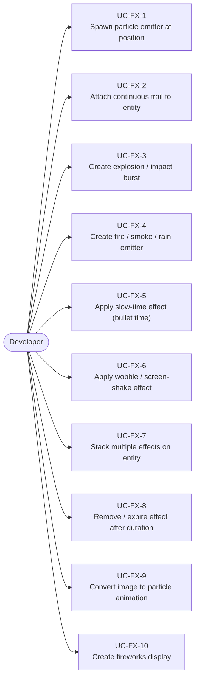
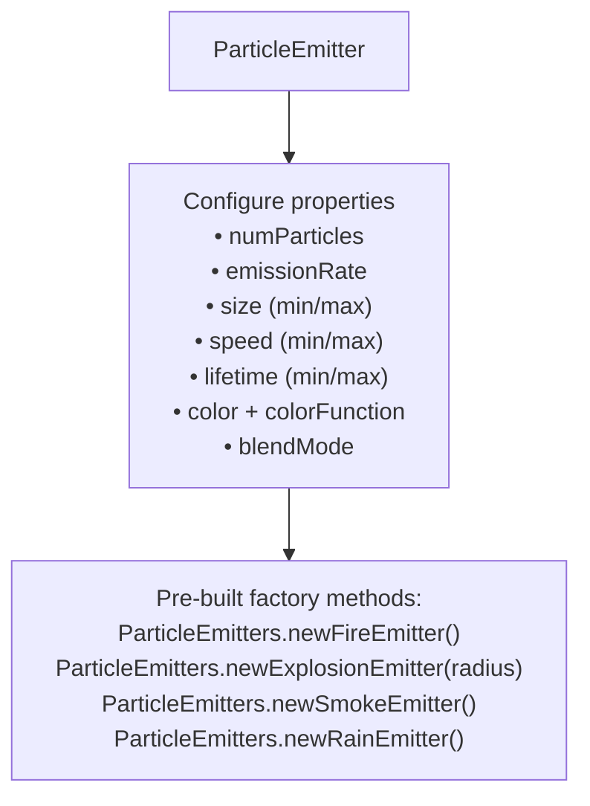
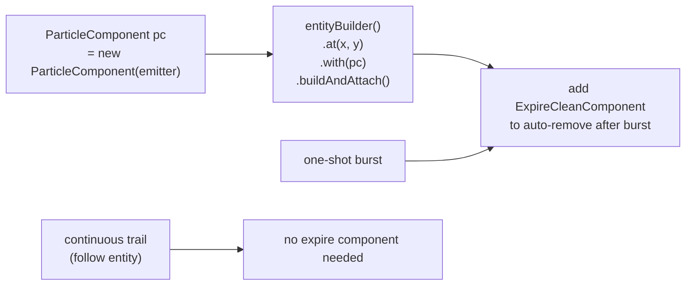
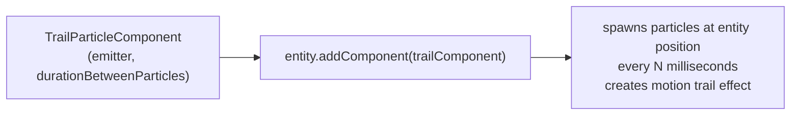
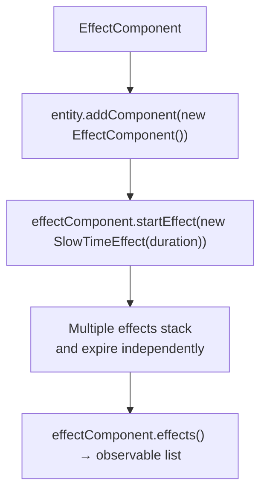
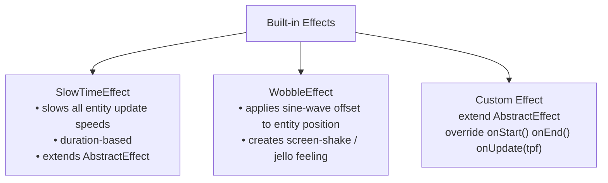
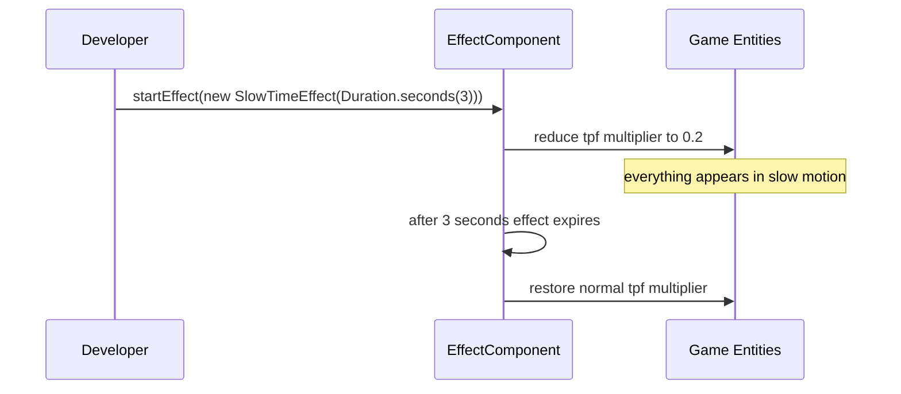
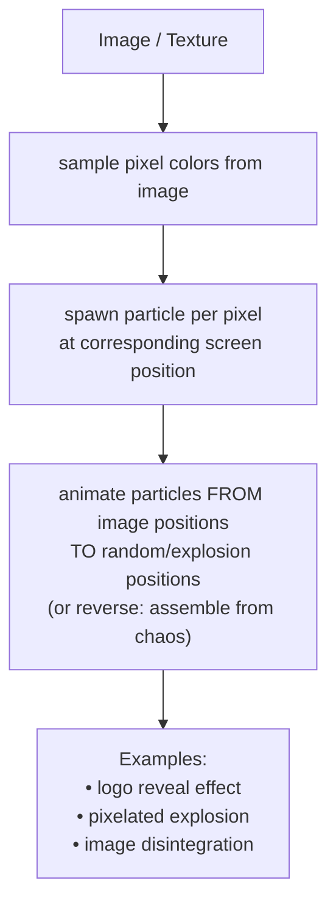
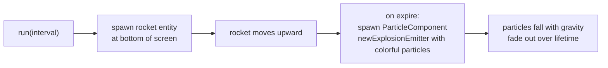
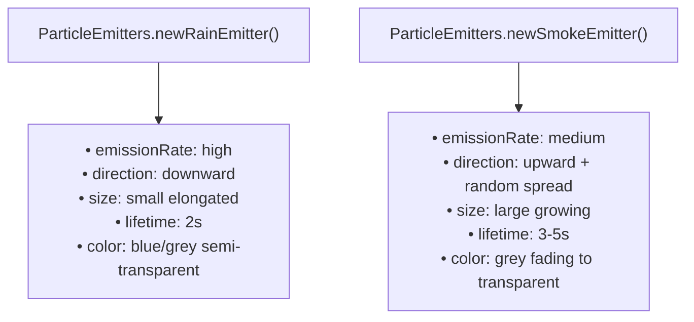

# Use Cases — Particle System & Visual Effects

Covers particle emitters, the particle system, trail particles, slow-time effect, wobble effect,
and effect composition via EffectComponent.

## Actors and Primary Use Cases

## Particle Emitter Configuration

## Particle Emitter Spawning

## TrailParticleComponent (Entity Trail)

## EffectComponent & Effect Stacking

## Built-in Effects

## Slow-Time Effect Use Case

## Image-to-Particles Animation

## Fireworks Use Case

## Rain / Smoke Use Case

