# Use Cases — Particle System & Visual Effects

Covers ParticleEmitter configuration, built-in factory emitters, image-textured particles,
custom per-particle control functions, TrailParticleComponent, EffectComponent, and
screen-level effects (SlowTimeEffect, WobbleEffect).

## Actors and Primary Use Cases

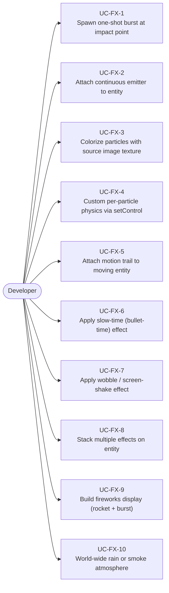

## Emitter Configuration API

```mermaid
flowchart TD
    PE["ParticleEmitter\n(or factory from ParticleEmitters)"] --> Count["setNumParticles(int)\nsetEmissionRate(0.0–1.0)\nsetMaxEmissions(int MAX_VALUE = infinite)"]
    PE --> Size["setSize(double min, double max)"]
    PE --> FnV["setVelocityFunction(\n  Function<Integer, Point2D>\n)"]
    PE --> FnA["setAccelerationFunction(\n  Supplier<Point2D>\n)"]
    PE --> FnE["setExpireFunction(\n  Function<Integer, Duration>\n)"]
    PE --> FnS["setScaleFunction(\n  Function<Integer, Point2D>\n) — per-particle scale delta"]
    PE --> FnSP["setSpawnPointFunction(\n  Function<Integer, Point2D>\n) — offset from entity origin"]
    PE --> Color["setStartColor(Color)\nsetEndColor(Color)"]
    PE --> Img["setSourceImage(Image)\n— colorize via texture().multiplyColor(c)\n   or texture().toColor(c)"]
    PE --> Blend["setBlendMode(BlendMode.ADD | SRC_OVER)"]
    PE --> Rot["setAllowParticleRotation(boolean)"]
    PE --> Interp["setInterpolator(Interpolators.EXPONENTIAL.EASE_OUT())"]
    PE --> Ctrl["setControl(Consumer<Particle>)\n— per-frame per-particle override"]
```

## Built-in Factory Emitters

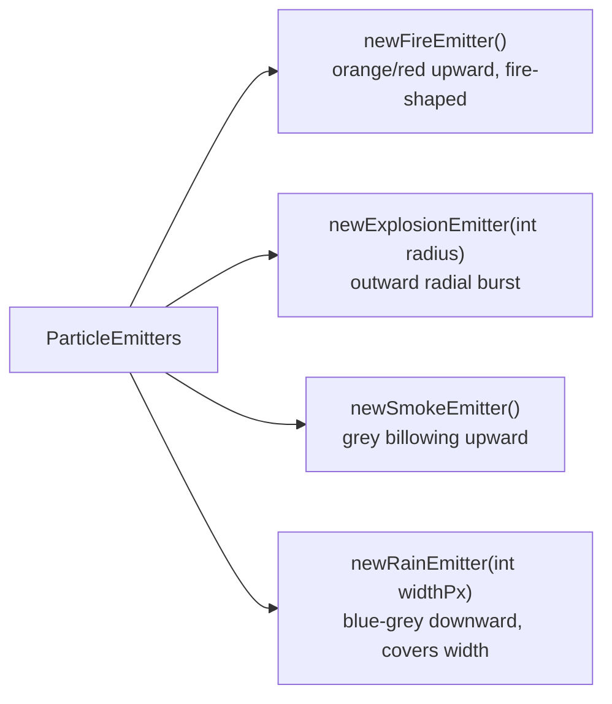

## Attaching Emitter to Entity

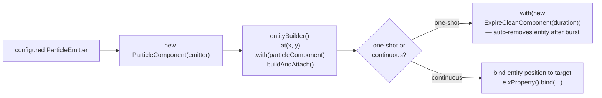

## UC-FX-1: One-Shot Burst at Impact Point

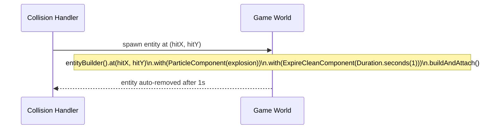

## UC-FX-3: Textured Particles with Colorization

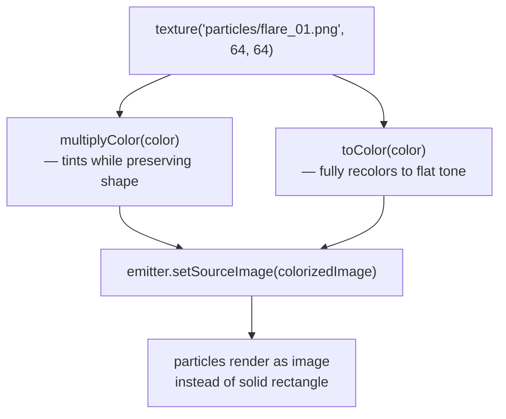

Available particle sprite names (from `assets/textures/particles/`):
`circle_01–05`, `dirt_01–03`, `fire_01–02`, `flame_01–06`, `flare_01`, `light_01–03`,
`magic_01–05`, `muzzle_01–05`, `scorch_01–03`, `spark_01–07`, `star_01–09`,
`smoke_01–10`, `slash_01–04`, `twirl_01–03`, `trace_01–07`, `symbol_01–02`, `window_01–04`

## UC-FX-4: Custom Per-Particle Physics (setControl)

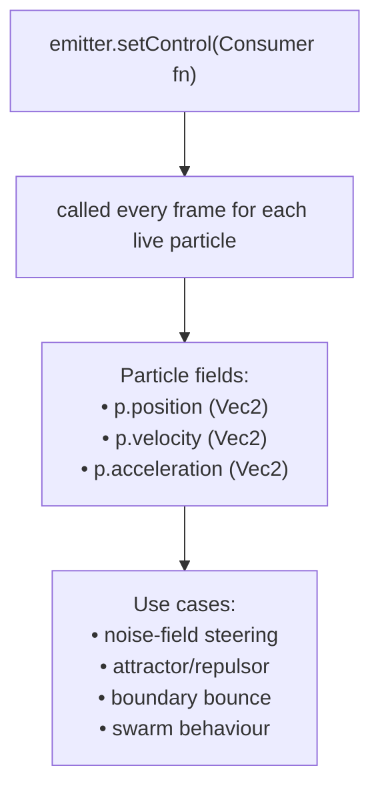

## UC-FX-5: Motion Trail on Moving Entity

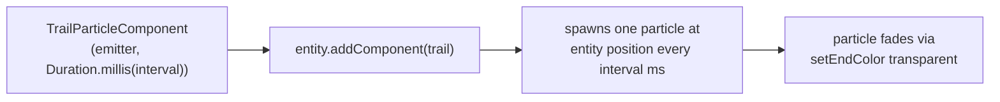

## UC-FX-6 / UC-FX-7: EffectComponent Effects

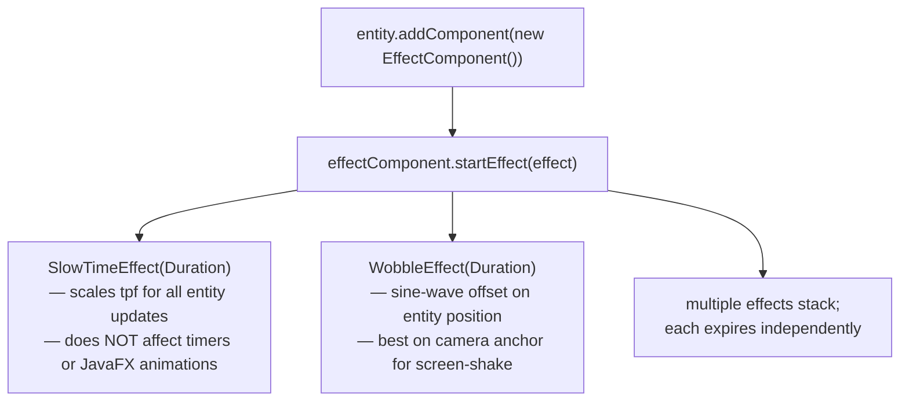

## UC-FX-9: Fireworks Display Pattern

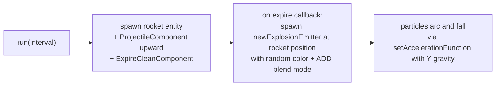

## UC-FX-10: Atmospheric Rain / Smoke

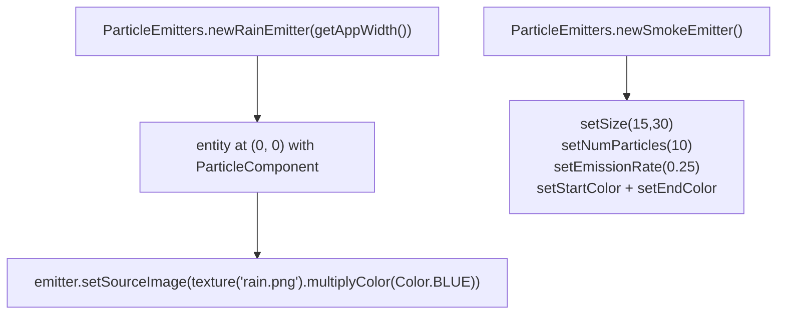

## Gotcha Summary

| Gotcha | Rule |
|--------|------|
| Missing `ExpireCleanComponent` | One-shot emitters leak entities forever — always pair |
| `BlendMode.ADD` on light backgrounds | Switch to `BlendMode.SRC_OVER` |
| High-rate `TrailParticleComponent` | Each trail particle is its own entity — profile at high counts |
| `setControl` modifies velocity/acceleration | Do not fight the base velocity/acceleration unless you zero them first |
| `setVelocityFunction` vs `setVelocityX/Y` | FXGL uses function-based API; `setVelocityX/Y` does not exist |
| `SlowTimeEffect` scope | Affects entity `onUpdate()` tpf only — not `run()` timers or JavaFX |
