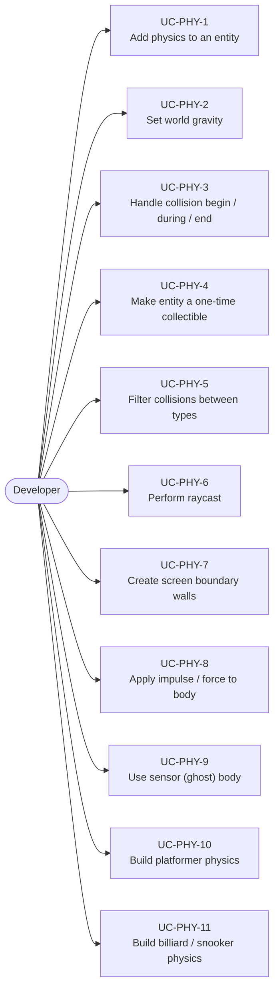
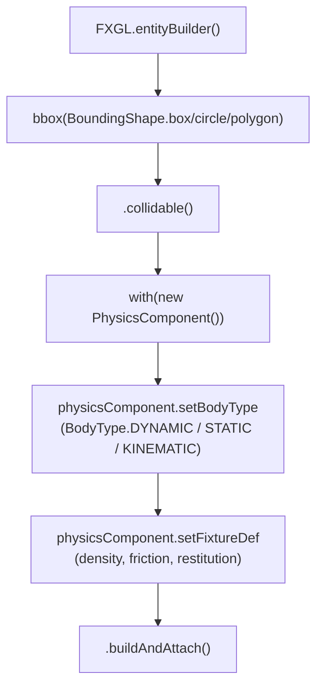
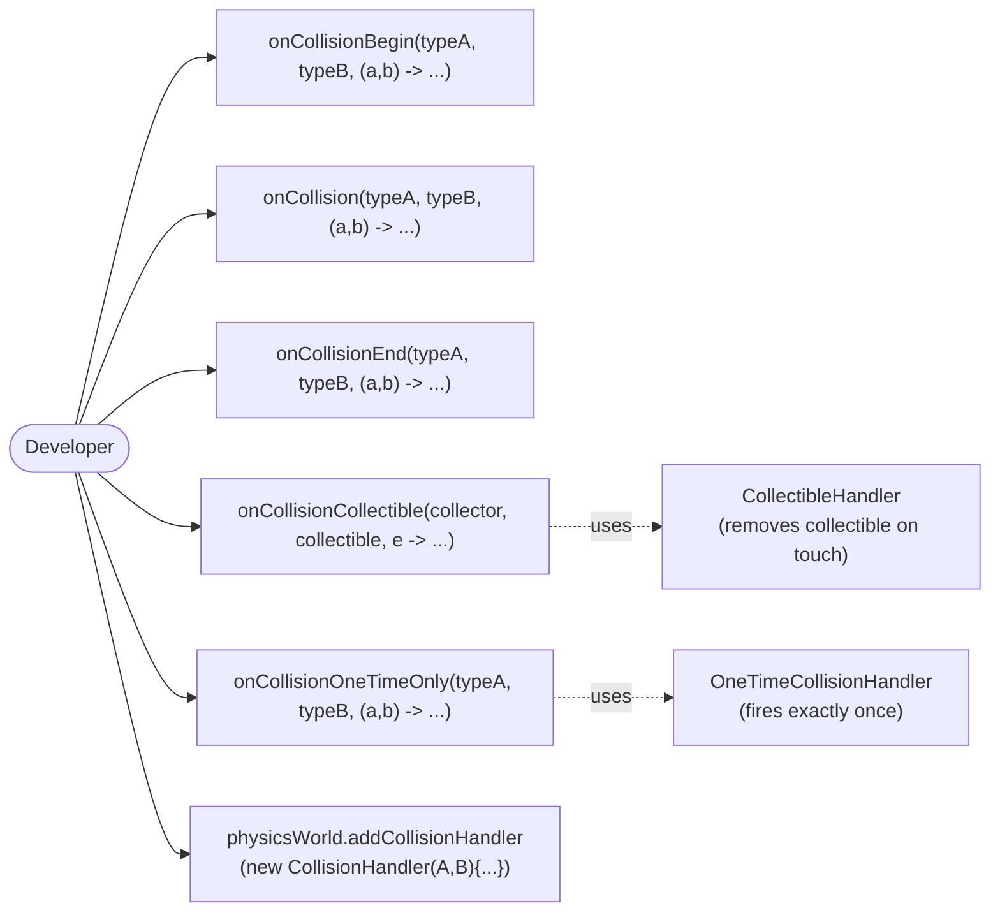
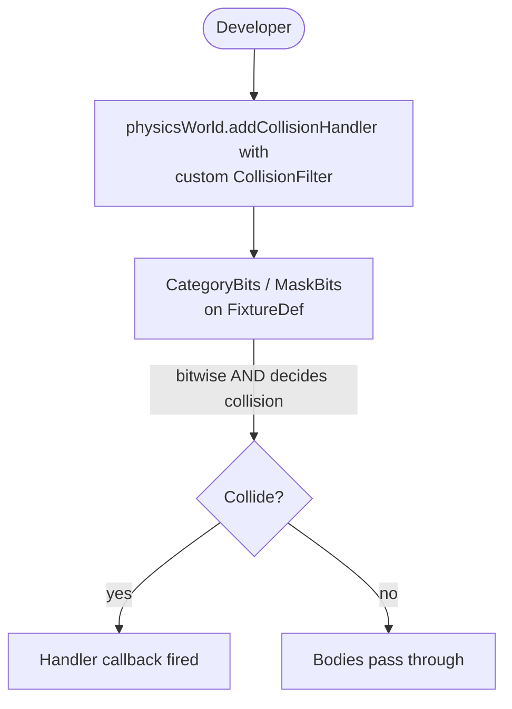
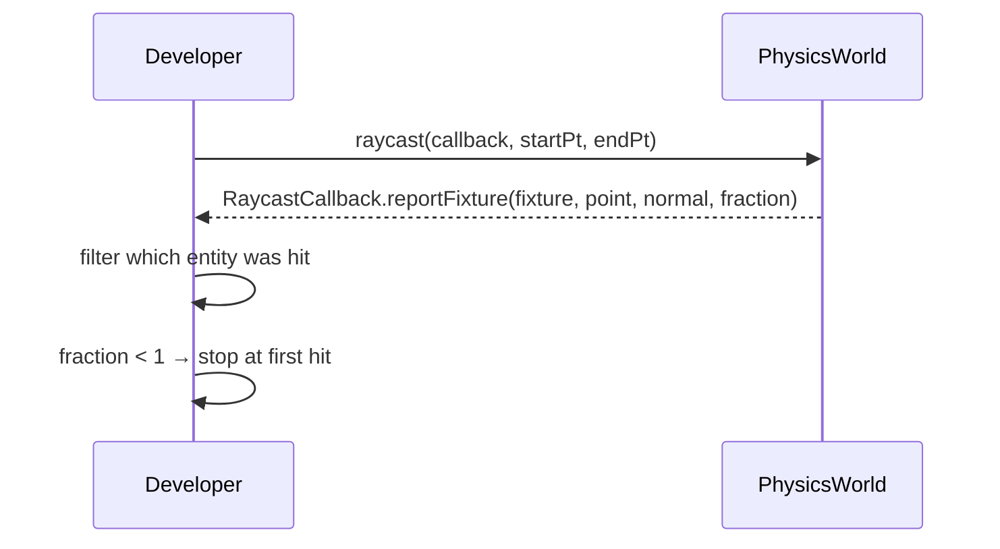
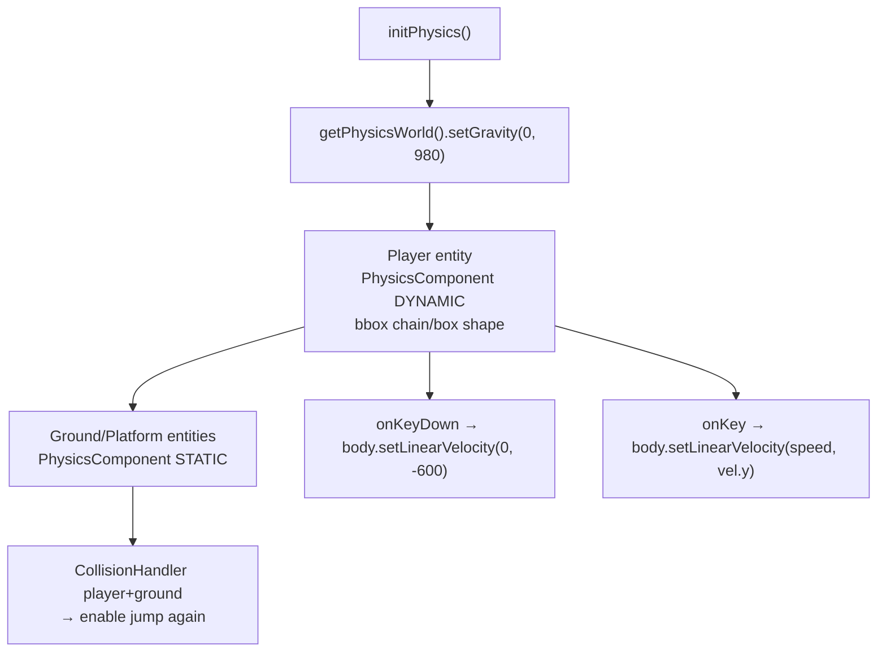

# Use Cases — Physics & Collision

Covers Box2D integration, rigid bodies, collision handlers, sensors, and raycasting.

## Actors and Primary Use Cases



## Physics Entity Setup



## Collision Handler Registration



## Collision Filter Use Case



## Raycast Use Case



## Platformer Physics Pattern



## Physics Body Types

```mermaid
graph LR
    BodyTypes["BodyType"]
    BodyTypes --> Static["STATIC\nImmovable walls,\nground, obstacles"]
    BodyTypes --> Dynamic["DYNAMIC\nPlayer, enemies,\nprojectiles"]
    BodyTypes --> Kinematic["KINEMATIC\nPlatforms that move\nunder script control"]
    BodyTypes --> Sensor["Sensor FixtureDef\n(ghost body for trigger zones)"]
