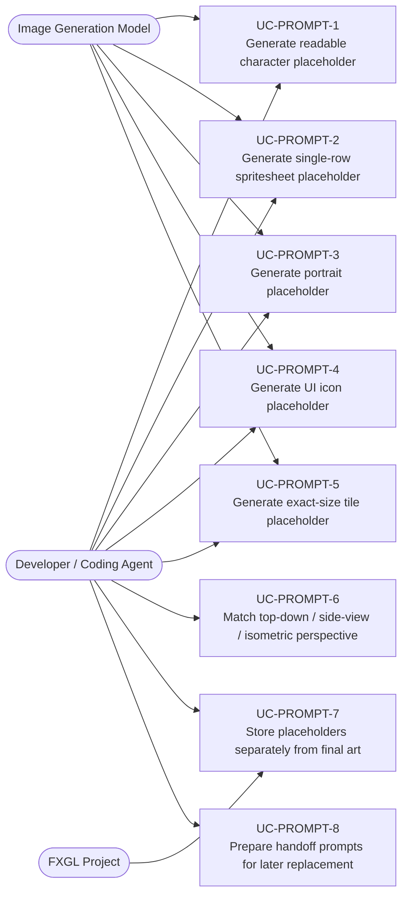
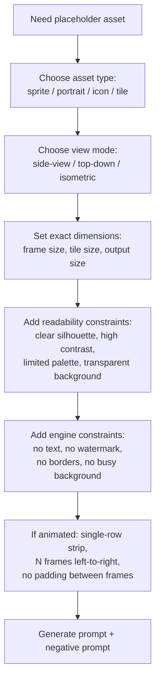
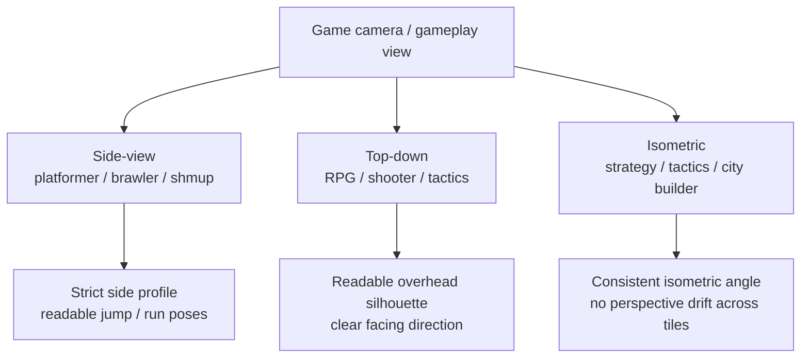
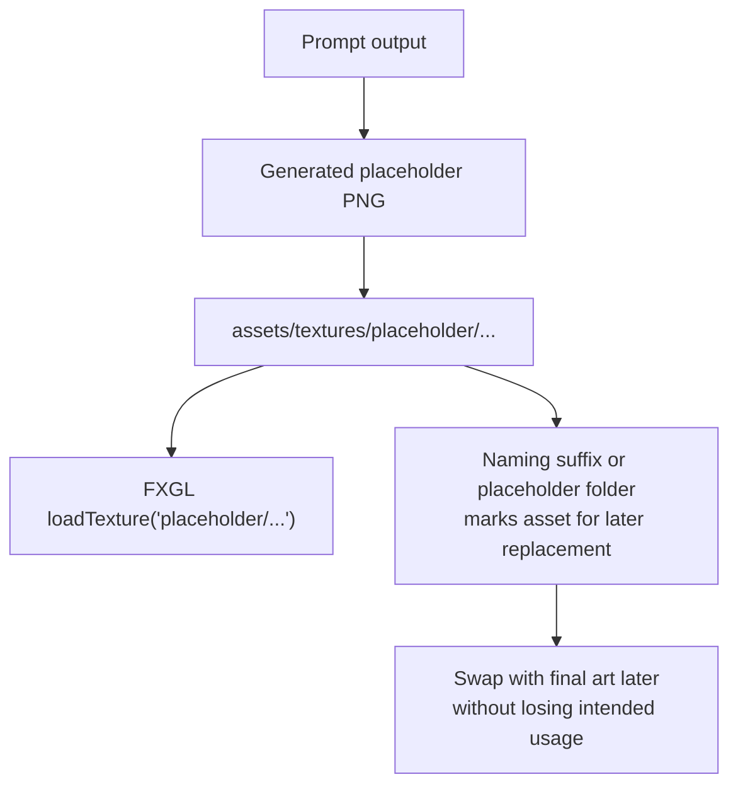
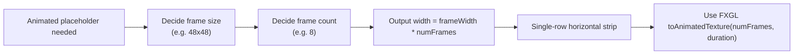
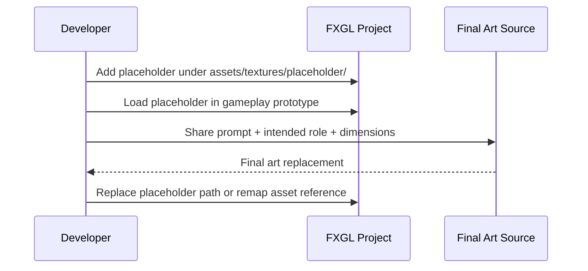

# Use Cases — AI Placeholder Art Prompts for FXGL

Covers prompt generation for temporary, gameplay-readable placeholder images that fit an FXGL
project's perspective, tile size, and animation constraints.

## Actors and Primary Use Cases

## Prompt Construction Flow

## Perspective Selection

## Placeholder Intake into FXGL Project

## Spritesheet Structure Constraint

## Placeholder Replacement Lifecycle

