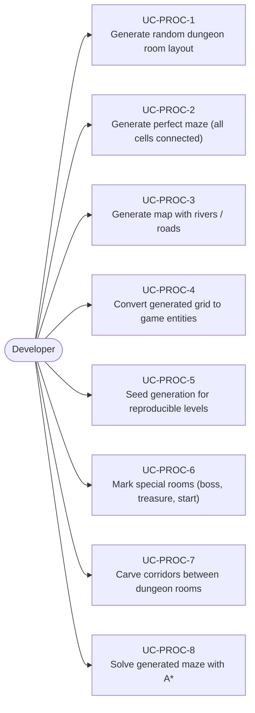
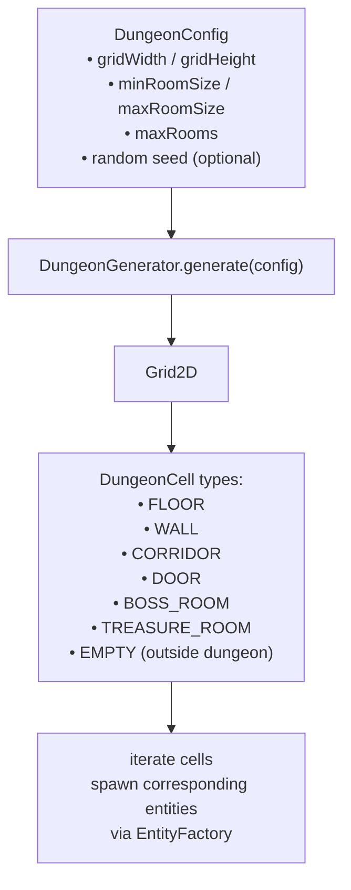
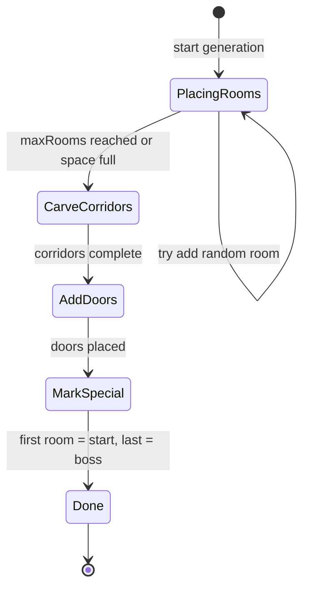
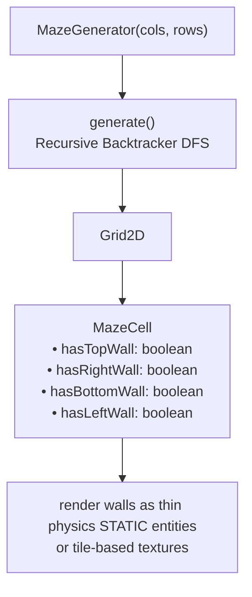
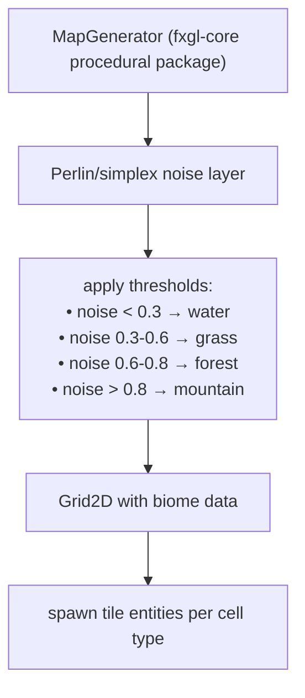
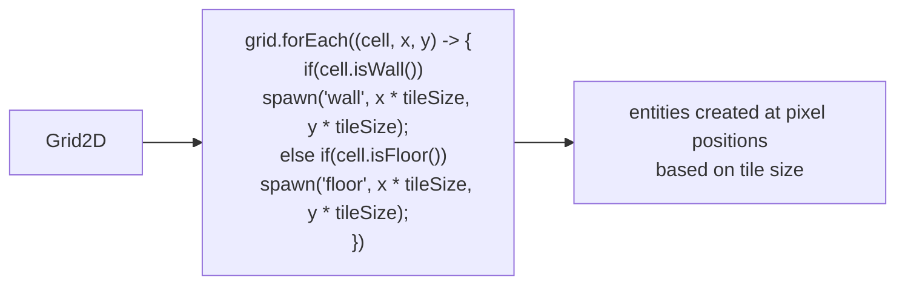
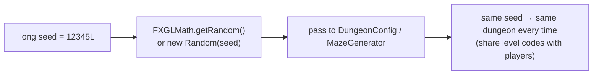
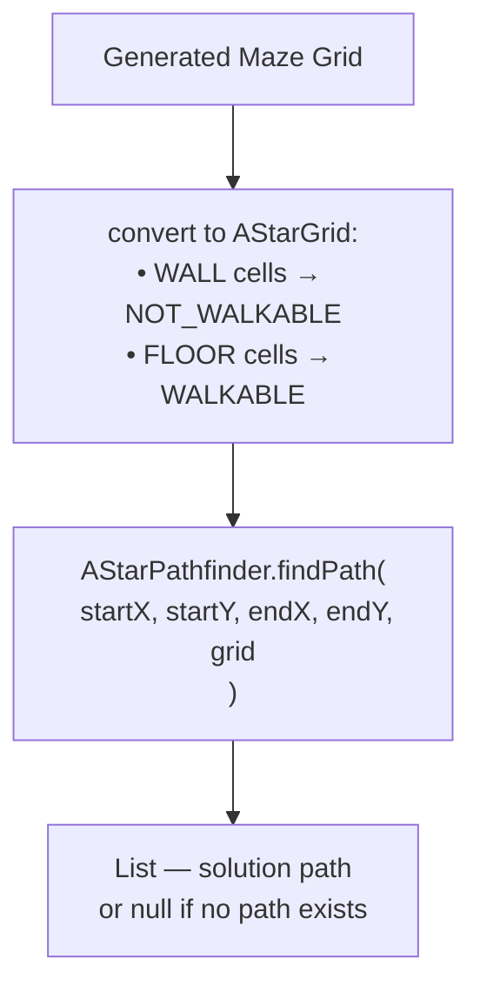
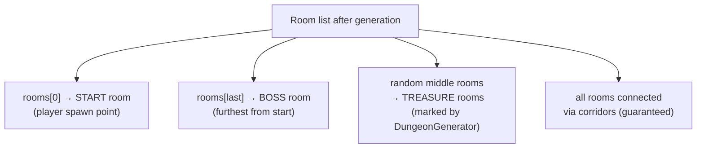

# Use Cases — Procedural Generation

Covers dungeon generation, maze generation, map generation, and procedural level assembly.

## Actors and Primary Use Cases

## Dungeon Generation Flow

## Dungeon Generation State Machine

## Maze Generation Flow

## Map Generation (Terrain-style)

## Grid-to-Entity Conversion Pattern

## Reproducible Generation with Seed

## A* on Generated Maze

## Special Room Placement

