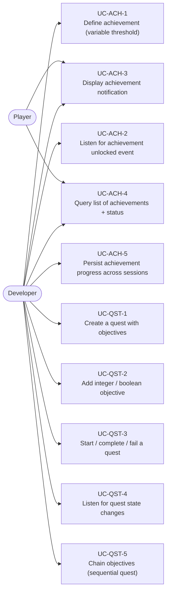
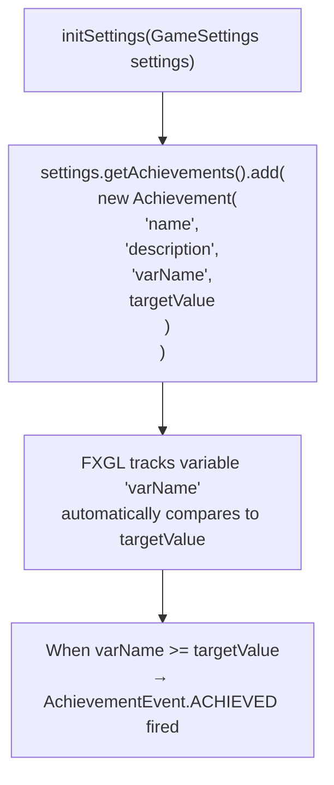
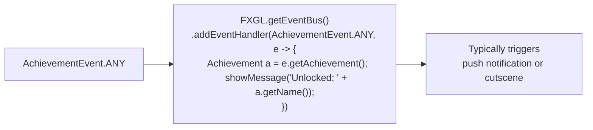
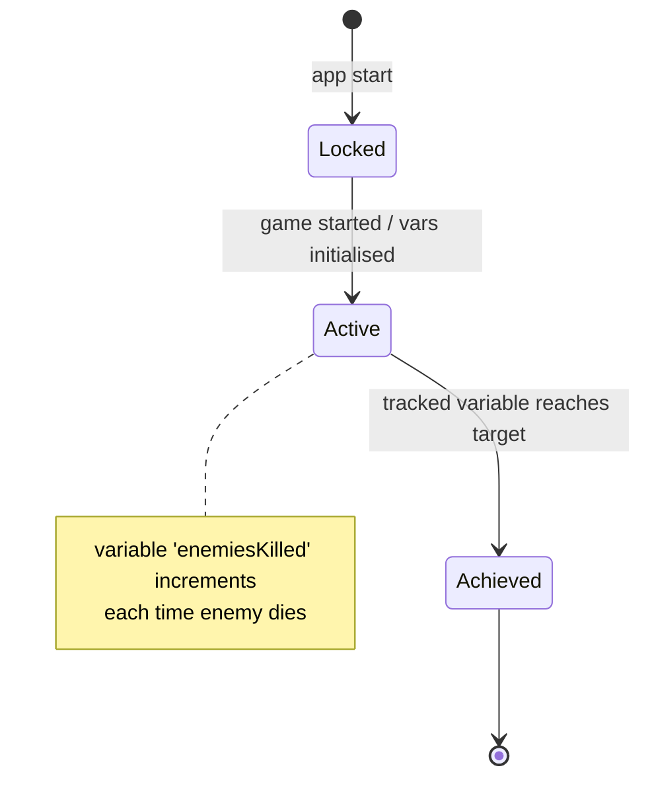
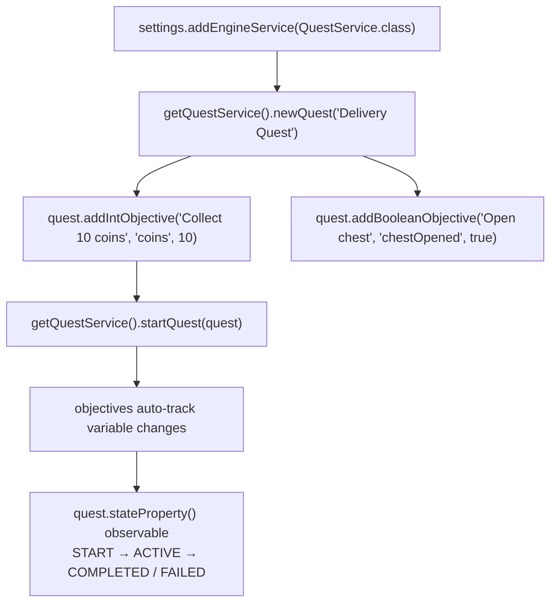
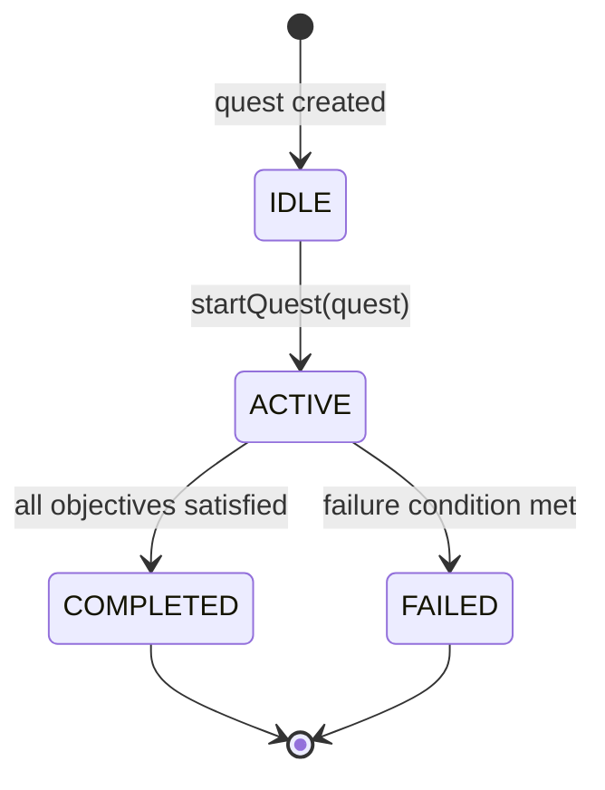
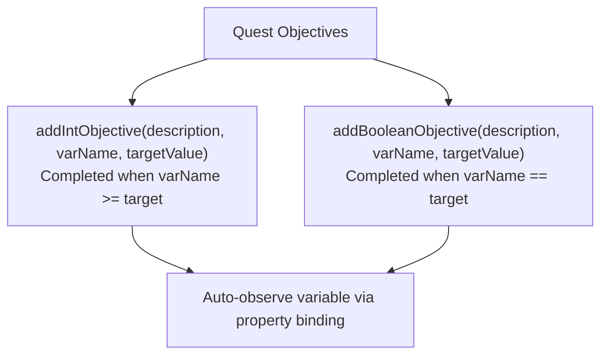
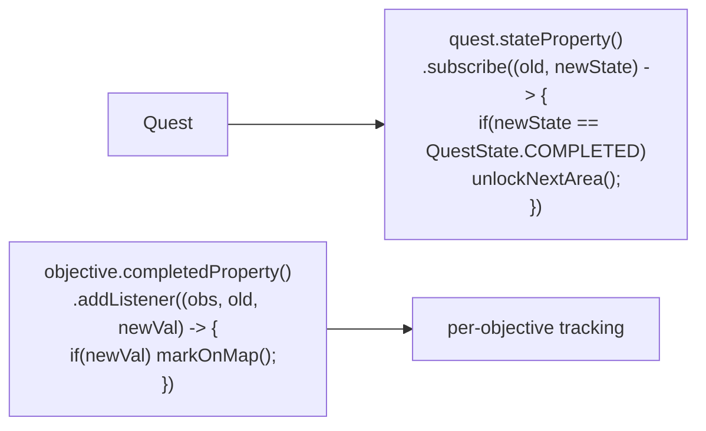
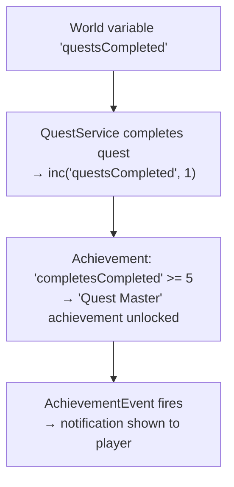

# Use Cases — Achievements & Quests

Covers variable-driven achievement tracking, the AchievementService, quest objectives, and the QuestService.

## Actors and Primary Use Cases

## Achievement Definition & Registration

## Achievement Event Handling

## Achievement State Machine

## Quest Creation & Lifecycle

## Quest State Machine

## Quest Objective Types

## Quest State Listener

## Achievement + Quest Integration Pattern

