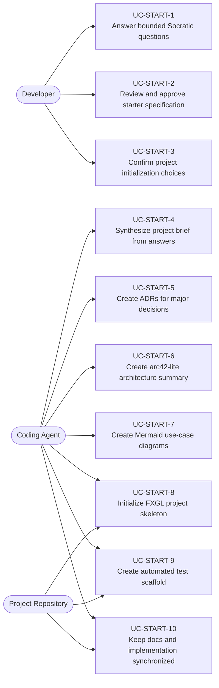
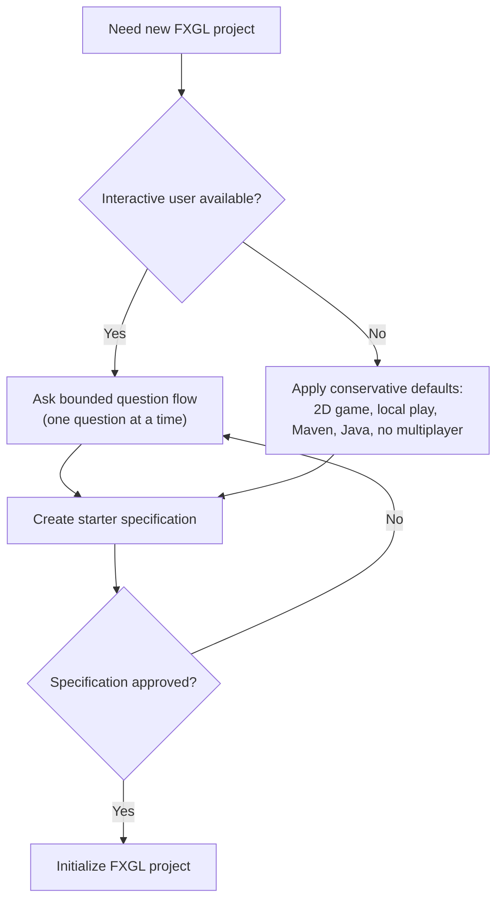
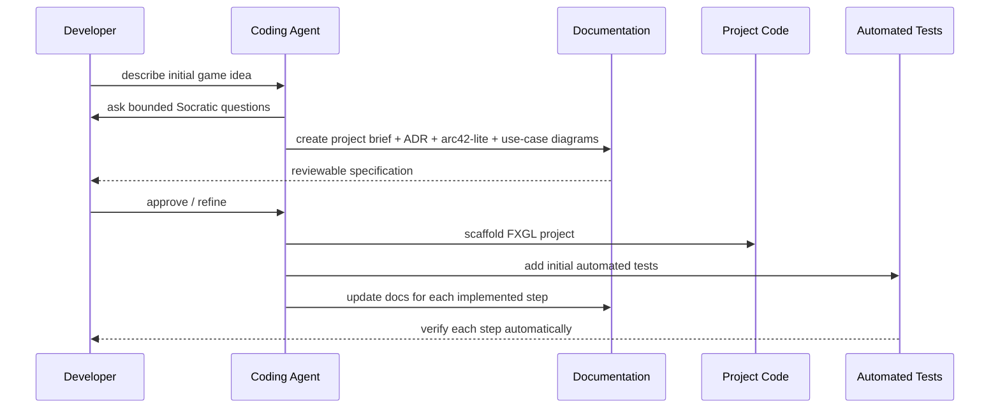
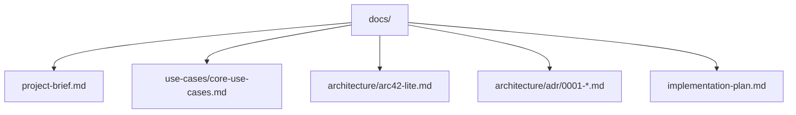
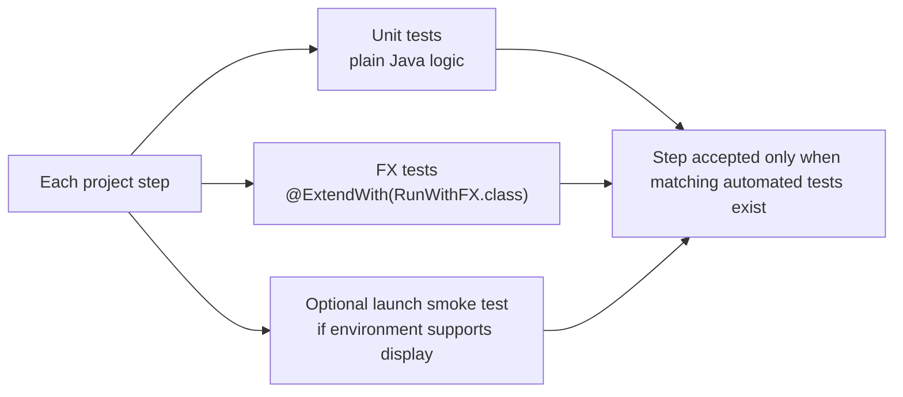
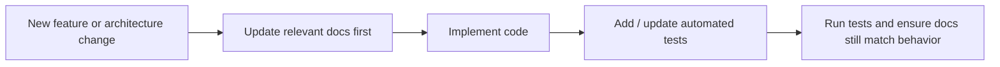

# Use Cases — FXGL Project Starter Workflow

Covers interactive project discovery, docs-first specification, project scaffolding, and
documentation-synchronized implementation for new FXGL projects.

## Actors and Primary Use Cases

## Interactive vs Default Path

## Docs-First Delivery Flow

## Documentation Artifacts

## Testing Strategy

## Synchronization Rule

