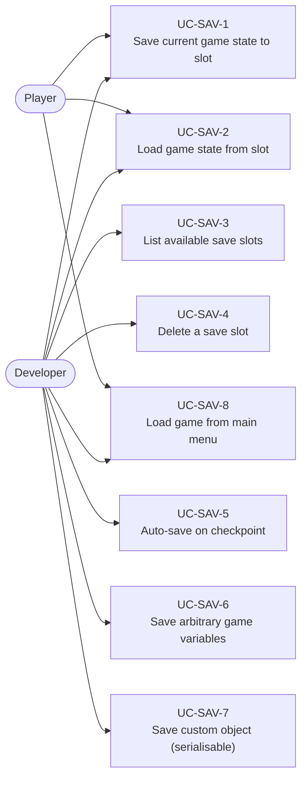
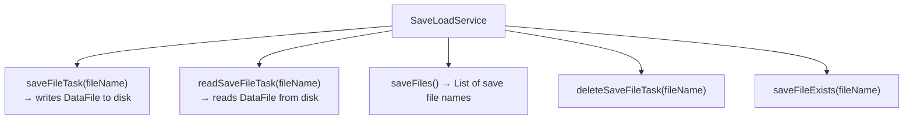
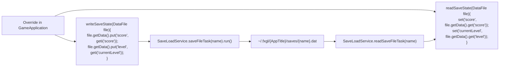
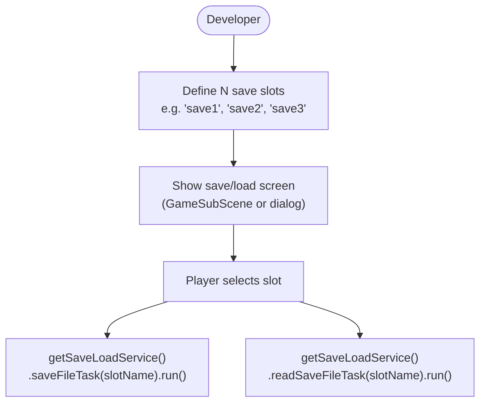
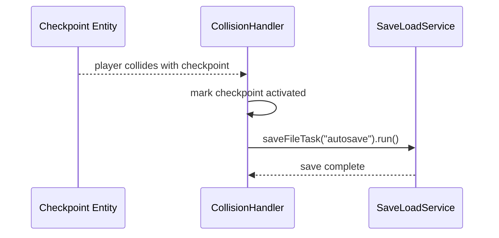
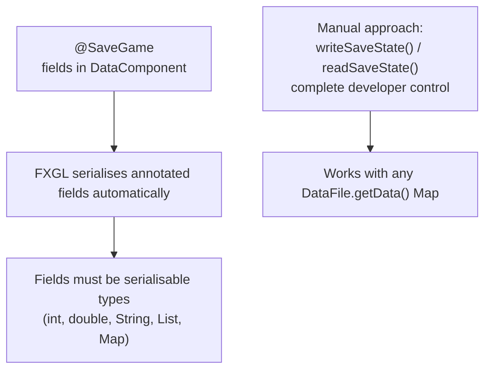
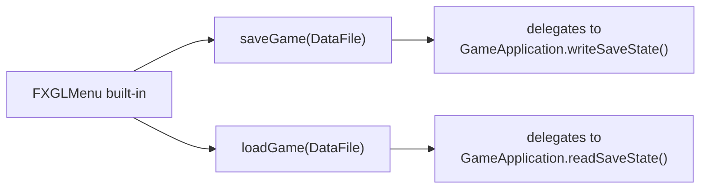

# Use Cases — Save & Load

Covers the SaveLoadService, data serialisation, slot-based saves, and save-game variable persistence.

## Actors and Primary Use Cases

## SaveLoadService API

## Save Game Data Flow

## Slot-Based Save System Pattern

## Auto-Save on Checkpoint

## Save Game Variables (SaveGameVars pattern)

## Integration with Menu System

