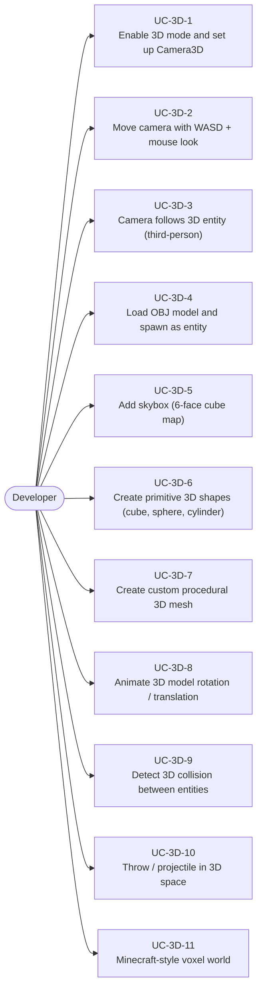
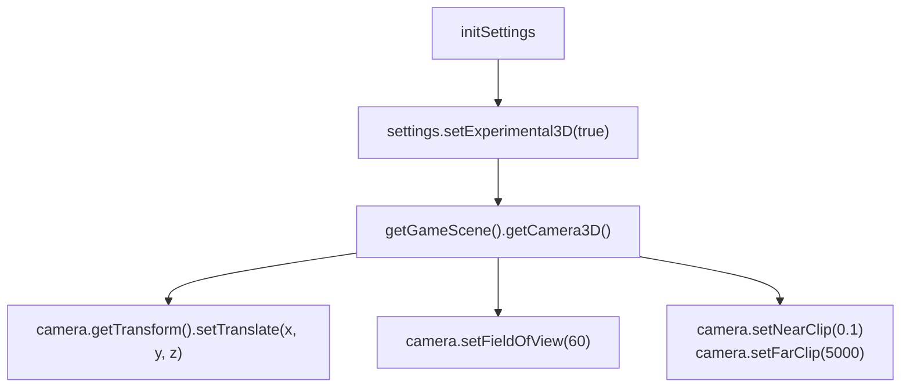
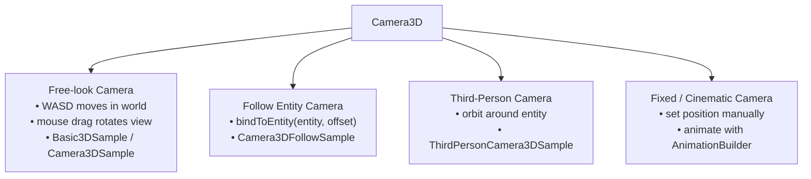
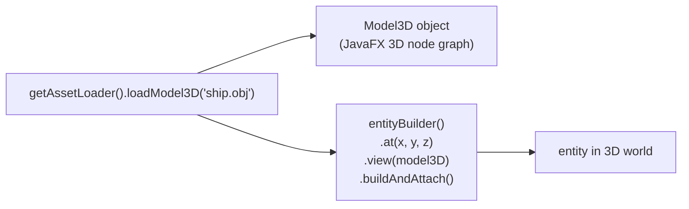
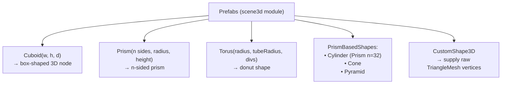
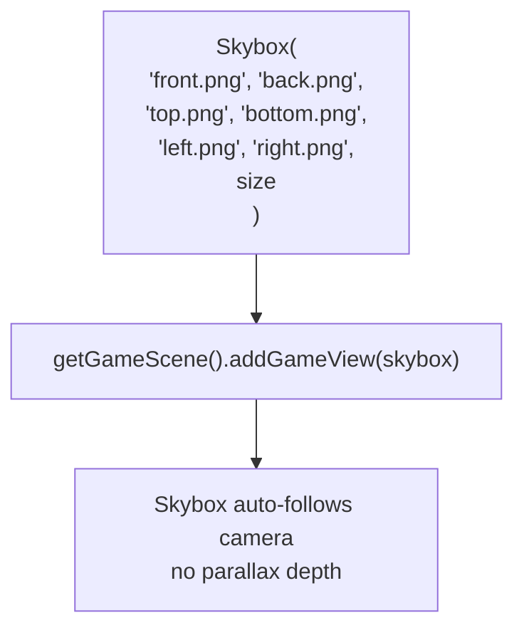
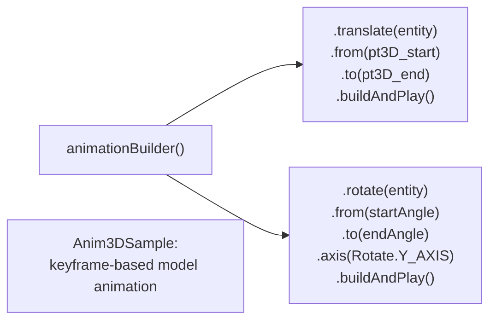
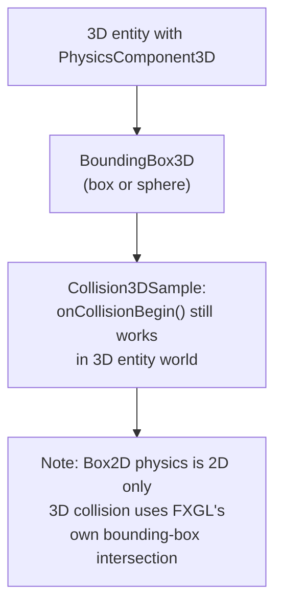
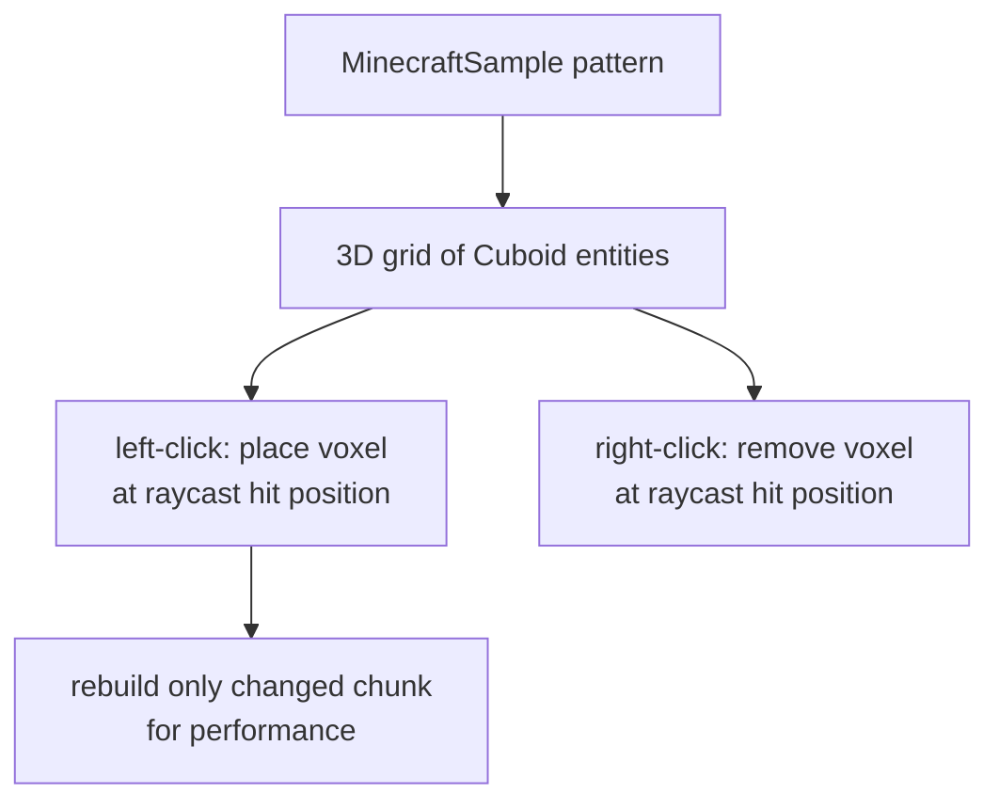
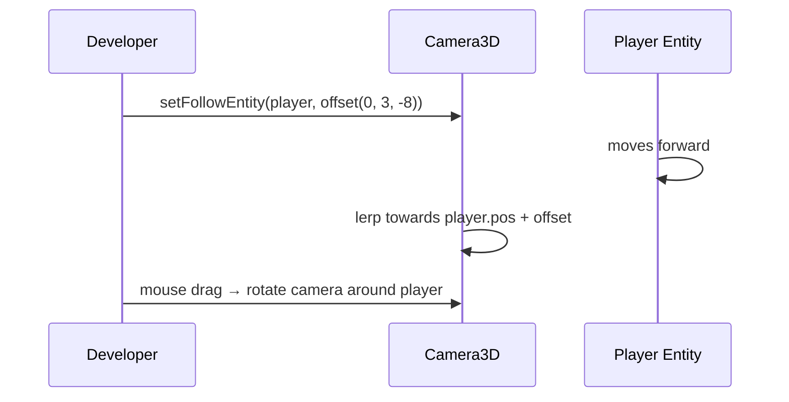

# Use Cases — 3D Scene

Covers Camera3D, Model3D loading (OBJ), Skybox, 3D primitives (Cuboid, Prism, Torus),
custom 3D shapes, 3D collision, and third-person camera.

## Actors and Primary Use Cases

## 3D Mode Setup

## Camera3D Control Modes

## OBJ Model Loading & Spawning

## Built-in 3D Primitive Shapes

## Skybox Setup

## 3D Animation Use Case

## 3D Collision Detection

## Minecraft Voxel Pattern

## Third-Person Camera Pattern

